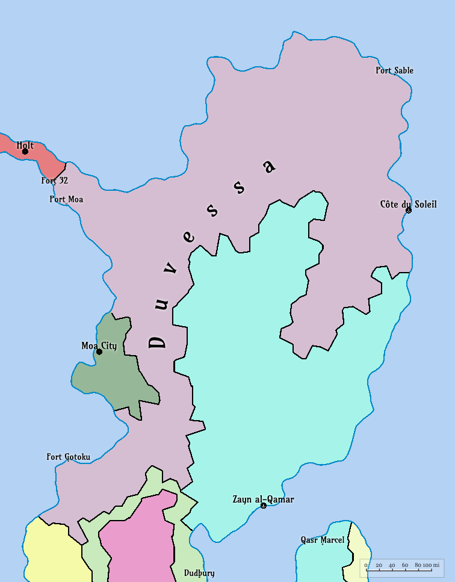

# Duvessa

**Duvessa** is a coastal nation on the north-eastern shores of West Yanorra (also known as [Wanorra](./Wanorra.md)), a continent on the planet Yanorra.  Known for its strategic control over maritime trade routes and its role in the ongoing civil war between the authoritarian **Dornish Order (DO)** and the **Sombra Insurgents**, Duvessa is a key geopolitical player in the post-Drift world.

## Overview

**Name**: Duvessa  
**Capital**: Côte du Soleil (population: ~800,000)  
**Population**: ~12.5 million  
**Largest City**: Port Sable (population: ~1.2 million)  
**Government**: Authoritarian regime under the Dornish Order (DO), contested by Sombra Insurgents  
<!--
**Official Language**: Qheswa (native), with colonial influences (French-like dialects)  
**Currency**: Unknown  
**Religion**: Inti-Tahuantinsuyo (sun worship, enforced by DO); Yana-Pacha (counter-ideology of Sombra Insurgents)  
-->

## Geography

**Location**: Northern coast of Eanorra (the eastern coast of West Yanorra), bordering the Veloku Ocean to the east, the Westvoid Ocean to the north, and the Brooding Sea in the west, separating it from western Wanorra nations like Ronobetu and Tsutodo.  

**Terrain**: Rocky and inhospitable northern coast; mountainous southern border adjacent to Southmoa and Bibi Shirif; fertile coastal plains around Port Sable.  
- **Provinces**:  
  - **Normoa**: Capital - Port Moa (~80,000), acquired after the Duvessa-Moa War (~100,000 cycles ago, ~274 Earth years). Known for rugged terrain and harsh winters.  
  - **Kutboga**: Capital - Fort 32 (population ~60K), borders Thornbelt, the Brooding Sea, and the Veloku Ocean. 
- **Key Islands**:  
  - **The Riftlands**: A chain of islands northeast of Duvessa, serving as a maritime rest stop for trade with Velu. Includes Sable Island (Sabletown port), Saint Armandre, Iskay, Morn’e, Yana Wat’a, Aguillon, Quelvasto, and Sopoko.  
  - **The Farlands**: Northern islands, including Saint Aveline (partially inhabited, under siege), Port Veiskar, and Karrholm.  
  - **Noxoch Isle**: Uninhabited, storm-battered northernmost landmass, considered cursed.  
- **Climate**: Unpredictable due to The Drift (~146,100 cycles ago, ~400 Earth years). Short, scorching summers and long, severe winters. Coastal areas experience frequent storms from the Brooding Sea.

## History

### Pre-Drift Era (~500,000 cycles ago, ~1,369 Earth years)

Before The Drift, Duvessa was a maritime powerhouse, dominating the Brooding Sea with a vast fleet of advanced vessels. 

As a key hub in Eanorra, the eastern region of West Yanorra, Duvessa connected the fertile plains of Ronobetu in Wanorra (the western part of West Yanorra, including Ronobetu) to Eanorra’s nations, like Bibi Shirif, and the Three Sisters (Totoku, Endotoku, Obetoku) across the Brooding Sea. In the west of Duvessa, cities such as Fort 32 and Fort Gotoku thrived.

In the east, Duvessa established multiple trade routes with Velu. Port Sable and Cöte du Soleil became major trade hubs as innovative ship designs enabled reliable crossings of the Veloku Ocean to Velu. This fostered a prosperous, cosmopolitan society with sun-venerating rituals and communal gatherings.

Before The Drift, Duvessa had established itself as a key player in regional trade to its west and east. The society was cosmopolitan, with sun-venerating rituals and communal gatherings.

### Post-Drift Era

The Drift transformed the tidal system in Yanorra, making sea travel, an already perilous endeavor, even more dangerous.

 In the west, all trade routes to Ronobetu were cut off and the once-thriving ports of Fort 32 and Fort Gotoku became ghost towns as ships who attempted to cross the Brooding Sea, were lost to the unpredictable tides and storms. Because of this, Thornbelt, the only land route to Ronobetu, increased tariffs on goods traveling from Ronobetu to Duvessa, leading to skyrocketing food prices.

In the east, all trade routes to Velu became perilous, except for the passage through the Riftlands. This became the sole maritime route to travel between East and West Yanorra. This lead to a population boom in Sabletown, which became a key stopover for ships traveling to Velu's Gate Thaurin.

These changes lead to widespread famine and unrest in Duvessa, with the Dornish Order (DO) rising to power by promising stability and control. The DO enforced strict rationing and authoritarian rule, suppressing dissent and consolidating power.

### Duvessa-Moa War

Approximately 73 centara (~20 years) after The Drift, the Dornish Order (DO) faced a significant challenge from the rival nation of Moa. Moa attempted to seize Duvessa’s northern territory bordering the Thornbelt land-bridge, igniting the Duvessa-Moa War.

Duvessa not only successfully repelled the invasion, but was able to seize Moa's northern territory, including the coastal city of Port Moa. This victory allowed Duvessa to annex Normoa, a rugged and insular region with a population of around 80,000, while Soumoa remained an independent remnant of the former Moa.

### Current Era

A group of insurgents, known as the Sombra, emerged in response to the DO’s oppressive rule, particularly in the loosely controlled region of Normoa where Moa sentiments remain strong. The Sombra advocate for Yana-Pacha ideology, promoting rebellion and chaos against the DO’s authoritarian regime. The insurgents have gained significant support in rural areas like Normoa, where resentment towards the DO runs deep.

Duvessa remains locked in a civil war between the DO and the Sombra Insurgents, with Port Sable and Normoa as major battlegrounds, as insurgents 

## Politics

 ### Government
 The Dornish Order (DO) enforces authoritarian rule, centered on Inti worship and strict control of trade routes. The Sombra Insurgents, led by Capac Dupont, challenge the DO with Yana-Pacha ideology, advocating rebellion and chaos.  

### Foreign Relations 

  - Controls trade with Velu (East Yanorra) via the Riftlands, leveraging Velu’s agricultural surplus.  
  - Strained relations with Bibi Shirif and the Three Sisters (Totoku, Endotoku, Obetoku), who depend on Duvessa for food imports from Ronobetu and Velu but resent its trade monopoly.  
  - Tense neutrality with Soumoa, a remnant of the former Moa, wary of Duvessa’s expansionism.  
- **Key Issues**: Civil war, trade route control, and unrest in Normoa due to historical Moan resentment.

## Economy

- **Overview**: Relies on maritime trade through Port Sable and the Riftlands, primarily with Velu. Historically facilitated food imports from Ronobetu (West Yanorra) and Velu (East Yanorra).  
- **Main Exports**: Limited due to The Drift; primarily fish, coastal agricultural products, and smuggled goods via black markets.  
- **Main Imports**: Agricultural goods from Velu, grains and preserved meats from Ronobetu (pre-Drift).  
- **Trade Hubs**:  
  - **Port Sable**: Main maritime city, center for trade, black market activity, and DO surveillance.  
  - **Sabletown (Riftlands)**: Key stopover for ships traveling to Velu’s Gate Thaurin.  
- **Challenges**: The Brooding Sea’s dangers limit trade with Ronobetu, forcing dependence on Velu. Black market networks thrive due to food shortages in Bibi Shirif and the Three Sisters.

## Culture

- **Cultural Influences**:
- **Religion**:  
  - **Inti-Tahuantinsuyo**: DO-enforced sun worship, blending Quechua rituals with militaristic traditions. Propaganda posters proclaim slogans like “One Sun, One People, One Order!”  
  - **Yana-Pacha**: Sombra Insurgent ideology, emphasizing rebellion against the DO’s sun worship, with the motto “Pour Yana-Pacha—mort à l’Inti!”  
- **Society**:  
  - Urban life in Port Sable is tense, with sandbagged checkpoints and rationed food (choclo and llama charqui).  
  - Rural areas, especially Normoa, are rugged and insular, with lingering Moan cultural identity.  
- **Notable Sites**:  
  - **Torre-Casa de Runa**: Tower-houses in Saint Aveline, home to families like the player’s in the *No Escape* narrative.  
  - **Saint Aveline**: A remote island blending Quechua and French influences, now a conflict zone.

## Technology

- **Communication**: Limited to packet radio and shortwave relays, with frequent interference and delays. No internet or cell towers.  
- **Power**: Sparse electricity from solar panels, wind-up generators, and rare diesel sources. Kerosene, firewood, and candles are common.  
- **Transportation**: Coastal ships and ferries (steam/diesel-powered) navigate short routes to the Riftlands. No transoceanic vessels or aircraft.  
- **Computing**: Equivalent to late 1980s/early 1990s Earth technology, with a basic Compuserve-like network. Mechanical tools and analog systems dominate.

## Military

- **Dornish Order (DO)**:  
  - Well-organized, with sandbagged checkpoints and propaganda enforcing Inti worship.  
  - Uses colonial-era tactics and weaponry, including rifles and fortified positions.  
- **Sombra Insurgents**:  
  - Guerrilla fighters wielding improvised weapons (chonta spears, *fusils anciens*, firebombs).  
  - Operate in small, mobile units, focusing on close-quarters combat and sabotage.  
- **Key Conflicts**: Ongoing civil war, with battles in Port Sable, Normoa, and Saint Aveline (searching for the Tumi-Lumière).

## Demographics

- **Population**: ~2.5 million, concentrated in Port Sable (~1.2 million) and Normoa (~80,000 in Port Moa).  
- **Ethnicity**: Blend of native Qheswa peoples and colonial descendants, with Normoa retaining Moan cultural elements.  
- **Languages**: Qheswa (primary), with French-like dialects in urban areas and DO administration.

## Infrastructure

- **Ports**: Port Sable (main trade hub), Sabletown (Riftlands stopover).  
- **Fortifications**: Gate Thaurin (Velu’s entry point), DO checkpoints in Port Sable, and militarized zones in Normoa.  
- **Housing**: Torre-Casa de Runa (tower-houses) in urban areas like Saint Aveline; stone and timber dwellings in rural Normoa.

## Environment

- **Post-Drift Effects**: Unpredictable seasons, with short, intense summers and long, harsh winters. Coastal storms and tidal chaos from Serya and Mirelda’s gravitational pull.  
- **Natural Resources**: Fish, limited coastal agriculture, and smuggled goods. Timber and stone in Normoa’s rugged interior.

## Notable Events

- **The Drift (~146,100 cycles ago, ~400 Earth years)**: Disrupted trade and climate, leading to DO’s rise.  
- **Duvessa-Moa War (~110,000 cycles ago, ~301 Earth years)**: Resulted in Moa’s division into Normoa and Soumoa.  
- **Sombra Insurgent Uprising (~50,000 cycles ago, ~137 Earth years)**: Ongoing civil war challenging DO rule.

