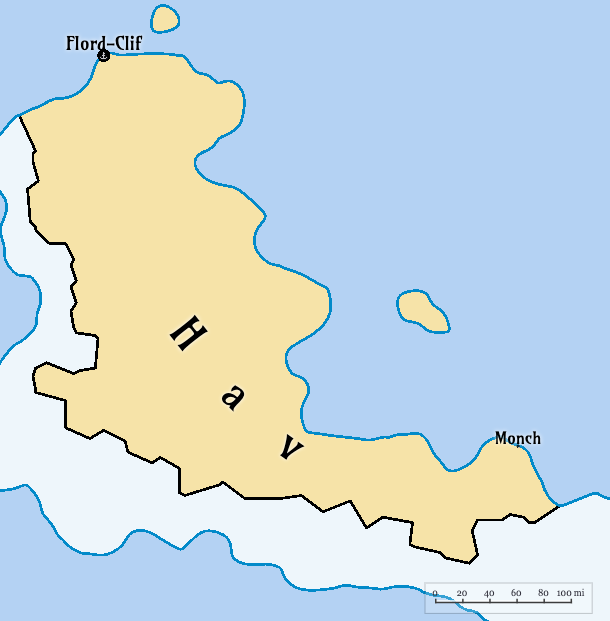

# Hav

#### Table of Contents
- [Overview](#overview)
- [Geography](#geography)
- [History](#history)
- [Technology](#technology)
- [Notable Events](#notable-events)

**Hav** is a large, isolated and sparsely populated country located in Soumoa. Hav is only accessible by sea from southern Eanorra.

## Overview

- **Name**: Hav  
- **Capital**: Flord-Clif
- **Largest City**: Flord-Clif (population: 50,000)
- **Area**: 152,809 km² (59,000 sq mi)
- **Government**: (TBD)
- **Official Language**: (TBD)  
- **Population**: 700,000 (estimated)  
- **Currency**: (TBD)  
- **Religion**: (TBD)  

## Geography

### Location

Hav is located in Soumoa, extending from north western coast along to the eastern coast, borded by the Brooding Sea to the north. To the south lies the disorganized and unclaimed lands of the southern Sounorra.

### Terrain

The southern border of Hav is characterized by a large mountain range called the Iron Peaks, which separates it from the southern Sounorra. The coastal regions feasure a mix of cold sandy beaches, rocky shores, and cliffs. Inland features dense foress, with some fertile valleys where Hav grows most of its food.

### Key Regions

- **Flord-Clif**: The capital city, located on the north western shore, known for its steep cliffs and scenic views of the Brooding Sea. It serves as the political and economic center of Hav.
- **Monch**: A small coastal town known for its fishing industry, located on the far south. Monch is considered by many to be the end of the world, as it is the last settlement before the unclaimed lands of the southern Sounorra.
- **Iron Peaks**: A mountain range forming the southern border, rich in minerals but difficult to traverse.

## Climate

 Post-Drift climate with short, mild summers and extremely cold, snowy winters. Many speculate that Hav will be the last place on Yanorra to burn in the heat death of Yanorra.

## History

### Pre-Drift Era (~500,000 cycles ago, ~1,369 Earth years)

Hav was a sparsely populated region, primarily inhabited by nomadic tribes who relied on hunting and gathering. As neighboring S'Tsutodo to north searched for alternative food sources, they discovered the fertile valleys of Hav. 

S'Tsutodo's expansion into Hav, however, caused conflict with the indigenous tribes, leading to a series of skirmishes. Ronobetu wanted to expand its influence in the region, while forcing S'Tsutodo to rely more on Ronobetu for food, so they supported the tribes in their resistance against S'Tsutodo.

Two hundred years before The Drift, Hav officially became a protectorate of Ronobetu, which established trade routes and military outposts to secure its interests in the region. This led to increased stability and the development of Hav's agricultural practices, particularly in the fertile valleys.

### The Drift (~146,100 cycles ago, ~400 Earth years)

After The Drift, many states adopted isolationist policies to protect their resources and populations. Hav, cut off from Ronobetu due to the Brooding Sea's dangers, focused on self-sufficiency and local governance.

S'Tsutodo's, desperate for food, attempted to reassert control over Hav, but the indigenous tribes, now more organized were able to resist.

Instead, Hav's leaders declared independence, establishing a loose confederation of tribes and settlements. This confederation quickly normalized trade with S'Tsutodo, exchanging agricultural goods for manufactured items and technology.

### Post-Drift Era (~145,000–130,000 cycles ago, ~397–356 Earth years)

### Current Era (~146,100 cycles, ~400 Earth years since The Drift)

Velu remains East Yanorra’s agricultural and economic powerhouse, exporting food to Duvessa, Bibi Shirif, and the Three Sisters. Its strict immigration protect its resources but exacerbate regional tensions, particularly as frustration with Duvessa’s trade monopoly through The Riftlands grows. 

Velu stays neutral in Duvessa’s civil war, though its reliance on The Riftlands keeps it entangled in regional dynamics. The Anqaran people, now split between Velu’s coastal cliffs and Reddelstone, maintain their distinct rituals -- such as solstice harvest festivals -- despite ongoing debates about their Anqharan origins and Erik the Explorer’s voyages, which remain unprovable due to the unnavigable Eastvoid Ocean.

Velu has advanced its communication technology, developing a cable-phone system capable of transmitting data across the Valka Ocean, enabling near-instant contact with Duvessa, Bibi Shirif, and the Three Sisters. Packet radio and shortwave relays connect Velu’s rural farming communities, improving internal coordination. These technologies, shared with other East Yanorra nations, have strengthened regional networks despite post-Drift infrastructure challenges.

## Politics

- **Government**: Unknown structure, but characterized by strict centralized control, particularly over immigration and trade. Gate Thaurin serves as the administrative and military hub.  
- **Foreign Relations**:  
  - **Duvessa**: Reliant on Duvessa’s Riftlands route for exporting agricultural goods, leading to a strained but necessary trade partnership.  
  - **Bibi Shirif and Three Sisters**: Supplies food to these East Yanorra nations, which depend on Velu’s surplus but resent Duvessa’s trade monopoly.  
  - **Ronobetu**: Limited contact post-Drift due to the Brooding Sea’s dangers, with trade now routed through Duvessa.  
- **Key Issues**: Balancing agricultural exports with internal food security, managing immigration pressures, and navigating Duvessa’s trade dominance.

## Economy

- **Overview**: Agriculture-driven economy, with Gate Thaurin as the primary export hub. Velu’s fertile plains produce grains, vegetables, and livestock, critical for East Yanorra’s food supply.  
- **Main Exports**: Agricultural products (grains, root crops, preserved meats, vegetables).  
- **Main Imports**: Limited, primarily maritime goods and manufactured items from Duvessa’s Port Sable and Riftlands trade routes.  
- **Trade Hubs**:  
  - **Gate Thaurin**: Fortified port city, controlling all maritime trade and immigration.  
  - **Riftlands (via Duvessa)**: Key stopover for Velu’s exports to reach West Yanorra and other East Yanorra nations.  
- **Challenges**: Dependence on Duvessa’s maritime routes, vulnerability to Valka Ocean storms, and black-market smuggling driven by regional food shortages.

## Culture

- **Cultural Influences**: Unknown, but likely distinct from Duvessa’s Qheswa and colonial blend, with a focus on agricultural traditions and self-sufficiency.  
- **Religion**: (TBD)  
- **Society**: Highly insular due to strict immigration policies. Rural communities center around farming, while Gate Thaurin is a fortified urban hub with a focus on trade and security.  

## Technology

- **Communication**: Likely limited to packet radio and shortwave relays, similar to Duvessa, with delays due to post-Drift infrastructure challenges.  
- **Power**: Solar panels, wind-up generators, and possibly hydroelectric sources from inland rivers. Kerosene and firewood are common.  
- **Transportation**: Coastal ships and ferries (steam/diesel-powered) for trade with Duvessa’s Riftlands. No transoceanic vessels or aircraft.  
- **Computing**: Equivalent to late 1980s/early 1990s Earth technology, with minimal digital infrastructure.

## Military

- **Overview**: Focused on defending Gate Thaurin and securing trade routes. Likely maintains a strong coastal guard to regulate immigration and exports.  
- **Key Conflicts**: No direct involvement in Duvessa’s civil war, but monitors regional instability due to reliance on Duvessa’s trade routes.

## Demographics

- **Population**: ~2 million, with ~800,000 in Gate Thaurin and the remainder in rural farming communities.  
- **Ethnicity**: Unknown, likely distinct from Qheswa and Moan populations in West Yanorra.  
- **Languages**: (TBD)  

## Infrastructure

- **Ports**: Gate Thaurin, the primary fortified port for trade and immigration control.  
- **Fortifications**: Coastal defenses around Gate Thaurin, with checkpoints to regulate entry and exit.  
- **Housing**: Unknown, likely a mix of rural farmsteads and fortified urban dwellings in Gate Thaurin.

## Environment

- **Post-Drift Effects**: Seasonal rains support agriculture, but coastal storms from the Valka Ocean disrupt trade. Short summers and cold, wet winters.  
- **Natural Resources**: Fertile soils, rivers for irrigation, and livestock. Limited non-agricultural resources.

## Notable Events {#notable-events}

- **The Drift (~146,100 cycles ago, ~400 Earth years)**: Disrupted trade with Ronobetu, forcing reliance on Duvessa’s Riftlands route.  
- **Velu’s Immigration Policy Shift (Post-Drift)**: Implementation of strict controls to protect agricultural resources, centered at Gate Thaurin.