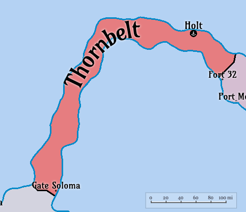

# Thornbelt

#### Table of Contents
- [Overview](#overview)
- [Geography](#geography)
- [Climate](#climate)
- [History](#history)
- [Politics](#politics)
- [Economy](#economy)
- [Culture](#culture)
- [Technology](#technology)
- [Military](#military)
- [Demographics](#demographics)
- [Infrastructure](#infrastructure)
- [Environment](#environment)
- [Notable Events](#notable-events)

**Thornbelt** is a thin isthmus nation that connects northern parts of Eanorra and Wanorra, namely the nations of Ronobetu and Duvessa. Thornbelt acts as an important landbridge for trade betwen the eastern and western parts of West Yanorra.

## Overview

- **Name**: Thornbelt  
- **Capital**: Holt (population: ~80,000)
- **Largest City**: Gate Soloma (population: ~115,000)
- **Population**: 645,000 (estimated)  
- **Area**: 31,000 km² (12,000 sq mi)
- **Government**: (TBD)
- **Official Language**: (TBD)  
- **Currency**: (TBD)  
- **Religion**: (TBD)  

## Geography

**Thornbelt** is a thin isthmus nation that connecting the subcontinents of Eanorra and WanorraIt is bordered by the Brooding Sea to the south and the Sea of Storms to the north. The terrain is primarily flat low-lying land, with some areas of dense forest and wetlands. The region is prone to flooding during heavy rains, which can impact transportation and agriculture.

Thornbelt serves as a crucial landbridge for trade between the eastern and western parts of West Yanorra, facilitating economic exchange and cultural interactions.

### Location

(TBD)

### Terrain 

(TBD)

### Key Regions

(TBD)

## Climate

(TBD)

## History

### Pre-Drift Era (~500,000 cycles ago, ~1,369 Earth years)

The area of Thornbelt was inhabited by various nomadic tribes who relied on fishing and hunting for sustenance. The region's strategic location made it a crossroads for trade and cultural exchange between several ancient civilizations.

As trade increased, Thornebelt became a strategic land bridge as sea travel was often dangerous due to the unpredictable weather patterns of the Brooding Sea and the Sea of Storms. The tribes began to establish more permanent settlements.

When Ronobetu was established as a kingdom, it sought to control the trade routes through Thornbelt. This led to the construction of fortifications near the border with Duvessa, and to an elevated road system that connected the major settlements in the region.

### The Drift (~146,100 cycles ago, ~400 Earth years)

Soon after The Drift, the region of Thornbelt was significantly affected by the environmental changes and the resulting unpredictable tides. As all nations began to fortify their borders, a contingency in Thornbelt was established and declared their independence from Ronobetu, forming the nation of Thornbelt. The new nation focused on importing agricultural techniques from distant Velu, which allowed them to cultivate the land more effectively.

Given the relatively small population, Thornbelt was able to feed itself almost purely through its own agriculture. 

### Post-Drift Era (~145,000–130,000 cycles ago, ~397–356 Earth years)

(TBD)

### Current Era (~146,100 cycles, ~400 Earth years since The Drift)

(TBD)

## Politics

- **Government**: (TBD)  
- **Foreign Relations**: (TBD)  
- **Key Issues**: (TBD)

## Economy

- **Overview**: (TBD)  
- **Main Exports**: (TBD)  
- **Main Imports**: (TBD)  
- **Trade Hubs**: (TBD)  
- **Challenges**: (TBD)

## Culture

- **Cultural Influences**: (TBD)  
- **Religion**: (TBD)  
- **Society**: (TBD)  

## Technology

- **Communication**: (TBD)  
- **Power**: (TBD)  
- **Transportation**: (TBD)  
- **Computing**: (TBD)

## Military

- **Overview**: (TBD)  
- **Key Conflicts**: (TBD)

## Demographics

- **Population**: 700,000 (estimated)  
- **Ethnicity**: (TBD)  
- **Languages**: (TBD)  

## Infrastructure

- **Ports**: (TBD)  
- **Fortifications**: (TBD)  
- **Housing**: (TBD)

## Environment

- **Post-Drift Effects**: (TBD)  
- **Natural Resources**: (TBD)

## Notable Events

(TBD)