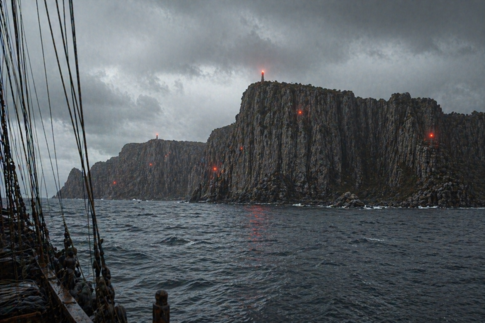
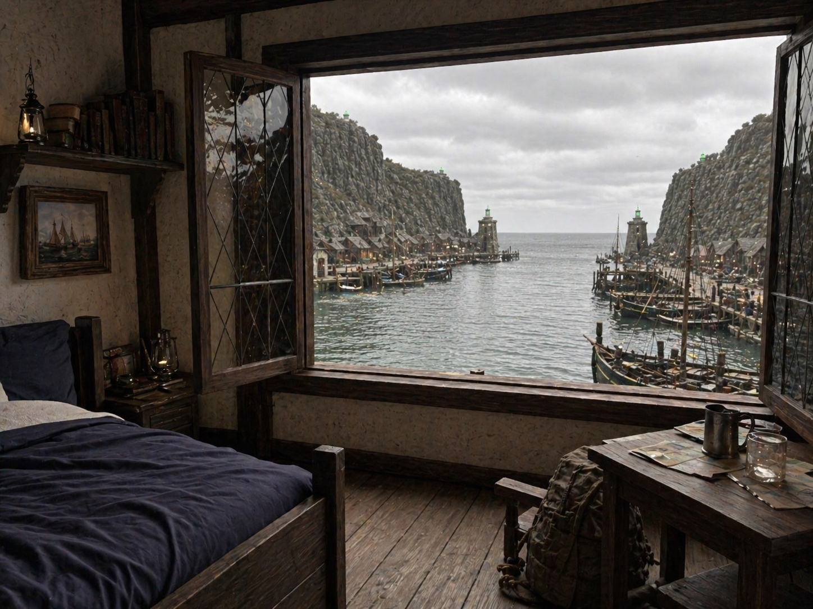
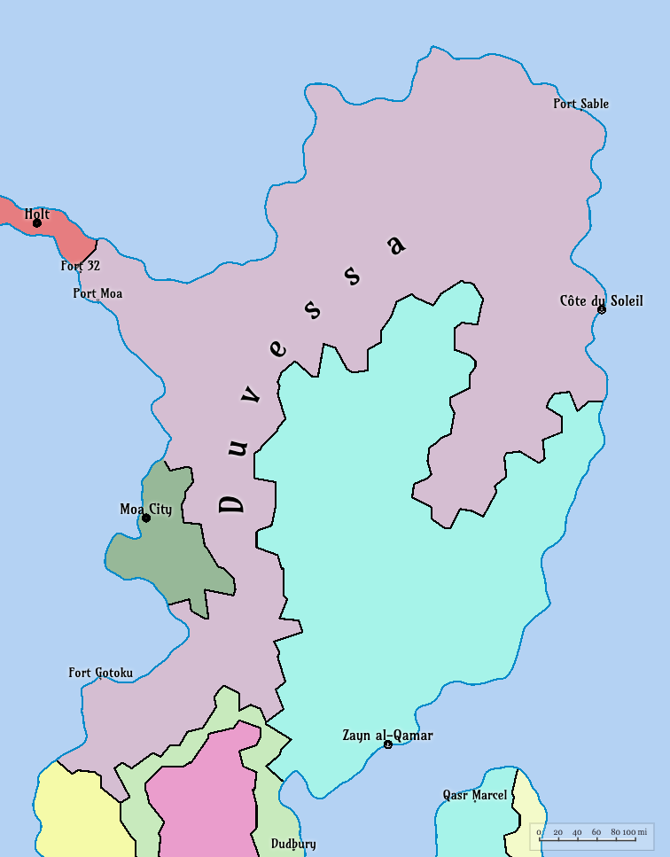
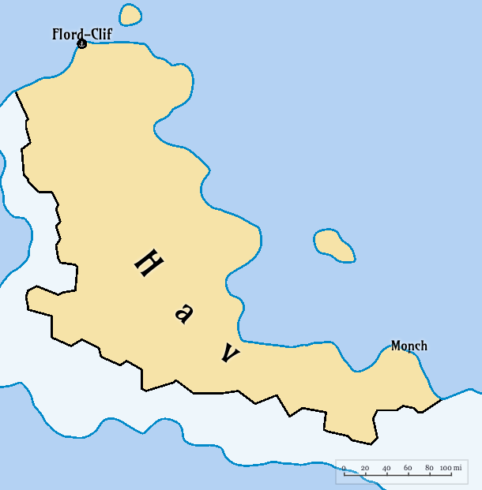
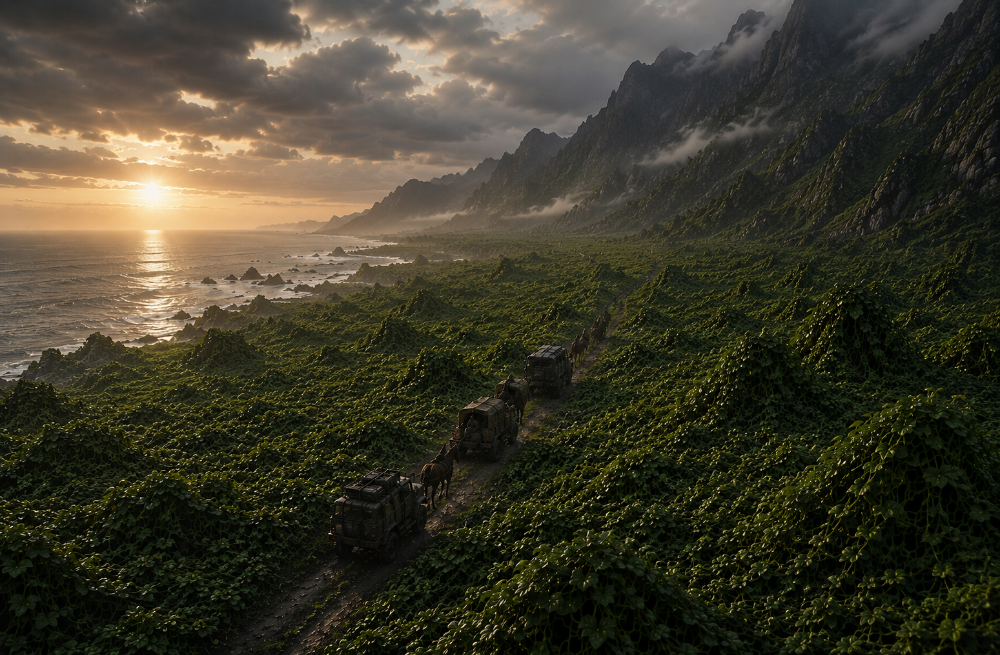
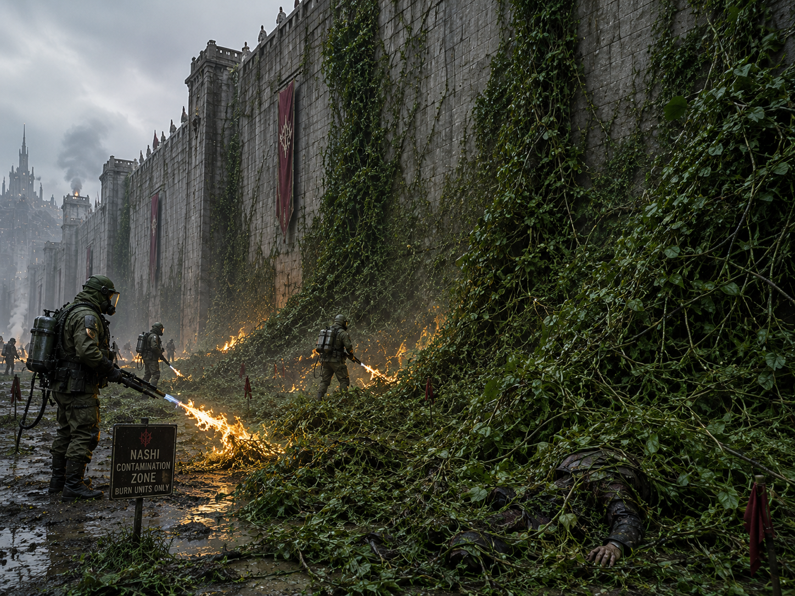
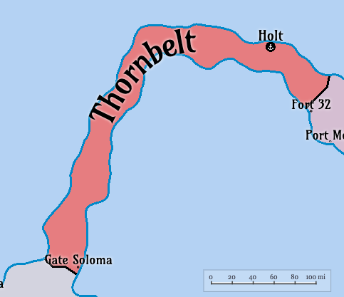
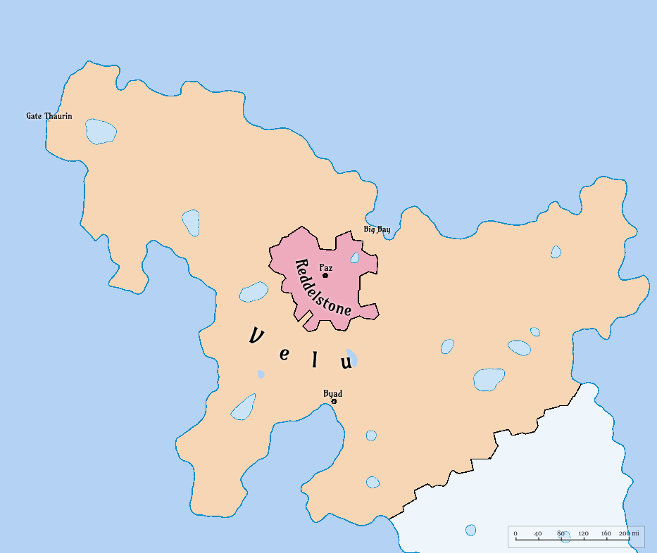

-------------- Alonah.md -------------

# Alonah

<span y-type="mapelement" y-zoom="10" y-center="-19.66, -64.57" y-minzoom="2" y-scrollwheelzoom="true" y-debug="true"/>

**Alonah** is an island settlement region located roughly halfway between [Tsutodo](./Tsutodo.md) and [Hav](./Hav.md). Though little is known of the island's interior, it is recognized by sailors across the southern routes as the site of **Alonah-Clif**, a tightly controlled port stop opened after [The Drift](./The_Drift.md) to aid vessels crossing between Dima Eta in Tsutodo and Flord-Clif in Hav.

---

## Geography

**Location**: Alonah lies along the sea corridor between [Tsutodo](./Tsutodo.md) and [Hav](./Hav.md), making it a rare and valuable stopping point on an otherwise dangerous route.

**Terrain**: The island is ringed by steep cliffs and difficult waters, with Alonah-Clif regarded as the only known safe point of entry. Even there, access is limited: the harbor settlement is enclosed by walls, and all passage into the inner island is strictly forbidden, whether by cliff, gate, or Alonah-built barriers.

<figure style="max-width: 500px; margin: auto; text-align: center;">
    
    <figcaption style="font-size: 0.9em;">Alonah Cliffs showing the red lights notifying ships that landing is forbidden</figcaption>
</figure>

---

## Climate and Environment

Alonah appears to experience heavy sea fog, salt winds, and sudden weather shifts common to the southern waters after [The Drift](./The_Drift.md). More detailed environmental records remain unavailable.

---

## Political Status

Alonah is functionally self-controlled. Whether it is formally claimed by a neighboring state or remains fully independent is still debated by navigators and political recordkeepers.

Its border practices, however, are unmistakable: the harbor is open to trade, but the island beyond the walls is not.

---

## Settlement and Population

The only confirmed settlement is **Alonah-Clif**, a fortified port town built into the island's outer approach. It serves as a provisioning stop, overnight harbor, and tightly supervised point of contact for passing crews.

No reliable count exists for the island's total population. It is unknown how many Alonah live within the port itself and how many reside beyond the sealed interior.

 <figure style="max-width: 500px; margin: auto; text-align: center;">
  
  <figcaption style="font-size: 0.9em;">A view of the harbor from the larger inn in Alonah-Clif</figcaption>
</figure>

---

## Economy and Supply

Little is known about the Alonah economy, but it is clear that the island sustains itself, at least in part, through maritime service. Over the years, the number of inns, kitchens, markets, and repair facilities within Alonah-Clif has grown to accommodate the steady flow of ships passing through the southern route. 

Trade is conducted through a barter system, with the Alonah providing food, water, shelter, and basic repairs in exchange for small livestock such as goats and fowl, fuel sources (kerosene, coal, and oil), and construction materials such as worked timber, rope, and iron fittings. 

Luxury goods, such as wine and spirits, as well as nashi-based candies, are accepted in small quantities, though no one has ever witnessed an Alonah consuming such items. What the Alonah do with much of what they receive remains unknown.

Despite the limited scope of trade, Alonah-Clif remains a vital stop along the southern route, providing continuity where few alternatives exist.

---

## Cultural Significance

Despite their hospitality in trade, the Alonah people remain among the most enigmatic known populations of Yanorra. They operate the inns, kitchens, and storehouses of the port, yet appear in full-body coverings from head to toe, with even the eyes hidden behind fine mesh. They do not speak to foreigners within the port. Instead, they rely on an elaborate sign language developed over generations of controlled exchange. Though most scholars assume the Alonah possess a spoken language of their own, no verified outsider has ever heard one of them utter a single word.

Travelers' accounts, though inconsistent, often describe glimpses beneath shifting cloth and sea mist: blue-tinted skin, piercing red eyes, and hair of pale ash-grey. Such descriptions remain unconfirmed, but they have done much to shape the island's fearful reputation.

Among sailors, Alonah is spoken of with equal parts gratitude and unease. To some it is a necessary refuge between two distant coasts; to others it is a silent island whose people reveal only what they must.

---

## Historical Context

Prior to The Drift, Alonah-Clif was regarded as a hostile shoreline. Accounts from pre-Drift sailors describe vessels being fired upon when attempting to approach. No successful landings were recorded, and the island was marked on maritime charts as unapproachable.

As the seas changed after The Drift, sailors began reporting green lights along the cliffs during low visibility. Initially dismissed as illusion or storm-light, repeated sightings led some crews to approach cautiously.

Those that did found they were no longer fired upon, but instead silently guided through a narrow approach into a sheltered harbor.

From that point forward, Alonah-Clif became a controlled refuge port. Inns, kitchens, and small markets developed within the harbor walls, allowing ships traveling between Tsutodo and Hav to resupply and repair.

---

## Origin of the Name

The origin of the name **Alonah** is uncertain. Some claim it derives from an older island word preserved only by the inhabitants themselves, while others argue that it was a sailors' term later adopted into charts.

No explanation has been confirmed by the Alonah people.

---

*See also:* [Tsutodo](./Tsutodo.md), [Hav](./Hav.md), [The Drift](./The_Drift.md)


-------------- Anqara.md -------------

# Anqara

**Anqara** is a disputed land believed by some scholars to exist beyond the **Eastvoid Ocean**. Knowledge of its existence originates primarily from accounts attributed to **Thalen of the Eastvoid**, a Veluan navigator active several decara before **The Drift**. 

According to surviving maritime records and oral traditions, Thalen claimed to have crossed the Eastvoid Ocean and reached an unfamiliar landmass which he and members of his expedition called **Anqara**.

Upon returning to Velu, Thalen brought with him unfamiliar artifacts, plant specimens, and a small group of people who identified themselves as **Anqaran**. 

The existence of Anqara itself remains unverified. Since **The Drift**, the Eastvoid Ocean has become effectively unnavigable beyond a short distance from shore, making direct confirmation impossible.

---

## Theorized Continent of Anqara

Anqara is believed to lie somewhere east of **East Yanorra**, beyond the Eastvoid Ocean.

No confirmed maps of the continent exist. All information regarding the land comes from pre-Drift accounts recorded in Velu.

Descriptions attributed to Thalen and his contemporaries describe a fertile coastal land with unfamiliar vegetation and sophisticated agricultural practices.

Some scholars consider the **continued existence of the Anqaran people and their distinctive crops** to be indirect evidence supporting Thalen’s account.

Others argue that the story may have been exaggerated or mythologized after The Drift, when direct exploration became impossible.

Because no vessel has successfully crossed the Eastvoid Ocean since that time, the question of Anqara’s existence remains unresolved.

---

## Thalen of the Eastvoid and the Voyage to Anqara

Thalen of the Eastvoid was a navigator from the Veluan city of **Byad**, remembered as one of the final great maritime explorers of the pre-Drift age. 

During a period of expanding shipbuilding technology and maritime ambition, Thalen reportedly led several expeditions eastward across the Eastvoid Ocean.

According to surviving Veluan records, one of these voyages resulted in contact with a previously unknown land.

Thalen returned from that voyage with:

* unfamiliar crops and seeds
* unknown artifacts and tools
* a small group of people who identified themselves as **Anqaran**

These individuals eventually settled in Velu and became the ancestors of the modern Anqaran population.

Skepticism toward Thalen’s voyage has persisted for centuries. Since The Drift rendered the Eastvoid Ocean unnavigable, the journey cannot be replicated and the existence of Anqara cannot be independently verified.

---

## The Anqaran People

The **Anqaran** are a small cultural group believed to descend from the people who accompanied Thalen back from Anqara.

They initially settled in Velu’s fertile plains and became known for introducing advanced agricultural techniques, including:

* irrigation systems
* crop diversification
* ritualized seasonal harvest practices

These methods significantly improved Velu’s agricultural productivity before and after The Drift. 

Over time, however, political centralization in Velu and competition for farmland led to increasing marginalization of Anqaran communities.

---

## Early Anqaran Settlements in Velu

**Several Veluan traditions record that among the Anqaran settlers were two prominent figures known as Aunqua and Auntia, who arrived with roughly twenty followers and a collection of unfamiliar plants and seeds.** 

**These plants included fruits, vegetables, medicinal herbs, and a dark chocolate-like crop known as *nashi*.**

**The Anqarans guarded the seeds and cultivation techniques carefully, which drew suspicion from Veluan farmers who attempted to grow the crops independently.**

When Veluans attempted to cultivate nashi themselves, they discovered the plant spread uncontrollably across farmland.

**Within only a few growing seasons, nashi proved to be a highly invasive species capable of destroying surrounding crops and overwhelming native vegetation.**

---

## Nashi

**Nashi is an agricultural plant introduced by the Anqaran settlers that produces a dark, bitter-sweet substance resembling chocolate.** 

**Although valuable as a food and trade product, nashi is extremely aggressive outside controlled cultivation.**

If planted directly into open farmland, its root systems spread rapidly and overtake surrounding crops.

Because of this, the Anqarans developed strict containment methods, including:

* **controlled burn circles used to isolate planting zones**
* **clay barriers reinforced with mineral compounds**
* **sealed growth pits or ceramic vessels**

These methods prevented the plant from spreading into surrounding soil.

---

## Discovery of Reddle Stone

As tensions with Veluan farmers increased, Anqaran communities were gradually pushed away from the fertile plains and into the mountainous interior of central Velu.

**During this migration they discovered deposits of a mineral known as *Reddle Stone*.**

**When crushed and mixed into clay, Reddle Stone created a hardened material capable of blocking the underground spread of nashi roots.**

Using this discovery, the Anqarans constructed **containment walls** that allowed the plant to be cultivated safely.

---

## Founding of Paz

**After being displaced from the plains, Anqaran settlers and several Veluan followers established a settlement in the central mountains known as *Paz*.** 

With access to Reddle Stone and controlled cultivation methods, the community was able to grow nashi on a large scale.

**Within only a few seasons, Paz expanded rapidly, reaching several thousand inhabitants as additional containment fields were built throughout the surrounding valleys.**

Paz eventually became the cultural and agricultural center of the Anqaran population.

---

## Post-Drift Relations with Velu

Following **The Drift**, Velu attempted several times to seize the Reddle Stone deposits located in Anqaran territory.

**Anqaran leaders reportedly warned that if their territory were invaded, they would release uncontrolled nashi growth onto Veluan farmland.**

Because the plant could devastate entire agricultural regions, Velu ultimately abandoned attempts to annex the territory.

A boundary agreement was eventually reached.

**Under this arrangement, nashi and nashi-derived products were permitted to circulate within Velu as regulated trade goods.**

---

## Modern Anqaran Communities

Today the Anqaran people remain a distinct cultural group within East Yanorra.

Their population is primarily concentrated in:

* the mountain settlements surrounding **Paz**
* the independent state of **Reddelstone**
* smaller diaspora communities along Velu’s coastal cliffs

Although many Veluan scholars question the historical accuracy of Thalen’s voyage, Anqaran communities continue to assert their ancestral connection to the lost land of **Anqara**.

The existence of that land remains one of the most enduring mysteries of Yanorran history.


-------------- Barrel.md -------------

# Barrel

<span y-type="mapelement" y-zoom="4" y-center="-2.99, 25.62" y-minzoom="2" y-scrollwheelzoom="true" y-debug="true"/>

## Table of Contents

- [Overview](#overview)
- [Geography](#geography)
- [Climate](#climate)
- [History](#history)
- [Politics](#politics)
- [Economy](#economy)
- [Culture](#culture)
- [Technology](#technology)
- [Military](#military)
- [Demographics](#demographics)
- [Infrastructure](#infrastructure)
- [Environment](#environment)
- [Notable Events](#notable-events)

**Barrel** is a nation.

[](../Maps/Barrel.png)

## Overview

- **Name**: Barrel  
- **Capital**: Seshai
- **Largest City**: Seshai (population: 202,103)
- **Area**: (TBD) km² ((TBD) sq mi)
- **Government**: (TBD)
- **Official Language**: (TBD)  
- **Population**: 3M (estimated)  
- **Currency**: (TBD)  
- **Religion**: (TBD)  

## Geography

Barrel is a nation located in East Yanorra. It is bordered by Velu to the east, and the Veloku Ocean to the west. The shores of barrel are flat and fertile land, with the interior being very mountainous and rugged. 

### Key Regions

#### Sashai

#### Brater Lake

Brater Lake is a large freshwater lake located in the interior of Barrel. It is surrounded by steep mountains and dense forests, making it a secluded and picturesque area. On its shore is the town of Brater, which serves as a fishing port for the region. The lake is known for its crystal-clear waters and abundant fish population.

#### The Barrel Islands

The Barrel islands are a large archipelago located roughly halfway between East Yanorra and West Yanorra in the southern Veloku Ocean. The islands were characterized by steep cliffs and lush forests. In total there were over 100 islands, with the largest being about 150 km in length

### Location

(TBD)

### Terrain 

(TBD)

### Additional Regions

(TBD)

### Climate

(TBD)

## History

### Pre-Drift Era (~500,000 days ago, ~1,369 Earth years)

Before The Drift, Barrel was a prosperous maritime power in East Yanorra. Situated on the western coastline with sheltered harbors and skilled shipwrights, Barrel became the foremost facilitator of commerce across the Veloku Ocean.

Its greatest advantage was its control of the Barrel Islands — a large, strategically placed archipelago located nearly halfway between East Yanorra and West Yanorra in the southern Veloku Ocean. These islands served as a vital resupply point, allowing merchants to break the otherwise perilous voyage into manageable legs.

The Barrel fleet was famed for its speed and reliability, and merchants from both East and West Yanorra relied on its captains to move goods, people, and information. Some historians argue that without Barrel, true intercontinental trade between the East and West Yanorra would have developed centuries later.

### The Drift (~146,100 days ago, ~400 Earth years)


### Post-Drift Era (~145,000–130,000 days ago, ~397–356 Earth years)

With the Veloku crossing severed, Barrel’s economy collapsed almost immediately. Shipbuilding shifted from vast ocean-going galleons to smaller coastal craft, and the once-grand harbors silted over.

The fate of the Barrel Islands remained unknown. Attempts to reestablish contact always ended the same way: without return. Even the most well-prepared expeditions left no trace, their disappearance feeding both grief and romanticized tales of a hidden paradise, a cursed ruin, or a thriving society that had chosen to remain isolated.

The loss reshaped the nation’s culture. Songs, festivals, and seafaring traditions came to center on remembrance and the yearning for reunion.

### Current Era (~146,100 days, ~400 Earth years since The Drift)

### The Barrel Island

The Barrel Islands are an archipelago located in the southern Veloku Ocean, roughly halfway between East Yanorra and West Yanorra, that once served as a vital resupply point for maritime trade before The Drift.

When The Drift disrupted Yanorra’s orbit and climate, the Veloku Ocean was transformed almost overnight. Warm currents vanished, replaced by chaotic, colliding flows; entire weather systems shifted unpredictably; and storms of unprecedented violence swept the open waters.

The Barrel Islands, once a bustling midpoint of civilization, suddenly became inaccessible to the trade network as all known routes turned impassable. Survivors from failed voyages spoke of towering rogue waves, or skies that blackened in minutes before crushing winds tore masts to splinters.

The islands quickly became legend — their harbors, settlements, and people swallowed by the unreachable horizon. 

This began a tradition known as the **Voyage of Remembrance**. 

Every year on the same day, known as **Island Day**, a single stout vessel is prepared over many decara — its hull reinforced, its sails sewn with hand-dyed cloth, and its figurehead carved anew each year. Volunteers, often descendants of families who once lived on the islands, load it with supplies, livestock, crafted gifts, and handwritten letters.

The ship departs at dawn amid ceremonies, the docks crowded with thousands of onlookers. Bells toll, horns sound, and flower petals are scattered on the waves as the vessel slips into the southern horizon. No ship has ever returned. 

Voyages from other nations, such as Samariland and Bibi Shirif, have also been attempted, but all ended in failure. The only anomaly came decades ago, when the remains of a small fishing boat washed ashore near Seshai, its hull shattered but its mast still intact — carved in a style unrecognized by any shipbuilder in Barrel or beyond.

Some claim this is proof the islanders still live, taking in the voyagers but forbidding their return. Others believe the expeditions are swallowed by the ocean. 

Regardless, the islands are now considered a lost, with the fate of the islands and their inhabitants unknown.

## Politics

- **Government**: (TBD)  
- **Foreign Relations**: (TBD)  
- **Key Issues**: (TBD)

## Economy

- **Overview**: (TBD)  
- **Main Exports**: (TBD)  
- **Main Imports**: (TBD)  
- **Trade Hubs**: (TBD)  
- **Challenges**: (TBD)

## Culture

- **Cultural Influences**: (TBD)  
- **Religion**: (TBD)  
- **Society**: (TBD)  

## Technology

- **Communication**: (TBD)  
- **Power**: (TBD)  
- **Transportation**: (TBD)  
- **Computing**: (TBD)

## Military

- **Overview**: (TBD)  
- **Key Conflicts**: (TBD)

## Demographics

- **Population**: 700,000 (estimated)  
- **Ethnicity**: (TBD)  
- **Languages**: (TBD)  

## Infrastructure

- **Ports**: (TBD)  
- **Fortifications**: (TBD)  
- **Housing**: (TBD)

## Environment

- **Post-Drift Effects**: (TBD)  
- **Natural Resources**: (TBD)

## Notable Events

(TBD)


-------------- Barrel_Islands.md -------------

# Barrel Islands

<span y-type="mapelement" y-zoom="5" y-center="-28.00, -0.06" y-minzoom="2" y-scrollwheelzoom="true" y-debug="true"/>

**The Barrel Islands** are a lost archipelago in the southern Veloku Ocean, remembered in records as lying roughly midway between the eastern and western reaches of Yanorra. Everything written about the islands in the current era is drawn from historical logs, survivor fragments, and pre-Drift charts.

Since [The Drift](./The_Drift.md), no confirmed voyage to the islands has ever returned.

---

## Geography

**Location**: Historical navigation records place the Barrel Islands along the old deep-water crossing between eastern and western Yanorra, south of the most stable modern shipping lanes. Captains of the pre-Drift era described them as the central chain in a broad oceanic corridor once used for long-range trade.

**Terrain**: Accounts consistently describe steep coastal cliffs, narrow natural harbors, and densely forested interiors. The archipelago is said to have included more than one hundred islands and rocky outcrops, with a handful of large islands serving as anchorage and resupply centers for transoceanic fleets.

No modern survey has verified these details in person. All current maps are reconstructed from pre-Drift charts and copied expedition journals.

---

## Climate and Environment

Before The Drift, the islands were described as humid, wind-exposed, and fertile, with seasonal storms but dependable maritime windows for travel. Forest canopies, freshwater runoff, and sheltered coves reportedly made them suitable for temporary settlement and provisioning.

Post-Drift descriptions are speculative. Oceanographers and navigators agree only on one point: the surrounding waters became violently unstable after orbital disruption, with colliding currents and storm behavior severe enough to prevent reliable approach or retreat.

Because no return expedition has been documented, the present environmental condition of the islands is unknown.

---

## Population

No verified modern census exists.

Pre-Drift manifests indicate rotating populations of dockworkers, merchants, navigators, and maintenance crews, with some records suggesting permanent coastal communities on the largest islands. Whether any descendants remain is unconfirmed.

In scholarly convention, the current population status is listed as **unknown**.

---

## Cultural Signifigance

Across coastal nations, the Barrel Islands endure as a symbol of distance, loss, and obligation to those who vanished beyond the southern horizon.

Most notable is the ceremonial tradition of launching ships toward the islands. In many ports, a vessel is prepared each year in a formal rite of remembrance: families provide letters, keepsakes, and offerings; bells and harbor horns mark departure; and crowds witness the ship's course into open water. The voyage is both memorial and hope.

No ceremonial vessel has ever been confirmed to return.

---

## Historical Context

In the pre-Drift age, the Barrel Islands were one of Yanorra's most important maritime stopovers, allowing traffic between the eastern and western portions of the world to break a dangerous open-ocean crossing into manageable legs. This role made the chain strategically significant for trade, diplomacy, and naval logistics.

After The Drift, that corridor effectively collapsed. Expeditions continued for generations, but every documented attempt to reach the islands and return failed. As a result, the islands shifted from active waypoint to historical absence: essential in the record, unreachable in practice.

---

*See also:* [Barrel](./Barrel.md), [The Drift](./The_Drift.md), [Velu](./Velu.md), [Duvessa](./Duvessa.md)


-------------- Bharim_Islands.md -------------

# Bharim Islands

#### Table of Contents
- [Overview](#overview)
- [Geography](#geography)
- [Climate](#climate)
- [History](#history)
- [Politics](#politics)
- [Economy](#economy)
- [Culture](#culture)
- [Technology](#technology)
- [Military](#military)
- [Demographics](#demographics)
- [Infrastructure](#infrastructure)
- [Environment](#environment)
- [Notable Events](#notable-events)

The **Bharim Islands** is an archipelago nation, acting as a conduit between [Hav](./Hav.md) and the rest of West Yanorra. 

<a href="../Maps/Bharim Islands.png" target="_blank"></a>

## Overview

- **Name**: Bharim Islands  
- **Capital**: Qaryat al-Bahr (population: (TBD))
- **Largest City**: (TBD)
- **Area**: 8,200 km² (3,200 mi²)
- **Government**: (TBD)
- **Official Language**: (TBD)  
- **Population**: (TBD) (estimated)  
- **Currency**: (TBD)  
- **Religion**: (TBD)  

## Geography

(TBD)

### Location

(TBD)

### Terrain 

(TBD)

### Key Regions

(TBD)

## Climate

(TBD)

## History

### Pre-Drift Era (~500,000 days ago, ~1,369 Earth years)

(TBD)

### The Drift (~146,100 days ago, ~400 Earth years)

(TBD)

### Post-Drift Era (~145,000–130,000 days ago, ~397–356 Earth years)

(TBD)

### Current Era (~146,100 days, ~400 Earth years since The Drift)

(TBD)

## Politics

- **Government**: (TBD)  
- **Foreign Relations**: (TBD)  
- **Key Issues**: (TBD)

## Economy

- **Overview**: (TBD)  
- **Main Exports**: (TBD)  
- **Main Imports**: (TBD)  
- **Trade Hubs**: (TBD)  
- **Challenges**: (TBD)

## Culture

- **Cultural Influences**: (TBD)  
- **Religion**: (TBD)  
- **Society**: (TBD)  

## Technology

- **Communication**: (TBD)  
- **Power**: (TBD)  
- **Transportation**: (TBD)  
- **Computing**: (TBD)

## Military

- **Overview**: (TBD)  
- **Key Conflicts**: (TBD)

## Demographics

- **Population**: (TBD) (estimated)  
- **Ethnicity**: (TBD)  
- **Languages**: (TBD)  

## Infrastructure

- **Ports**: (TBD)  
- **Fortifications**: (TBD)  
- **Housing**: (TBD)

## Environment

- **Post-Drift Effects**: (TBD)  
- **Natural Resources**: (TBD)

## Notable Events

(TBD)

-------------- Bibi_Shirif.md -------------

# Bibi Shirif

**Bibi Shirif** is a nation.


## Overview

* **Name**: Bibi Shirif
* **Capital**: Zayn al-Qamar (population: ~1.5 million)
* **Largest City**: Zayn al-Qamar
* **Area**: (TBD) km² ((TBD) sq mi)
* **Government**: (TBD)
* **Official Language**: (TBD)
* **Population**: (TBD) (estimated)
* **Currency**: (TBD)
* **Religion**: (TBD)

## Geography

(TBD)

### Location

Located in Eanorra, Bibi Shirif occupies much of the eastern shore, with a long coastline along the Veloku Ocean. Bibi Shirif also claims several islands and land in the north west portion of [Dudburia](Dudburia.md).

### Terrain

(TBD)

### Key Regions

* **Zayn al-Qamar**: Capital and largest city, known for its rich history, cultural diversity, and vibrant markets.
* **Qasr Marcel**: On the island of Dudbinia, off the southeast coast of Bibi Shirif; a significant religious and cultural center and home to the Great Mosque of Zayn al-Qamar, a major pilgrimage site.

## Climate

(TBD)

## History

### Pre-Drift Era (~500,000 days ago, ~1,369 Earth years)

(TBD)

### The Drift (~146,100 days ago, ~400 Earth years)

(TBD)

### Post-Drift Era (~145,000–130,000 days ago, ~397–356 Earth years)

(TBD)

### Current Era (~146,100 days, ~400 Earth years since The Drift)

(TBD)

## Politics

* **Government**: (TBD)
* **Foreign Relations**: (TBD)
* **Key Issues**: (TBD)

## Economy

* **Overview**: (TBD)
* **Main Exports**: (TBD)
* **Main Imports**: (TBD)
* **Trade Hubs**: (TBD)
* **Challenges**: (TBD)

## Culture

* **Cultural Influences**: (TBD)
* **Religion**: (TBD)
* **Society**: (TBD)

## Technology

* **Communication**: (TBD)
* **Power**: (TBD)
* **Transportation**: (TBD)
* **Computing**: (TBD)

## Military

* **Overview**: (TBD)
* **Key Conflicts**: (TBD)

## Demographics

* **Population**: (TBD) (estimated)
* **Ethnicity**: (TBD)
* **Languages**: (TBD)

## Infrastructure

* **Ports**: (TBD)
* **Fortifications**: (TBD)
* **Housing**: (TBD)

## Environment

* **Post-Drift Effects**: (TBD)
* **Natural Resources**: (TBD)

## Notable Events

(TBD)


-------------- BoneIslands.md -------------

# Bone Islands

The **Bone Islands** are a wind-struck island chain off the western coast of **Southern Void**, southwest of [Hav](./Hav.md). Mariners across West Yanorra classify the waters around the chain as a hazard zone because the surrounding weather shifts abruptly and the crosswinds rarely subside for long.

No permanent settlement is known to exist on the islands in the current era.

---

## Geography

The chain consists of narrow rock islands, broken shelves, and low sea-cut ridges. Most coastlines are steep, with little beach access and frequent submerged stone near the tide line.

The largest island is **Ajanea**, where the ruins of an old lighthouse and a collapsed settlement remain on the northern cliffs. In navigation records, the site is referred to as **Ajanea-Clif**. No surviving civic roll, harbor register, or clan record has been tied with certainty to the people who once lived there, and no accepted account explains their disappearance.

A medium-sized island near the mainland shore is known as **Gracie Island**.

---

## Harbors and Navigation

Only a few islands in the chain offer anything resembling safe harbor. Even those anchorages are treated as conditional refuges rather than reliable ports.

Local pilots note three recurring dangers:

- hidden stone spines just below wave height
- funneling wind that can force vessels sideways into cliff walls
- rapid weather turns that erase visibility within minutes

Because of these factors, captains usually avoid deep entry into the chain unless driven by damage, pursuit, or dire shortage.

---

## Climate and Sea Conditions

The Bone Islands are known for harsh weather in all seasons. Gale-force winds are common, and calm intervals are short and unpredictable.

Observed conditions include:

- long-period swells from the southern open water
- opposing nearshore currents that twist steering response
- cold rain bands and sea fog that form without warning

For most navigators, the primary risk is not a single storm, but the persistent combination of wind shear and poor approach angles around rocky coastlines.

---

## Historical Site: Ajanea-Clif

Ajanea-Clif is the best-documented ruin in the chain. The lighthouse foundation still stands on Ajanea, with portions of the lower tower and cistern walls intact. Broken mooring rings and fragments of storage basins indicate that the settlement once supported regular maritime traffic.

No confirmed inscription has identified the keepers of the light, the date of abandonment, or the reason the settlement failed. Oral traditions from Hav describe the site as "a harbor that forgot its own name," but no record has yet resolved the phrase.

---

## Thalen's Refusal

One of the most repeated Bone Islands accounts concerns **Thalen of the Eastvoid**, the same explorer associated with the disputed voyage to [Anqara](./Anqara.md).

A late copy of a pre-Drift log attributed to his crew claims that Thalen diverted west during a return season and attempted a weather shelter near Ajanea. According to that account, he climbed the old light platform at dusk and saw what he described as "a second sea hanging above the first," with pale moving lights crossing it in silence from cliff to cliff.

Crew testimony recorded afterward states that Thalen came down shaking, ordered immediate departure despite worsening surf, and forbade any further landing in the chain. The same source claims he later swore before witnesses in Byad that he would "never again pass under the bones of that sky."

Scholars disagree on what he actually witnessed. Proposed explanations include refracted storm-light, airborne salt haze, or a panic response after exhaustion. Regardless of interpretation, the account became a lasting part of Bone Islands folklore and is often cited by captains refusing Bone Islands routes.

---

## The Smoke of Gracie Island

A separate and widely repeated sailors' tale comes from a convoy that hugged the southern coast of Southern Void during a lean trade year.

Near dawn on the ninth day, lookouts reported a narrow column of dark smoke rising from **Gracie Island**, then flattening beneath the wind before vanishing. The convoy master reportedly changed heading to investigate, expecting wreckage fire or a stranded camp.

By the time the lead vessel reached sounding distance, the smoke was gone. Crews found no lit beacon, no active kiln, and no fresh camp trace along the accessible stone shelves. Yet several witnesses swore they smelled burned pitch over clean sea wind for the rest of the day.

Since that voyage, sporadic smoke sightings from Gracie Island have been logged by passing crews, usually in poor weather windows. None has produced a confirmed source.

---

## Current Status

In modern charts, the Bone Islands are marked as:

- **unsettled**
- **hazardous approach zone**
- **emergency anchorage only**

Most maritime authorities in nearby ports recommend passage well offshore whenever hull condition and weather allow.

---

*See also:* [Hav](./Hav.md), [Anqara](./Anqara.md), [The Drift](./The_Drift.md)


-------------- Calendar.md -------------

# Calendar

Yanorran timekeeping is generally divided into two broad eras: before and after [The Drift](./The_Drift.md). Older records use local pre-Drift systems that were tied to stable seasons, while most modern records use a Drift-based day count.

## Pre-Drift

Before The Drift, most nations tracked time through regular seasonal years, local planting cycles, and temple or court records. Because Yanorra's orbit was more stable, calendars could be planned around expected weather windows, sea routes, and harvest periods.

There was no single world calendar in universal use. Port cities, kingdoms, and religious institutions often kept different year names or regnal systems, then converted dates when trading or copying records.

In modern scholarship, pre-Drift dates are usually standardized as **BD** (Before Drift) when comparing archives across regions.

## Post-Drift

After The Drift altered orbit and season regularity, older year systems became unreliable for practical forecasting. Most modern record-keepers shifted to Drift-relative counting and mark dates as **AD** (After Drift).

The most common modern notation uses day counts in segmented form (for example: `146.1.27`), reflecting the current era's emphasis on counting elapsed Drift-time rather than trusting fixed seasonal months.

In everyday use, terms like **day**, **decara**, and **centara** appear in ledgers, histories, and official notices. Regional institutions still keep local observances and feast days, but interregional administration, trade, and scholarship generally rely on Drift-era day dating.


-------------- Children_of_the_Tide.md -------------

# Children of the Tide

The **Children of the Tide** are a coastal devotional movement centered on the belief that the sea and the sky breathe in long, unequal cycles since [The Drift](./The_Drift.md). Their best-known rite is the **Walk**: a silent, white-clad procession into open water during periods they call the **Outer Turning**.

The movement is neither fully centralized nor fully local. Most chapters keep no permanent temples, no formal clergy rolls, and no single canon accepted in every region. Despite this, their symbols, language, and processional forms are consistent enough that most scholars classify them as one trans-coastal cult network.

---

## Overview

- **Common name**: Children of the Tide
- **Self-designation in liturgy**: The Children, the Returning, or those who go with the Breath Out
- **Core rite**: The Walk
- **Primary sphere**: Exposed coasts of [The Farlands](./The_Farlands.md), northern [Duvessa](./Duvessa.md), and northern [Velu](./Velu.md).
- **Status**: Suppressed in several Duvessan ports; tolerated or quietly discouraged elsewhere

At the center of their worldview is a single phrase repeated across fragments of Tide texts:

> "When the world exhales, we go with it."

---

## Origin

## Where It Originated

Most historical registries place the earliest recognizable Tide gatherings on the storm coasts north of Sabletown routes, especially among fishing enclaves that later supplied [Saint Aveline](./Saint_Aveline.md). Isolated references also appear in abandoned signal-ledger houses between Sabletown and the outer shoals.

The strongest archival line comes from weather logs and burial records held in Duvessan quartermaster vaults, which describe "white lines at dawn entering calm water" in settlements that no longer exist.

## When It Originated

Scholars disagree on a single founding day, but most date the cult's formation to the **late Post-Drift hardship period**, roughly **124-132 days after The Drift**.

This period overlaps with:

- multi-day food failures in northern coasts,
- repeated navigational losses during unstable tide intervals,
- and the deepening social despair now grouped under the **Long Sorrow**.

In this context, the Children of the Tide likely emerged not from one prophet, but from several grief-rites that gradually synchronized into a shared doctrine.

---

## Belief and Practice

The Children teach that the world moves through stretches of loosening and return. During loosening, settlements are "temporarily spared." During return, the sea "reclaims what was only borrowed."

They claim the beginning of return cannot be forecasted far in advance. Instead, local watchers monitor converging signs:

- an incomplete rise or fall in expected tides,
- abrupt coastal wind reversal or prolonged stillness,
- unusual dimming of Ember Mother across several observations,
- short-lived radio clarity where static is usually constant.

When a chapter confirms enough signs, they declare an **Outer Turning**.

## The Walk

The Walk is carried out in strict silence.

Participants:

- wear thin white cloth without insignia,
- walk in evenly spaced rows at dusk or pre-dawn,
- enter water at a fixed pace,
- and continue forward without swimming.

No central authority requires death, and not every Walk ends in disappearance. Some events halt at thigh or chest depth and close with a shoreline vigil. Others continue until participants vanish in low light or sea fog.

This ambiguity is one reason the movement persists despite prohibitions.

---

## Recent Notable Walks

The following entries are commonly cited by harbor offices, military notices, and witness testimony. Numbers vary by source.

## 145.10.03 - Hautspeej Massacre, Outer Duvessa coast

A prohibited gathering dispersed under warning fire from local Dornish detachments. The front rank continued into surf while rear ranks broke formation. Reported losses: 11 confirmed dead, 27 missing, unknown number fled inland.

## 146.1.27 - Pride Rock's Landing, Saint Aveline

Small procession (estimated 22-30). Witnesses reported near-total wind drop for the duration of the entry. Twelve participants re-emerged two days later and refused formal debrief.

## 146.2.19 - The Walk of 300 (Spencer, S'Tsutodo)

Estimated 300 walkers entered at dusk in organized formation based on witness reports. Over multiple days, authorities recovered 288 confirmed dead from the shoreline and sea, marking the largest single-Walk casualty count on record. Following this event, the S'Tsutodo government initiated a severe crackdown on cult activity, banning gatherings and increasing coastal patrols.

## 146.3.11 - Sablelight Beach, Saint Aveline

The largest documented Walk in the current decara. Harbor observers counted 140 or more participants in parallel rows across the eastern beach. Event concluded before sunrise with widespread disappearances and no debris field.

## 146.4.02 - South Shoal Steps, Farland chain

Mixed-age procession led by three elder watchers carrying unlit lantern frames. Entire line halted at waist depth and withdrew intact. This event is frequently cited by scholars as evidence that not all Walks are terminal rites.

---

## Political and Social Response

In [Duvessa](./Duvessa.md), the Dornish administration treats major Walks as unlawful mass endangerment and coastal morale destabilization. In outlying settlements, enforcement varies with weather, garrison strength, and local sympathy.

In [Saint Aveline](./Saint_Aveline.md), responses are less uniform. Some residents view the Children as predatory grief-workers; others view them as the only group that names what many already feel but will not say aloud.

---

## Scholarly Debate

Current debate usually falls into three camps:

- **Ritual-fatalist**: The Walk is a social expression of Long Sorrow conditions.
- **Environmental**: Tide acoustics, pressure shifts, and electromagnetic anomalies may influence group behavior.
- **Devotional-cosmological**: The Children are correctly reading real turning points in post-Drift sky-sea mechanics.

No interpretation has achieved broad consensus.

---

*See also:* [The Drift](./The_Drift.md), [The Farlands](./The_Farlands.md), [Saint Aveline](./Saint_Aveline.md), [Duvessa](./Duvessa.md)


-------------- Duvessa-Moa_War.md -------------

# The Duvessa-Moa War

## Background and Causes

In the years following The Drift, both Duvessa and Moa struggled with food shortages and economic collapse. Moa, desperate to secure access to the Thornbelt trade route and Duvessa's coastal resources, launched a surprise invasion in 73,450 days ago (~201 Earth years ago, ~Year 1825 CE equivalent).

General Huascar Tovar, leader of Moa's military forces, led an army of approximately 15,000 soldiers across the border, seizing the strategic fortress of Qhapaq Tunki and advancing toward Port Moa. The invasion caught Duvessa's fragmented military off-guard, as regional commanders struggled to coordinate a response in the chaos of post-Drift instability.

## The War's Turning Point

The conflict raged for seven brutal years. Initially, Moa gained ground, capturing key northern settlements including Fort Kamaq and the mountain pass of Yana Chaka. However, the tide turned when Commander Manco Dorn, a ruthless military strategist and fervent Inti worshipper, unified Duvessa's scattered forces under a single command.

Dorn implemented several controversial measures:

* **Total Mobilization**: Conscripted all able-bodied men between ages 16-50, enforcing strict penalties for desertion (execution by firing squad).
* **Scorched Earth Policy**: Ordered the burning of villages along retreat routes to deny Moan forces supplies and shelter.
* **The Blood Oath**: Required soldiers to swear loyalty to Inti and the emerging Dornish Order, framing the war as a holy crusade.

The decisive **Battle of Rumi Chaka** (67,200 days ago, ~184 Earth years ago) saw Dorn's forces trap Tovar's army in a narrow mountain valley during a winter storm. Over 8,000 Moan soldiers froze to death or were slaughtered in what became known as "The Red Snow." General Tovar was captured and publicly executed in Port Moa.

## Aftermath and Annexation

Duvessa not only repelled the invasion but launched a counter-offensive, seizing Moa's northern territory including the coastal city of Port Moa. By 66,450 days ago (~182 Earth years ago), the war ended with the **Treaty of Inti's Dawn**, which:

* Formally annexed Moa's northern provinces as **Normoa** (population ~80,000)
* Divided the remainder of Moa into the weakened state of **Soumoa**
* Established Commander Manco Dorn as Supreme Commander of Duvessa's military

The victory came at a terrible cost: an estimated 35,000 Duvessan deaths and 50,000 Moan casualties. Entire villages in Normoa were destroyed, and thousands of Moan civilians were displaced or killed in retaliatory violence.

## Birth of the Dornish Order

The war fundamentally transformed Duvessa's political landscape. Manco Dorn leveraged his military victory to establish the **Dornish Order (DO)** as the nation's governing body, promising "eternal stability through divine mandate." The DO's founding principles included:

1. **Inti Supremacy**: Mandatory sun worship as the state religion
2. **Military Autocracy**: Centralized control under DO commanders
3. **Zero Tolerance**: Brutal suppression of dissent, justified by wartime necessity
4. **Normoa Integration**: Forced cultural assimilation of conquered Moan territories

The DO implemented increasingly oppressive measures in Normoa:

* Banned Moan language and cultural practices
* Relocated Duvessan loyalists to "re-educate" the population
* Established **Fort 32** and **Fort Gotokua** as military occupation bases
* Created the **Inti Youth Corps**, forcing Normoan children into DO indoctrination programs

## Seeds of the Sombra Insurgency

The harsh occupation of Normoa planted the seeds of resistance that would eventually bloom into the Sombra Insurgency. Key factors included:

**The Normoa Massacres (62,800 days ago, ~172 Earth years ago)**: DO forces executed 2,400 civilians in Port Moa during the "Festival of Dark Remembrance," a traditional Moan mourning ceremony the DO deemed seditious. The massacre, led by Colonel Atahualpa Beaumont, became a rallying cry for resistance.

**Underground Cultural Preservation**: Moan elders established secret schools to preserve their language and traditions, teaching children the phrase "Yana-Pacha yachachkan" ("The Dark Earth remembers"). These clandestine networks formed the organizational backbone of future resistance.

**The Dupont-Amaru Alliance (58,900 days ago, ~161 Earth years ago)**: Two key figures emerged: **Isabeau Dupont**, a Duvessan deserter disgusted by DO atrocities, and **Tupac Amaru II**, grandson of a Moan general killed at Rumi Chaka. Their partnership merged Duvessan tactical knowledge with Moan guerrilla traditions and deep-seated grievances.

**Formation of Yana-Pacha Ideology**: The insurgents adopted Yana-Pacha ("Dark Earth") as their counter-religion, rejecting the DO's solar worship in favor of earth-centered spirituality. The motto "Pour Yana-Pacha—mort à l'Inti!" became their battle cry.

## Legacy

The Duvessa-Moa War's legacy continues to shape modern conflicts:

* Normoa remains the primary base of Sombra operations, with 60-70% of the population sympathetic to the insurgency
* The DO's wartime brutality established patterns of oppression that fuel ongoing resistance
* Veterans of the war founded both the DO's military elite and the Sombra's leadership cadre
* Annual commemorations of the Rumi Chaka massacre occur in both DO-controlled areas (celebrating victory) and Sombra territories (mourning genocide)

Current Sombra leader **Capac Dupont** (great-grandson of Isabeau Dupont) frequently invokes the war in propaganda, declaring: "The DO was born in blood at Rumi Chaka. In blood, it will end."


-------------- Duvessa.md -------------

# Duvessa

<span y-type="mapelement" y-zoom="4" y-center="20.13, -29.00" y-minzoom="2" y-maxzoom="7" y-scrollwheelzoom="true" y-debug="true"/>

**Duvessa** is a coastal nation on the north-eastern shores of West Yanorra (also known as [Wanorra](./Wanorra.md)), a continent on the planet Yanorra.  Known for its strategic control over maritime trade routes and its role in the ongoing civil war between the authoritarian **Dornish Order (DO)** and the **Sombra Insurgents**, Duvessa is a key geopolitical player in the post-Drift world.

<a href="../Maps/Duvessa.png" target="_blank"></a>

## Overview

**Name**: Duvessa  
**Capital**: Côte du Soleil (population: ~800,000)  
**Population**: ~12.5 million  
**Largest City**: Port Sable (population: ~1.2 million)  
**Government**: Authoritarian regime under the Dornish Order (DO), contested by Sombra Insurgents  
<!--
**Official Language**: Qheswa (native), with colonial influences (French-like dialects)  
**Currency**: Unknown  
**Religion**: Inti-Tahuantinsuyo (sun worship, enforced by DO); Yana-Pacha (counter-ideology of Sombra Insurgents)  
-->

## Geography

**Location**: Northern coast of Eanorra (the eastern coast of West Yanorra), bordering the Veloku Ocean to the east, the Westvoid Ocean to the north, and the Brooding Sea in the west, separating it from western Wanorra nations like Ronobetu and Tsutodo.  

**Terrain**: Rocky and inhospitable northern coast; mountainous southern border adjacent to Southmoa and Bibi Shirif; fertile coastal plains around Port Sable. 
 
- **Provinces**:  
  - **Normoa**: Capital - Port Moa (~80,000), acquired after the Duvessa-Moa War (~100,000 days ago, ~274 Earth years). Known for rugged terrain and harsh winters.  
  - **Kutboga**: Capital - Fort 32 (population ~60K), borders Thornbelt, the Brooding Sea, and the Veloku Ocean. 
- **Key Islands**:  
  - **The Riftlands**: A chain of islands northeast of Duvessa, serving as a maritime rest stop for trade with Velu. Includes Sable Island (Sabletown port), Saint Armandre, Iskay, Morn'e, Yana Wat'a, Aguillon, Quelvasto, and Sopoko.  
    - **The Farlands**: Northern islands, including Saint Aveline (partially inhabited, under siege), Port Veiskar, and Karrholm.  
    - **[Noxoch Isle](./Noxoch_Isle.md)**: Uninhabited, storm-battered northernmost landmass, considered cursed.  
- **Climate**: Unpredictable due to The Drift (~146,100 days ago, ~400 Earth years). Short, scorching summers and long, severe winters. Coastal areas experience frequent storms from the Brooding Sea.

## History

### Pre-Drift Era (~500,000 days ago, ~1,369 Earth years)

Before The Drift, Duvessa was a maritime powerhouse, dominating the Brooding Sea with a vast fleet of advanced vessels. 

As a key hub in Eanorra, the eastern region of West Yanorra, Duvessa connected the fertile plains of Ronobetu in Wanorra (the western part of West Yanorra, including Ronobetu) to Eanorra’s nations, like Bibi Shirif, and the Three Sisters (Totoku, Endotoku, Obetoku) across the Brooding Sea. In the west of Duvessa, cities such as Fort 32 and Fort Gotoku thrived.

In the east, Duvessa established multiple trade routes with Velu. Port Sable and Cöte du Soleil became major trade hubs as innovative ship designs enabled reliable crossings of the Veloku Ocean to Velu. This fostered a prosperous, cosmopolitan society with sun-venerating rituals and communal gatherings.

Before The Drift, Duvessa had established itself as a key player in regional trade to its west and east. The society was cosmopolitan, with sun-venerating rituals and communal gatherings.

### Post-Drift Era

The Drift transformed the tidal system in Yanorra, making sea travel, an already perilous endeavor, even more dangerous.

 In the west, all trade routes to Ronobetu were cut off and the once-thriving ports of Fort 32 and Fort Gotoku became ghost towns as ships who attempted to cross the Brooding Sea, were lost to the unpredictable tides and storms. Because of this, Thornbelt, the only land route to Ronobetu, increased tariffs on goods traveling from Ronobetu to Duvessa, leading to skyrocketing food prices.

In the east, all trade routes to Velu became perilous, except for the passage through the Riftlands. This became the sole maritime route to travel between East and West Yanorra. This lead to a population boom in Sabletown, which became a key stopover for ships traveling to Velu's Gate Thaurin.

These changes lead to widespread famine and unrest in Duvessa, with the Dornish Order (DO) rising to power by promising stability and control. The DO enforced strict rationing and authoritarian rule, suppressing dissent and consolidating power.

### Duvessa-Moa War

Approximately 73 centara (~20 years) after The Drift, the Dornish Order (DO) faced a significant challenge from the rival nation of Moa. Moa attempted to seize Duvessa’s northern territory bordering the Thornbelt land-bridge, igniting the Duvessa-Moa War.

Duvessa not only successfully repelled the invasion, but was able to seize Moa's northern territory, including the coastal city of Port Moa. This victory allowed Duvessa to annex Normoa, a rugged and insular region with a population of around 80,000, while Soumoa remained an independent remnant of the former Moa.

### Current Era

A group of insurgents, known as the Sombra, emerged in response to the DO’s oppressive rule, particularly in the loosely controlled region of Normoa where Moa sentiments remain strong. The Sombra advocate for Yana-Pacha ideology, promoting rebellion and chaos against the DO’s authoritarian regime. The insurgents have gained significant support in rural areas like Normoa, where resentment towards the DO runs deep.

Duvessa remains locked in a civil war between the DO and the Sombra Insurgents, with Port Sable and Normoa as major battlegrounds, as insurgents 

## Politics

 ### Government
 The Dornish Order (DO) governs through centralized decrees, military policing, and total control of public life. Education is tightly controlled by the state: approved histories are mandatory, loyalty rites are conducted in schools, and teachers who deviate from DO doctrine are removed or disappeared. The Sombra Insurgents, led by Capac Dupont, cite the Hautspeej massacre as proof of DO brutality; witnesses dispute the opening moments, with some claiming soldiers fired warning shots while others insist the detachments fired directly into the Walkers during the coastal purge, an event now invoked across rebel cells as a call to resistance.  

### Foreign Relations 

  - Controls trade with Velu (East Yanorra) via the Riftlands, leveraging Velu’s agricultural surplus.  
  - Strained relations with Bibi Shirif and the Three Sisters (Totoku, Endotoku, Obetoku), who depend on Duvessa for food imports from Ronobetu and Velu but resent its trade monopoly.  
  - Tense neutrality with Soumoa, a remnant of the former Moa, wary of Duvessa’s expansionism.  
- **Key Issues**: Civil war, trade route control, and unrest in Normoa due to historical Moan resentment.

## Economy

- **Overview**: Relies on maritime trade through Port Sable and the Riftlands, primarily with Velu. Historically facilitated food imports from Ronobetu (West Yanorra) and Velu (East Yanorra).  
- **Main Exports**: Limited due to The Drift; primarily fish, coastal agricultural products, and smuggled goods via black markets.  
- **Main Imports**: Agricultural goods from Velu, grains and preserved meats from Ronobetu (pre-Drift).  
- **Trade Hubs**:  
  - **Port Sable**: Main maritime city, center for trade, black market activity, and DO surveillance.  
  - **Sabletown (Riftlands)**: Key stopover for ships traveling to Velu’s Gate Thaurin.  
- **Challenges**: The Brooding Sea’s dangers limit trade with Ronobetu, forcing dependence on Velu. Black market networks thrive due to food shortages in Bibi Shirif and the Three Sisters.

## Culture

- **Cultural Influences**:
- **Religion**:  
  - **Inti-Tahuantinsuyo**: DO-enforced sun worship, blending Quechua rituals with militaristic traditions. Propaganda posters proclaim slogans like “One Sun, One People, One Order!”  
  - **Yana-Pacha**: Sombra Insurgent ideology, emphasizing rebellion against the DO’s sun worship, with the motto “Pour Yana-Pacha—mort à l’Inti!”  
- **Society**:  
  - Urban life in Port Sable is tense, with sandbagged checkpoints and rationed food (choclo and llama charqui).  
  - Rural areas, especially Normoa, are rugged and insular, with lingering Moan cultural identity.  
- **Notable Sites**:  
  - **Torre-Casa de Runa**: Tower-houses in Saint Aveline, home to families like the player’s in the *No Escape* narrative.  
  - **Saint Aveline**: A remote island blending Quechua and French influences, now a conflict zone.

## Technology

- **Communication**: Limited to packet radio and shortwave relays, with frequent interference and delays. No internet or cell towers.  
- **Power**: Sparse electricity from solar panels, wind-up generators, and rare diesel sources. Kerosene, firewood, and candles are common.  
- **Transportation**: Coastal ships and ferries (steam/diesel-powered) navigate short routes to the Riftlands. No transoceanic vessels or aircraft.  
- **Computing**: Equivalent to late 1980s/early 1990s Earth technology, with a basic Compuserve-like network. Mechanical tools and analog systems dominate.

## Military

- **Dornish Order (DO)**:  
  - Well-organized, with sandbagged checkpoints and propaganda enforcing Inti worship.  
  - Uses colonial-era tactics and weaponry, including rifles and fortified positions.  
- **Sombra Insurgents**:  
  - Guerrilla fighters wielding improvised weapons (chonta spears, *fusils anciens*, firebombs).  
  - Operate in small, mobile units, focusing on close-quarters combat and sabotage.  
- **Key Conflicts**: Ongoing civil war, with battles in Port Sable, Normoa, and Saint Aveline (searching for the Tumi-Lumière).

## Demographics

- **Population**: ~2.5 million, concentrated in Port Sable (~1.2 million) and Normoa (~80,000 in Port Moa).  
- **Ethnicity**: Blend of native Qheswa peoples and colonial descendants, with Normoa retaining Moan cultural elements.  
- **Languages**: Qheswa (primary), with French-like dialects in urban areas and DO administration.

## Infrastructure

- **Ports**: Port Sable (main trade hub), Sabletown (Riftlands stopover).  
- **Fortifications**: Gate Thaurin (Velu’s entry point), DO checkpoints in Port Sable, and militarized zones in Normoa.  
- **Housing**: Torre-Casa de Runa (tower-houses) in urban areas like Saint Aveline; stone and timber dwellings in rural Normoa.

## Environment

- **Post-Drift Effects**: Unpredictable seasons, with short, intense summers and long, harsh winters. Coastal storms and tidal chaos from Serya and Mirelda’s gravitational pull.  
- **Natural Resources**: Fish, limited coastal agriculture, and smuggled goods. Timber and stone in Normoa’s rugged interior.

## Notable Events

- **The Drift (~146,100 days ago, ~400 Earth years)**: Disrupted trade and climate, leading to DO’s rise.  
- **Duvessa-Moa War (~110,000 days ago, ~301 Earth years)**: Resulted in Moa’s division into Normoa and Soumoa.  
- **Sombra Insurgent Uprising (~50,000 days ago, ~137 Earth years)**: Ongoing civil war challenging DO rule.


-------------- EasternVoid.md -------------

## Eastern Void

The **Eastern Void** is the eastern coastal belt of East Yanorra between the Chatunkut mountain wall and the Eastvoid Ocean. On paper, it remains a mapped region with old roads, settlements, and survey marks. In lived experience, it is known primarily as the largest unmanaged nashi zone in Yanorra.

People west of the Chatunkut range often shorten the entire matter to one phrase: **"Only nashi."** That phrase is an exaggeration, but not by much.

---

## Overview

The region is not empty in the strict sense. Edge communities survive. Watch posts remain active. Defensive farm belts still operate in scattered pockets. But beyond the maintained burn lines and salt trenches, nashi dominates ground cover, waterways, and former transport corridors at a scale no nearby state has reversed.

The settlement of **Khn** is generally considered the northern hard boundary of regular habitation in the region. South of Khn, the old coast route toward Saple Town survives only as a hazardous remnant known as the **Khn Trail**.

## Geography

The Eastern Void lies on a narrow and unstable strip between:

- the eastern slopes and passes of the Chatunkut Mountains,
- and the exposed coast of the Eastvoid Ocean.

This geography leaves little depth for retreat or rerouting. Where old roads fail, travelers are forced toward either mountain detours or direct contact with nashi margins. Seasonal rain, marsh inlets, and clay collapse further reduce reliable movement.

## Nashi Expansion

Most historical accounts agree on the broad sequence:

1. Nashi was first cultivated as a controlled high-value crop.
2. Production expanded under trade and political pressure.
3. Containment failed through multiple local decisions, weather events, and weak enforcement.
4. Unmanaged growth escaped sanctioned fields and spread through connected lowland systems.

No single event is accepted as the sole cause. Local records describe cumulative failure rather than one catastrophe.

In the Eastern Void specifically, nashi growth now shows characteristics that exceed ordinary field behavior:

- rapid runner spread through disturbed soil,
- recurring regrowth after burn clearance,
- plume and dust release that can affect concentration and judgment,
- strong adhesion to transport infrastructure (axles, ropes, wheel seams, and ditch walls).

For this reason, local crews in Khn and nearby settlements use layered containment rather than crop-style management: brine ditches, periodic burn belts, metal-fence noise lines, runner salting, and continuous perimeter cutting.

## Khn and Frontier Life

Khn functions as a fortified edge-town rather than a conventional inland market settlement. Defensive practices are integrated into daily life.

Common Khn restrictions include:

- no unsupervised movement beyond the burn line,
- no unlicensed handling of nashi material,
- no independent burn attempts when blue-flame reactions are present,
- no night approach toward field lights or unverified movement in growth zones.

These rules are treated as survival protocol, not moral law.

## The Khn Trail

The Khn Trail is the old southern coastal route from Khn to Saple Town. Pre-collapse maps mark it as a trade line with wells, shelters, and signal posts. In current use, it is a high-risk corridor attempted by very few travelers in a given centara.

Most modern traffic between Khn and Saple avoids the trail and instead travels west through safer mountain passages, then south, then east again near the lower coast. The detour is longer and more expensive, but has far higher survival confidence.

Field reports from trail-carters describe recurring hazards:

- bridge and post failure with no reliable replacement network,
- root-runner entanglement around wheel assemblies and animal limbs,
- marsh-edge instability where old routes cross low inlets,
- cognitive drift in prolonged exposure conditions.

## Dima Eta Account

One widely circulated travel account from a writer originating in **Dima Eta** describes a partial Khn Trail attempt undertaken with a local trail-carter, **Orven Hask**. The party turned back after severe route degradation and direct runner contact with a draft animal near a failed bridge section.

The traveler later recorded that less than one quarter of the mapped Khn-to-Saple line had been covered before retreat. In Khn archival circles, this account is often cited for its practical detail about cart protocols, mule feed isolation, wheel wrapping, and perimeter behavior.

The same account also includes a greenwake-related visionary episode that some readers interpret literally and others treat as stress chemistry under nashi exposure. Local editors retain the record as testimony, but not as proof of nashi sentience.

## Current Status

No regional authority has presented a credible near-term reclamation plan for the full Eastern Void belt. Existing policy remains defensive and local:

- hold existing inhabited edges,
- keep corridor access open where possible,
- prevent western spread across key passes,
- and preserve documentation for future containment science.

In practical terms, the Eastern Void is mapped as land, governed in fragments, and lived as a moving frontier.

---

*See also:* [Anqara](./Anqara.md), [Reddelstone](./Reddelstone.md), [Land of Water](./Land_of_Water.md), [Saple Islands](./Saple_Islands.md)


-------------- Endotoku.md -------------

# Endotoku

<span y-type="mapelement" y-zoom="5" y-center="-10.66, -40.85" y-minzoom="2" y-scrollwheelzoom="true" y-debug="true"/>

- Capital: Onerston (population: ~600,000)

#### Table of Contents
- [Overview](#overview)
- [Geography](#geography)
- [Climate](#climate)
- [History](#history)
- [Politics](#politics)
- [Economy](#economy)
- [Culture](#culture)
- [Technology](#technology)
- [Military](#military)
- [Demographics](#demographics)
- [Infrastructure](#infrastructure)
- [Environment](#environment)
- [Notable Events](#notable-events)

**Endotoku** is a landloced mountainous country located in southern Eanorra. It is one of the three nations collectively known as the **Three Sisters** (Totoku, Obetoku, and Endotoku).

<a href="../Maps/Totuku.png" target="_blank"></a>

## Overview

- **Name**: Endotoku  
- **Capital**: TBD (population: TBD)
- **Largest City**: (TBD)
- **Area**: (TBD) km² (15,000 sq mi)
- **Government**: (TBD)
- **Official Language**: (TBD)  
- **Population**: (TBD) (estimated)  
- **Currency**: (TBD)  
- **Religion**: (TBD)  

## Geography

### Location

(TBD)

### Terrain 

(TBD)

### Key Regions

(TBD)

## Climate

(TBD)

## History

### Pre-Drift Era (~500,000 days ago, ~1,369 Earth years)

(TBD)

### The Drift (~146,100 days ago, ~400 Earth years)

(TBD)

### Post-Drift Era (~145,000–130,000 days ago, ~397–356 Earth years)

(TBD)

### Current Era (~146,100 days, ~400 Earth years since The Drift)

(TBD)

## Politics

- **Government**: (TBD)  
- **Foreign Relations**: (TBD)  
- **Key Issues**: (TBD)

## Economy

- **Overview**: (TBD)  
- **Main Exports**: (TBD)  
- **Main Imports**: (TBD)  
- **Trade Hubs**: (TBD)  
- **Challenges**: (TBD)

## Culture

- **Cultural Influences**: (TBD)  
- **Religion**: (TBD)  
- **Society**: (TBD)  

## Technology

- **Communication**: (TBD)  
- **Power**: (TBD)  
- **Transportation**: (TBD)  
- **Computing**: (TBD)

## Military

- **Overview**: (TBD)  
- **Key Conflicts**: (TBD)

## Demographics

- **Population**: 700,000 (estimated)  
- **Ethnicity**: (TBD)  
- **Languages**: (TBD)  

## Infrastructure

- **Ports**: (TBD)  
- **Fortifications**: (TBD)  
- **Housing**: (TBD)

## Environment

- **Post-Drift Effects**: (TBD)  
- **Natural Resources**: (TBD)

## Notable Events

(TBD)

-------------- Gunsey.md -------------

# Gunsey

<span y-type="mapelement" y-zoom="10" y-center="29.75, -3.54" y-minzoom="2" y-maxzoom="20" y-scrollwheelzoom="true" y-debug="true"/>

---

## Geography

**Location**: Gunsey is a small island in the Veloku Ocean, positioned between [Sable Isle](./Sable_Isle.md) and the mainland coast of [Velu](./Velu.md). Although geographically closer to Velu, the island is claimed by [Duvessa](./Duvessa.md), which regards Gunsey as part of its eastern maritime holdings and a strategic extension of the route connecting Port Sable, Sabletown, and Gate Thaurin. Duvessa’s broader control of the Riftlands trade route gives the island political importance beyond its size.  

Gunsey sits near one of the safer but still dangerous stretches of the Veloku crossing. Ships traveling between Duvessa and Velu often pass near its waters, though not all stop there. Since [The Drift](./The_Drift.md), the surrounding sea has become increasingly unreliable, with chaotic tides, violent squalls, and sudden changes in wind direction caused by Yanorra’s unstable orbit and the competing tidal pull of Serya and Mirelda. 

**Terrain**: Gunsey is low, compact, and wind-exposed, measuring no more than twelve miles across at its widest point. Gunsey is not dominated by high peaks or a dramatic caldera. Its terrain consists mainly of low ridgelines, salt-stiff grasslands, weathered stone shelves, and narrow coastal bluffs broken by small coves.

Because Gunsey is closer to Velu than to Duvessa, its geography has long complicated its political status. To Duvessa, it is a necessary watchpoint on the maritime road east. To Velu, it is an island sitting uncomfortably near its coast under a foreign flag.


-------------- Hav.md -------------

# Hav

<span y-type="mapelement" y-zoom="4" y-center="-31.03, -55.15" y-minzoom="2" y-maxzoom="7" y-scrollwheelzoom="true" y-debug="true"/>

#### Table of Contents
- [Overview](#overview)
- [Geography](#geography)
- [Climate](#climate)
- [History](#history)
- [Politics](#politics)
- [Economy](#economy)
- [Culture](#culture)
- [Technology](#technology)
- [Military](#military)
- [Demographics](#demographics)
- [Infrastructure](#infrastructure)
- [Environment](#environment)
- [Notable Events](#notable-events)

**Hav** is a large, isolated and sparsely populated country located in Soumoa. Hav is only accessible by sea from southern Eanorra.

<a href="../Maps/Hav.png" target="_blank"></a>

## Overview

- **Name**: Hav  
- **Capital**: Flord-Clif
- **Largest City**: Flord-Clif (population: 50,000)
- **Area**: 152,809 km² (59,000 sq mi)
- **Government**: (TBD)
- **Official Language**: (TBD)  
- **Population**: 700,000 (estimated)  
- **Currency**: (TBD)  
- **Religion**: (TBD)  

## Geography

### Location

Hav is located in Soumoa, extending from north western coast along to the eastern coast, borded by the Brooding Sea to the north. To the south lies the disorganized and unclaimed lands known as the Westlands.

### Terrain 

The southern border of Hav is characterized by a large mountain range called the Iron Peaks, which separates it from the southern Sounorra. The coastal regions feature a mix of cold sandy beaches, rocky shores, and cliffs. Inland features dense forest, with some fertile valleys where Hav grows most of its food.

### Key Regions

- **Flord-Clif**: The capital city, located on the north western shore, known for its steep cliffs and scenic views of the Brooding Sea. It serves as the political and economic center of Hav.
- **Monch**: A small coastal town known for its fishing industry, located on the far south. Monch is considered by many to be the end of the world, as it is the last settlement before the unclaimed lands of the Westlands.
- **Iron Peaks**: A mountain range forming the southern border, rich in minerals but difficult to traverse.

## Climate

 Post-Drift climate with short, mild summers and extremely cold, snowy winters. Many speculate that Hav will be the last place on Yanorra to burn in the heat death of Yanorra.

## History

### Pre-Drift Era (~500,000 days ago, ~1,369 Earth years)

Hav was a sparsely populated region, primarily inhabited by nomadic tribes who relied on hunting and gathering. As neighboring S'Tsutodo to north searched for alternative food sources, they discovered the fertile valleys of Hav. 

S'Tsutodo's expansion into Hav, however, caused conflict with the indigenous tribes, leading to a series of skirmishes. Ronobetu wanted to expand its influence in the region, while forcing S'Tsutodo to rely more on Ronobetu for food, so they supported the tribes in their resistance against S'Tsutodo.

Two hundred years before The Drift, Hav officially became a protectorate of Ronobetu, which established trade routes and military outposts to secure its interests in the region. This led to increased stability and the development of Hav's agricultural practices, particularly in the fertile valleys.

### The Drift (~146,100 days ago, ~400 Earth years)

After The Drift, many states adopted isolationist policies to protect their resources and populations. Hav, cut off from Ronobetu due to the Brooding Sea's dangers, focused on self-sufficiency and local governance.

S'Tsutodo, desperate for food, attempted to reassert control over Hav, but the indigenous tribes, now more organized were able to resist.

Instead, Hav's leaders declared independence, establishing a loose confederation of tribes and settlements. This confederation quickly normalized trade with S'Tsutodo, exchanging agricultural goods for manufactured items and technology.

### Post-Drift Era (~145,000–130,000 days ago, ~397–356 Earth years)

After The Drift, Hav remained isolated and relied on subsistence farming. Around 145.400.0 (~300 years ago), iron deposits in the Iron Peaks were developed, first through small forges and later larger smelters. This marked the beginning of Hav’s industrial growth.

Water-driven mills appeared first, followed by coal furnaces and, much later, steam power. The Black Pike Road, once a trade path, was rebuilt with early iron rails, allowing ore and coal to be transported north to Flord-Clif.

The expansion of mining and industry led to the growth of towns such as Tolvask, Grensport, and Harbortown Yval, and created a wealthy class of industrialists known as the Iron Barons. Leaders such as Edran Volrek and Maere Dunschild invested in civic buildings and early power stations, helping Flord-Clif become Hav’s industrial hub.

Industrialization also displaced many clans in the southern valleys, leading to resistance. The largest of these conflicts, the Drokshold Uprising (145.316.8), was suppressed but left lasting divisions between industrial towns and nomadic groups.

Hav’s economy was based on iron and coal exports, giving it influence in trade with S’Tsutodo and Ronobetu. 

### Current Era (~146,100 days, ~400 Earth years since The Drift)

In the present day, Hav is defined by its iron industry. Mining in the Iron Peaks continues to be the country’s economic foundation, with ore processed in Flord-Clif and exported through Harbortown Yval. Coal remains the primary fuel source, though small power stations provide electricity to parts of the capital and surrounding towns.

Rail lines connect major settlements in the north to mining centers in the south, but much of Hav’s interior remains isolated and difficult to traverse. Towns like Tolvask and Grensport serve as regional hubs for mining operations, while coastal communities such as Monch continue to rely on fishing and trade.

Politically, Hav is a fragile balance between the industrial elite, often called the Iron Barons, and traditional clans in the highlands who retain influence over unindustrialized regions. Tensions between these groups occasionally flare, especially when new mining projects threaten ancestral lands.

Despite these divisions, Hav has achieved modest prosperity. Its iron exports make it a valuable, if small, partner in regional trade, particularly with S’Tsutodo and Ronobetu. However, dependence on the Iron Peaks leaves its economy vulnerable to resource depletion and fluctuations in demand.

## Politics

- **Government**: (TBD)  
- **Foreign Relations**: (TBD)  
- **Key Issues**: (TBD)

## Economy

- **Overview**: (TBD)  
- **Main Exports**: (TBD)  
- **Main Imports**: (TBD)  
- **Trade Hubs**: (TBD)  
- **Challenges**: (TBD)

## Culture

- **Cultural Influences**: (TBD)  
- **Religion**: (TBD)  
- **Society**: (TBD)  

## Technology

- **Communication**: (TBD)  
- **Power**: (TBD)  
- **Transportation**: (TBD)  
- **Computing**: (TBD)

## Military

- **Overview**: (TBD)  
- **Key Conflicts**: (TBD)

## Demographics

- **Population**: 700,000 (estimated)  
- **Ethnicity**: (TBD)  
- **Languages**: (TBD)  

## Infrastructure

- **Ports**: (TBD)  
- **Fortifications**: (TBD)  
- **Housing**: (TBD)

## Environment

- **Post-Drift Effects**: (TBD)  
- **Natural Resources**: (TBD)

## Notable Events

(TBD)

-------------- Intalink.md -------------

## Intalink

**Intalink** is the world-spanning information network used across much of Yanorra for public messaging, civic records, trade coordination, and private discussion. It began as a university communication system in **Barrel**, where coastal scholars and technical offices needed a faster way to exchange notices between campuses, ports, and harbor registries.

What started as a local academic utility quickly spread outward. Early adoption in **Velu** and **Reddelstone** turned Intalink into a practical commercial tool, and from there it moved through the southern nations of East Yanorra, including **Chatunkut** and the **Land of Water**, before reaching the far southern chain of **Saple**. As more settlements joined, Intalink changed from a regional convenience into the default medium for long-distance civilian traffic.

---

## Origin in Barrel

The first Intalink deployments are usually dated to the university district of Barrel, where administrators wanted a system that could pass messages between separate buildings and distant harbors without waiting for couriers or ship schedules. The earliest network was local, experimental, and heavily managed, but it established the basic ideas that still define Intalink today: endpoint addressing, routed traffic, and shared public access nodes.

From the beginning, its strength was not simply speed. It was the ability to move information from one named endpoint to another without requiring every intermediate station to know the full contents of the message. That made the system easier to scale and much harder to disrupt by accident.

## Expansion Across East Yanorra

Once Barrel’s academic offices proved the system reliable, municipal authorities and trading houses began adopting it for practical use. **Velua** was among the first major regions beyond Barrel to standardize Intalink access, followed by **Reddelstone**, where merchants valued the network for market coordination and inland supply tracking.

From there, Intalink spread through the southern nations of East Yanorra. **Chatunkut** adopted it for port notices and inter-island dispatches, while the **Land of Water** made it part of routine administrative life. As cable routes widened and relay stations multiplied, even remote settlements in **Saple** gained stable access.

By the time Intalink reached Saple, it was no longer seen as a novelty. It had become part of ordinary governance, commerce, and social life.

## The Velu-Duvessa Cable

The decisive step in Intalink’s world-wide expansion was the laying of a high-speed undersea cable between **Velu** and **Duvessa**. That route connected two major centers of population and administration, allowing traffic to move across the central divide of the world with far greater reliability than ship-borne relays or coastal towers ever could.

After the Velu-Duvessa link came online, network planners extended the system outward in successive rings. Regional trunks connected to the new backbone, then smaller coastal and inland branches were tied in behind them. Over time, the result was a single interlinked structure that reached most inhabited shores and many interior cities.

Even distant places such as **Monch** eventually came within range, though often through slower local branches rather than direct backbone service. In practice, the entire world became part of the same communication web.

## Pioneers

Two names are most often associated with Intalink’s rise.

### Serran Vael

Serran Vael, a Barrel-born systems scholar, is credited with the routing framework that made Intalink scalable. Vael’s work introduced reliable endpoint addressing, path selection across mixed networks, and traffic handoff rules that allowed messages to move cleanly from one node to another without manual intervention at every step. Later engineers built on Vael’s model to create the routing tables and regional gateways that stabilized the wider network.

### Ilyra Nemet

Ilyra Nemet is remembered for the physical side of the system: the hardened undersea cabling that made long-distance links practical. Nemet developed a low-loss, pressure-resistant cable sheath and a relay-friendly cable core that could carry signals for hundreds of kilometers without severe degradation. Her design also reduced the need for frequent signal restoration, which made the first transcontinental and undersea links far easier to maintain.

Without Nemet’s work, the Velu-Duvessa cable would have been far more fragile, and Intalink would likely have remained a regional network instead of becoming a planetary one.

## Legacy

Intalink reshaped how Yanorrans think about distance. Messages that once depended on ships, runners, or local bulletin boards could now move almost immediately between distant regions. Markets synchronized prices more closely, governments coordinated more efficiently, and private communities formed across boundaries that had once felt enormous.

Today, Intalink is often taken for granted, but its history is still remembered as one of the clearest examples of a local innovation becoming a world system.

---

*See also:* [Barrel](./Barrel.md), [Velu](./Velu.md), [Duvessa](./Duvessa.md), [Reddelstone](./Reddelstone.md), [Saple Islands](./Saple_Islands.md), [Land of Water](./Land_of_Water.md)


-------------- Land_of_Water.md -------------

# Land of Water

#### Table of Contents
- [Overview](#overview)
- [Geography](#geography)
- [Climate](#climate)
- [History](#history)
- [Politics](#politics)
- [Economy](#economy)
- [Culture](#culture)
- [Technology](#technology)
- [Military](#military)
- [Demographics](#demographics)
- [Infrastructure](#infrastructure)
- [Environment](#environment)
- [Notable Events](#notable-events)

**TEMPLATE** is a nation.

<a href="../Maps/Land_of_Water.png" target="_blank"></a>

## Overview

- **Name**: Land of Water  
- **Capital**: Qaria
- **Largest City**: Qaria (population: 107K)
- **Area**: (TBD) km² ((TBD) sq mi)
- **Government**: (TBD)
- **Official Language**: (TBD)  
- **Population**: (TBD) (estimated)  
- **Currency**: (TBD)  
- **Religion**: (TBD)  

## Geography

(TBD)

### Location

(TBD)

### Terrain 

(TBD)

### Key Regions

- **Colbridge**: A village in the northern part of the Land of Water, 
- **Dunster**: An inland city at the base of the Calgari Mountains, where the Land of Water's military is building fortifications inside the mountains.
- **Qaria**: The capital city, known for its extensive waterways with proximity to the sea and the Qaria Lake.

## Climate

(TBD)

## History

### Pre-Drift Era (~500,000 days ago, ~1,369 Earth years)

(TBD)

### The Drift (~146,100 days ago, ~400 Earth years)

(TBD)

### Post-Drift Era (~145,000–130,000 days ago, ~397–356 Earth years)

(TBD)

### Current Era (~146,100 days, ~400 Earth years since The Drift)

(TBD)

## Politics

- **Government**: (TBD)  
- **Foreign Relations**: (TBD)  
- **Key Issues**: (TBD)

## Economy

- **Overview**: (TBD)  
- **Main Exports**: (TBD)  
- **Main Imports**: (TBD)  
- **Trade Hubs**: (TBD)  
- **Challenges**: (TBD)

## Culture

- **Cultural Influences**: (TBD)  
- **Religion**: (TBD)  
- **Society**: (TBD)  

## Technology

- **Communication**: (TBD)  
- **Power**: (TBD)  
- **Transportation**: (TBD)  
- **Computing**: (TBD)

## Military

- **Overview**: (TBD)  
- **Key Conflicts**: (TBD)

## Demographics

- **Population**: (TBD) (estimated)  
- **Ethnicity**: (TBD)  
- **Languages**: (TBD)  

## Infrastructure

- **Ports**: (TBD)  
- **Fortifications**: (TBD)  
- **Housing**: (TBD)

## Environment

- **Post-Drift Effects**: (TBD)  
- **Natural Resources**: (TBD)

## Notable Events

(TBD)

-------------- Lo-Disporum.md -------------

# **Lo-Disporum**

Lo-Disporum is the name given to the wandering red body whose passage through the outer sky led to **[The Drift]**. Its slow crossing, visible for several generations, marked a turning point in the world's history. Though once feared as an omen or divine instrument, the modern sciences now classify it as a **cold star-fragment** -- a substellar object of immense mass but faint light.

Although Lo-Disporum never neared Yanorra’s heavens directly, its gravity altered the course of **Ember Mother**, which in turn reshaped our orbit, seasons, and tides for all the days that have followed.

## **Historical Observation**

### **Early Sightings**

Lo-Disporum was first recorded during the late Pre-Drift period, when night-watchers, sailors, and priest-astronomers began reporting a **new red point** in the northern quarter of the sky. Early descriptions call it:

* “the ember with a patient stride,”
* “the third wanderer,”
* “the eye that does not blink.”

At this time, observers lacked telescopes, and all charting was done with charcoal and parchment. Early star-maps show Lo-Disporum as a simple red dot with notations like *moves too quickly to be trusted* or *unfaithful to its constellation*.

### **The Long Crossing**

Because Lo-Disporum moved slowly, many citizens lived entire lives beneath its watch:

* As its brightness grew, coastal villages described the night sea as “holding a red shimmer.”
* Farmers noted when it passed near familiar constellations, marking planting cycles by its drift.
* Some temples rang bells whenever its position shifted with unusual speed.

The object completed its visible crossing over more than **five decara**, leaving much confusion and superstition in its wake.

## **Role in The Drift**

### **Modern Interpretation**

With the development of the Lorn Array and the Reconstructed Sky Models, modern scholars agree that:

* Lo-Disporum passed **far beyond the outer ice belt**
* Its mass was **greater than Serya and Mirelda combined**, but its surface light was faint
* It disturbed the path of Ember Mother, not Yanorra directly

This indirect influence is what pulled Yanorra into its current wandering ellipse, lengthening our winters, destabilizing the cycle of warmth, and causing the unreliable seasons that define our age.

#coun## **Appearance in the Sky**

At its peak brightness, witnesses describe Lo-Disporum as:

* **Redder than any fixed star**
* **Brighter than the twin moons**, though still only a point
* A slow traveler whose motion could be tracked day to day

In northern Riftland tradition, it was said to “paint the frost with dying fire.”

---

## **Cultural Interpretations**

### **In Duvessa**

Lo-Disporum is often taught as a symbol of humility: a reminder that the heavens may shift without warning, and the world must adapt. Several state-produced posters over the last centara depict it as a massive sphere looming over Yanorra—images not meant to be literal but to impress upon citizens the fragility of cosmic order.

### **In Velu**

Old Velu scripture refers to Lo-Disporum as a “breaker of calendars.” Priests once warned that it would unmake the tides. Though disproven, the image persists in conservative religious art, where Lo-Disporum is portrayed as a cracked, bleeding sun.

### **In the Riftlands**

Some sects revere it as a bringer of transformation—neither good nor ill. Pilgrims often wear red glass pendants meant to mimic its color during closest approach.

### **In the Farlands**

Lo-Disporum is central to winter storytelling, credited with “pulling the sky askew.” Many tales exaggerate its size, sometimes showing it large enough to dwarf Serya.

---

## **Modern Study**

### **Technological Foundations**

The following developments enabled accurate modeling of Lo-Disporum’s path:

* **Electro-optic lenses**, first produced in Côte du Soleil
* **Radio through-line arrays** capable of reading background interference
* **Cycle-integrated computational engines**, used to run large-scale sky models
* **Reconstructed Sky Atlases**, which merge pre-Drift journals with modern measurements

### **Current Consensus**

Scholars now classify Lo-Disporum as a **cold star-fragment**—what early texts vaguely called a “failed star.” It has since departed our region of the sky and is not expected to return within the next milarna.

## **Trajectory Reconstructions**

*Appendix A — In-Universe Descriptive Diagrams*

Because Yanorran publications cannot embed real stellar diagrams at scale, the Registry uses **narrative diagrams** — written spatial descriptions that scholars and navigators can translate onto charts or star-maps.

Below are the three most widely accepted Reconstructions of Lo Disporum's outbound trajectory.

---

## **1. The Duvessan Arc Model**

### (Official State Model, Duvessa High Observatory)

**Description of Diagram (word-rendered):**

* Imagine the night sky as a large arc sweeping from northeast to south-southwest.
* At the leftmost point of the arc lies the constellation **Lantern-River**.
* From this point, draw a red line slanting upward at a shallow angle, passing just beneath the bright star **Serya’s Hook**.
* Continue this line for the length of two handspans at arm’s distance.
* At the midpoint, the line bends slightly upward — this break represents the period of accelerated brightening recorded in pre-Drift journals.
* Past the bend, the line maintains a steady slope, exiting the sky near the dim constellation **Heart of Salt**.

**Interpretation:**
This model asserts Lo Disporum passed *north* of Ember Mother, pulling Yanorra’s orbit into its current elongated shape. It places modern Candidate L-3 exactly along the extended line.

---

## **2. The Riftland Spiral Reconstruction**

*(Favored by Monastic Sky-Keepers of the Stone Galleries)*

**Description of Diagram:**

* Begin at the constellation **Twin-Loaves**, marking the earliest surviving sighting.
* Draw a long, smooth curve that dips downward, as though circling the sky’s center.
* The curve widens — a gradual spiral — symbolizing the object’s perceived “hesitation” described in stone inscriptions.
* At its broadest point, the curve sharply ascends toward the upper sky, intersecting the path of Serya’s annual sweep.
* The curve exits the sky at the plateau between **The Resting Shield** and **The Unlit Forge**.

**Interpretation:**
The Spiral Reconstruction preserves ancient monastic claims that Lo Disporum performed a “sky-loop,” though modern astronomers attribute this to observational gaps during severe Riftland winters. Surprisingly, the extended spiral intersects the region where Candidate R-2 was allegedly recorded.

---

## **3. The Veluan Linear Path**

*(Scientific Council of Byad)*

**Description of Diagram:**

* Draw a perfectly straight line across the sky dome.
* It begins near **Old Mourner**, passes beneath **The Vintner’s Belt**, and ends just above the southern group **Salt-Eaters**.
* The line is slightly angled downward, representing the steady decline in brightness reported in Velu’s early tide annals.

**Interpretation:**
Velu’s scholars reject curves and “sky-loops.” Their model treats Lo Disporum as a distant body with negligible parallax. This reconstruction disagrees strongly with Riftland data, but it predicts Candidate S-9 precisely along its extension.

---

# **Appendix B — False Candidates & Historical Mistakes**

Throughout post-Drift scholarship, numerous stars, artifacts, and atmospheric phenomena have been mistaken for Lo Disporum. Several received early catalog numbers before being reclassified or debunked.

Below are the most notable.

---

## **1. The Crimson Lantern Error (98.41.3)**

**Mistaken Object:** A red variable star in Wanorra’s western sky.
**Cause of Confusion:**

* Its periodic brightening mimicked Lo Disporum’s pre-Drift approach.
* Discovered during a season of heavy ash storms; visibility was distorted.

**Debunking:**
Upon development of improved multi-day lenses, the object was revealed to be a distant giant undergoing natural luminosity pulses. Catalog number revoked.

---

## **2. The Coast-Reflection Incident (112.04.7)**

**Mistaken Object:** A supposed “moving ember-light” recorded by fishermen near Sabletown.
**Cause:**

* Reflections of Mirelda’s light on broken ice sheets.
* Ice drift created an illusion of slow sky motion.

**Debunking:**
Multiple coastal observatories confirmed zero matching sky movement.
Incident is now used in textbooks to teach students about **false parallax**.

---

## **3. The ‘Sister Flame’ Hoax (127.77.0)**

**Mistaken Object:** A forged photographic plate circulated by a private observatory.
**Cause:**

* Fabricated by an ambitious sky-prentice seeking funding.
* The plate depicted a bright, streaking red source unmatched by any night records.

**Debunking:**
Chemical inconsistencies in the plate were discovered.
The apprentice confessed.
This incident led to the creation of the **Plate Integrity Board**.

---

## **4. The Hearth-Mist Mirage (134.05.6)**

**Mistaken Object:** Apparent faint red movement recorded in Farlands winter skies.
**Cause:**

* Rare cold-weather phenomenon: glowing ice crystals illuminated by old thermal exhaust vents.
* Seen only during severe frost inversions.

**Debunking:**
Simultaneous northern observatories recorded no movement.
Riftland monasteries retracted the candidate entry with a formal apology.

---

## **5. Candidate N-1 (“Northwander”) Withdrawal (140.33.2)**

**Mistaken Object:** A dim, genuinely moving stellar body recorded by early radio arrays.
**Cause of Confusion:**

* It exhibited proper motion similar to predictions.
* Many believed it to be Lo Disporum’s remnant trail.

**Debunking:**
Decara-long tracking revealed the object’s motion was too slow and did not align with any reliable pre-Drift trajectory.
Now classified as a distant cold dwarf.

---

## **Summary of False Candidates**

| Candidate          | Region    | Reason for Rejection        | Status       |
| ------------------ | --------- | --------------------------- | ------------ |
| Crimson Lantern    | Wanorra   | Variable star misidentified | Reclassified |
| Coast Reflection   | Sabletown | Ice reflections             | Withdrawn    |
| Sister Flame       | Velu      | Forged plate                | Fraud        |
| Hearth-Mist Mirage | Farlands  | Ice-crystal optical trick   | Retracted    |
| Northwander (N-1)  | North sky | Incorrect proper motion     | Reassigned   |

---
[The Drift]: The_Drift


-------------- Nashi.md -------------

# Nashi

**Nashi** is a highly valued agricultural plant of Anqaran origin, known equally for its usefulness and its danger. In controlled cultivation, it produces a dark, bitter-sweet flesh used in food, drink, medicine, ceremony, and trade. Its fibers and oils are also prized in several industries. In unmanaged soil, however, nashi spreads aggressively through root-runners and can overwhelm surrounding crops, native vegetation, roads, riverbanks, and even small settlements.

Among scholars, nashi is often described as one of Yanorra’s most contradictory gifts: a plant that has fed towns, enriched nations, inspired rituals, soothed the sick, clothed the poor, and destroyed entire districts.

In most of East Yanorra, nashi is regulated as a high-value crop. In the **Nashi Fields of the Eastern Void**, it is regarded as an advancing disaster.

---

## Uses

Nashi has many uses, which explains why it spread so widely despite its known dangers.

The most common use is culinary. Properly processed nashi flesh produces a dark, rich, bitter-sweet paste that may be eaten plain, mixed with grain, pressed into cakes, cooked into sauces, or dried into travel rations. In wealthier households, refined nashi is served with fruit, milk-root, or sweet syrups. In poorer regions, it is often mixed with coarse flour and oil to make dense field-bread that keeps well through bad weather.

Nashi fibers are also useful. The long outer stalks can be stripped, soaked, and combed into thread. Coarse nashi cloth is common in parts of Reddelstone, Paz, and the Anqaran settlements of the Veluan highlands. It is not considered fine fabric, but it is durable, resistant to mildew, and useful for work clothes, sacks, rope, and sail-patching. Some caravaners favor nashi rope because it tightens when damp and does not rot quickly in sea air.

Nashi oil is pressed from the seed-heart and inner rind. In small amounts, it is used in cooking, lamp fuel, skin salves, waterproofing, and machine grease. Poorly refined oil may irritate the skin or cause confusion if inhaled over heat, so most towns require licensed pressing houses. Reddelstone oil is considered the safest and most consistent because of its stricter Anqaran processing standards.

Medicinally, nashi is used in several forms. Mild preparations are taken for fatigue, low mood, winter lethargy, stomach weakness, and certain pains of the joints. Stronger preparations are used by trained healers as sedatives, appetite restorers, fever-breakers, and treatments for shock after injury. In some frontier towns, diluted nashi tonics are given to exhausted burn crews after long work days, though Khn physicians warn that repeated use can dull judgment.

Concentrated nashi preparations are more controversial. These include resin, powdered flesh, pressed extract, fermented oil, and sealed medicinal tinctures. Some are legal only when prepared by licensed houses. Others circulate through smugglers, pilgrims, soldiers, and dock markets. Depending on strength and preparation, concentrated nashi may sharpen wakefulness, calm fear, induce visions, relieve pain, deepen sleep, or make a person dangerously suggestible.

The ash of burned nashi has minor construction uses. In Khn and nearby frontier settlements, fired nashi ash is sometimes mixed into blocks, mortar, and wall patching. Such material is not trusted for important foundations, but it is useful in temporary barriers, kiln work, and emergency repairs. The irony is not lost on Khn builders: part of the town’s defense against nashi is made from the remains of nashi itself.

---

## Consumption

Nashi must be prepared carefully before consumption. Fresh nashi flesh is considered unsafe unless handled by trained growers or licensed processors. Even dried pieces may retain oils that cause nausea, tremors, feverish dreams, or poor judgment. In frontier towns, travelers are warned never to eat nashi taken from unmanaged growth.

The simplest edible form is **dry nashi**, made by slicing the inner flesh, washing it repeatedly, pressing out the harsh oils, and drying it over low heat. Dry nashi is bitter, dark, and sustaining. It is often carried by laborers, sailors, and caravan guards because it keeps well and provides a steady lift to the body during long work.

A more refined form is **nashi paste**, prepared by fermenting, roasting, grinding, and mixing the flesh with fat, salt, sweetroot, or fruit reductions. In Reddelstone, paste-making is a respected household and commercial art. Families often keep their own recipes, and some Anqaran houses guard them as inheritance.

Nashi is also brewed. Ordinary **nashi steep** is a bitter hot drink made from dried flesh or husk shavings. It is common in cold upland regions, where it is taken in the morning or during long night watches. A mild steep brings warmth, alertness, and a sense of bodily ease. Too much may cause trembling hands, racing thoughts, or sleeplessness.

More ceremonial brews include **greenwake**, a processed nashi drink associated especially with Khn and the northern edge of the Nashi Fields. Greenwake is made from nashi flesh stripped of its most dangerous oils, fermented, dried, powdered, and steeped with herbs, bitter roots, salt, and local additions known only to the preparers. It is not considered an ordinary pleasure drink, though many people plainly enjoy it. Its defenders say greenwake reminds them that nashi was once more than an enemy: it was medicine, food, cloth, trade, and ceremony before it became a frontier terror.

Stronger preparations are used for medicine, spiritual practice, and recreation. These include **wake-resin**, **red oil**, **night paste**, **quiet drops**, and **sealed tinctures**. Names vary by region. In Anqaran practice, such preparations are taken under supervision, often with fasting, song, or prayer. In dock towns and army camps, they are more often abused.

Common effects of strong nashi preparations include warmth in the chest, sharpened hearing, unusual calm, emotional openness, laughter, memory flooding, brightened colors, and dreamlike impressions. Unpleasant effects include vomiting, panic, sweating, time confusion, false certainty, compulsive speech, and the sensation that nearby plants or objects are watching the user.

For this reason, most respectable physicians distinguish between **kept nashi** and **wild nashi**. Kept nashi comes from sealed pits, ceramic vessels, or Reddle Stone-lined fields. Wild nashi comes from unmanaged growth and is considered unpredictable. In Khn, consumption of wild nashi is treated not as foolishness but as a form of self-harm.

---

## History

## History

The earliest accounts of nashi connect it to the Anqaran people, who are said to have arrived in Velu after the disputed voyages of **Thalen of the Eastvoid**. According to Veluan and Anqaran folklore, Thalen returned from the land called **Anqara** with unfamiliar artifacts, plant specimens, and a small group of Anqaran settlers. Among the plants attributed to those settlers was nashi.

At first, nashi was rare and closely guarded. The Anqarans understood that it could not be treated like ordinary grain, vine, or orchard stock. It required barriers, burn circles, sealed vessels, and disciplined cutting. Early Anqaran growers cultivated it in small, watched plots and passed down strict rules for its handling.

Veluan farmers, impressed by the plant’s value and suspicious of Anqaran secrecy, attempted to grow nashi themselves. These efforts produced mixed results at first, then disaster. In open farmland, nashi root-runners spread quickly into nearby fields, choking other crops and returning after ordinary clearing. Within only a few growing seasons, several districts learned that nashi was not merely difficult to control, but capable of making land unusable.

As tensions between Veluans and Anqarans increased, Anqaran communities were pushed away from the fertile plains and into the mountainous interior of central Velu. There they discovered deposits of **Reddle Stone**, a mineral that, when crushed and mixed into clay, hardened into a barrier capable of blocking the underground spread of nashi roots. This discovery changed the history of the plant. With Reddle Stone, nashi could be cultivated at scale without immediately destroying the surrounding land.

The settlement of **Paz** became the center of controlled nashi production. Over time, Paz and the surrounding highland communities formed the heart of **Reddelstone**, now the largest Anqaran settlement and the greatest producer of nashi-derived goods in Yanorra. In Reddelstone, nashi is not treated as a wild force, but as a profitable and, in some cases, sacred crop—dangerous only when handled without respect.

### The Fall of Kona and the Eastern Void

I worked the political history into the Kona section, while keeping the focus on nashi rather than turning it into a full Khn politics entry.

## The Fall of Kona and the Eastern Void

For several decara after **The Drift**, the city of **Kona** was the largest producer of nashi outside Reddelstone. Its fields supplied demand throughout much of East Yanorra. For a time, Kona was celebrated as proof that nashi could be grown profitably beyond Anqaran control.

At the time, the lands east of the **Chatunkut Mountains**, and south of the Khn River, were claimed by **Velu**. This was recognized on maps, tax rolls, and government records. Kona, several smaller towns, and the settlements along the eastern lowlands were governed through local magistrates, trade inspectors, agricultural officers, and military detachments who held loyalty to Byad, Velu's capital.

As demand for nashi increased, unlicensed growers began planting nashi outside the sanctioned fields. Some did so in hidden plots beyond the city’s inspection zone. Others bribed local officials, falsified field records, or simply counted on the authorities to look away. Whether through corruption, negligence or incompetence enforcement weakened. Nashi spread from legal fields into illegal ones, then from illegal ones into ditches, roadbeds, marshes, riverbanks, and the edges of ordinary farmland.

Authorities raided illegal growers, burned illegal fields, and confiscated unauthorized inventory from large storehouses. Crops were dug up and carted away. Salt was poured into infected soil. In some districts, Reddle Stone barriers were installed after the fact in an attempt to halt the underground spread.

By then, the nashi around Kona had hardened into a more aggressive strain, one later called **Konashi** in common speech. This nashi strain lacked several of the effects that made nashi desirable. It was bitter, tough, and oily, with little of the medicinal or psychoactive properties of the strains brought from Anqara. It was also more likely to cause nausea, confusion, and panic if consumed.

What this strain did do was grow faster and root deeper. It also became significantly harder to contain. Burn crews reported clearing fields down to black soil only to find new shoots rising by the following morning, thicker and taller than before. In the worst areas, witnesses claimed the plant grew quickly enough to be seen moving in still air, its pale stalks lifting by finger-widths while men stood watching.

Attempts to cut it back often made matters worse. Severed runners produced new growth from multiple points. Burned fields sometimes returned denser. Salt slowed it, but did not reliably kill it. Digging exposed deeper root masses that could not be fully removed. Even Reddle Stone, long trusted in Anqaran cultivation, failed to contain the Kona strain once it had already spread through open ground.

Families began to leave as nashi spread, growing along the sides of buildings and even into homes. As the people fled, markets closed, banks withdrew their guards and temples sealed their doors. The city government continued issuing orders after large parts of Kona were already empty. In later accounts, this period is remembered less as an evacuation than as a slow admission that Kona no longer belonged to people.

This pattern was repeated all along the eastern lowlands. One by one, small towns and villages to fail. Some were abandoned after their fields were overtaken, or their wells were consumed by nashi roots. Others were evacuated after nashi spread into their yards, roads or animal yards. A few held out behind salt lines and local burn crews for several decara before finally emptying. As these settlements disappeared, so did Velu’s practical authority in the region. Officially, the eastern lowlands remained Veluan territory. In reality, the government had become little more than a memory.

Over the following decara, Konashi spread across much of the surrounding lowland belt. To the south and east, it was checked only by the sea. To the west, the **Chatunkut Mountains** formed a natural wall against its advance. To the north, the wide mouth of the **Khn River**, together with salted fields along its southern bank, slowed the spread enough for frontier defenses to take hold.

The northern edge of the Konashi growth is now considered one of the most important containment fronts in East Yanorra, and by many, all of Yanorra. Burn units from **Khn** regularly cross the river to salt the fields, cut new runners, and destroy fresh growth before it can establish itself. These efforts serve only to keep the line from moving.

Khn’s position became politically decisive after the city appealed beyond Velu for aid. By then, the Veluan governement had refused to send enforcement or relief, claiming that the containment was a local matter. Khn appealed to other nations and private relief organizations, arguing that the nashi threat was no longer a local issue but a regional one. Several nations and organizations responded with tools, salt, fuel, food, medicine, and trained crews. Velu’s government then attempted to impose taxes and handling fees on the incoming aid, claiming that all relief entering Veluan territory remained subject to Veluan authority.

According to the most commonly repeated account, Khn’s council informed Velu that if tax collectors or soldiers were sent to enforce the demand, the city would suspend its burn work south of the river. The meaning was clear: without Khn’s crews, salt fields, river watches, and sacrifice, the Konashi line would move. Whether the threat was practical, desperate, or immoral remains debated, but Velu backed down.

Since then, Khn has functioned as an autonomous city, though its status remains disputed in Veluan records. Critics argue that a modestly sized frontier city now holds East Yanorra, and perhaps all of Yanorra, hostage by controlling the most important containment line against the Nashi Fields. Khn denies this, insisting that it asks only modest aid from other nations in order to perform a duty no one else has been willing or able to carry. Among lifelong citizens of Khn, the work is often spoken of not as policy, but as a calling.

---

## Culture

Nashi occupies a divided place in Yanorran culture.

In Reddelstone and among Anqaran communities, nashi is a symbol of survival, ancestral knowledge, and disciplined abundance. Children are taught that nashi is neither evil nor kind. It is a plant with a strong will for life, and people must meet that will with stronger custom. Harvest songs, sealing rituals, red-clay blessings, and first-cut ceremonies remain important parts of Anqaran agricultural life.

In Velu, attitudes are more complicated. Nashi-derived products are widely consumed and traded, but the plant itself carries political unease. Some Veluans regard nashi as proof of Anqaran genius. Others see it as the crop that made independence possible for Reddelstone. In conservative Veluan speech, “to plant nashi in open ground” means to invite disaster for the sake of profit.

In western East Yanorra, especially in Barrel, Chatunkut, and the Land of Water, nashi is spoken of with both appetite and fear. Refined nashi sweets, travel cakes, and othr nashi based food products are desirable goods, but wild nashi is treated almost as a creeping enemy. Many households will eat Reddelstone nashi while refusing to keep even a decorative stalk in the home.

In Khn, nashi culture has become defensive and mournful. Residents live beside unmanaged growth every day of their lives. They cut it, salt it, burn it, watch it, curse it, and sometimes drink it in ritual form. Khn songs about nashi are rarely simple warnings. They often remember what the plant once gave before it took so much away.

There are also spiritual interpretations. Some Anqaran sects teach that nashi tests human arrogance because it rewards patience and punishes haste. In parts of Khn, greenwake drinkers speak of nashi as a lost covenant between people and land. Among frontier children, however, nashi is simply the thing beyond the bells.

---

## Nashi Fields of the Eastern Void

The **Nashi Fields of the Eastern Void** are the vast unmanaged nashi lands of the Eastern Void, stretching through the eastern coastal belt of East Yanorra between the **Chatunkut Mountains** and the **Eastvoid Ocean**. Although older maps still show roads, settlements, and other signs of civilization, much of the region is now functionally unusable.

<figure style="max-width: 500px; margin: auto; margin-bottom: 15px; margin-top: 15px; text-align: center;">
    
    <figcaption style="font-size: 0.9em;">A caravan heading through the Nashi Fields south to Saple Town</figcaption>
</figure>

People west of the Chatunkut Mountains often describe the Eastern Void with the phrase **“Only nashi.”** This is mostly true, though birds still appear near the coast, and insects return in wet seasons. 

The Nashi Fields are not a single field but an enormous living occupation. They cover old farms, cart roads, shrine grounds, abandoned villages, half-buried walls, and former grazing lands. Several settlements remain visible only as rooflines, bell towers, stone chimneys, or other structures rising from the stalks. In some places, nashi has grown through houses and sealed them from within. In others, entire streets are said to remain beneath the green, intact but unreachable.

Many smaller rivers and lakes have been consumed. Shallow ponds disappear beneath root mats. Narrow streams become hidden channels under nashi cover. Lesser lakes fill at their edges until only dark central pools remain open. Larger rivers still resist full closure, though even these may have nashi along their banks, undercutting crossings and choking smaller tributaries. Travelers are warned never to trust a watercourse marked on an old map unless it has been confirmed within the last few days.

The **Chatunkut Mountains** are the chief reason the Nashi Fields have not spread into the prosperous western regions of East Yanorra. The range forms a hard natural barrier, with steep slopes, colder elevations, and controlled passes that can be managed and defended. Nations west of the mountains argue over trade, tariffs, and borders, but almost all agree on one matter: the Chatunkut barrier must hold.

The northern end of the Nashi Fields near **Khn** is widely considered the front line of the nashi invasion. Khn sits between the eastern shoulder of the Chatunkuts and the coast. Its outer defenses include walls, burn belts, bell fences, salt pumps, cutting crews, and strict travel laws. Residents are not permitted on the southern banks of the Khn River without prior authorization.  Visitors are warned not to travel beyond the wall.

<figure style="max-width: 500px; margin: auto; margin-bottom: 15px; margin-top: 15px; text-align: center;">
    
    <figcaption style="font-size: 0.9em;">A burn unit outside of Khn</figcaption>
</figure>

Many people believe that if nashi breaks through Khn and the northern passes, the rest of Yanorra will eventually follow. Scholars consider this fear exaggerated in its simplest form, since climate, soil, elevation, and containment practice all shape nashi growth. Yet few dismiss it entirely. The Eastern Void proves that given enough neglect, and time, nashi can turn mapped land into forbidden country.

The **Khn Trail**, running south from Khn toward **Saple Town**, is the most infamous route through the Nashi Fields. On old maps it appears as a coastal trade road. In modern use, it is closer to a dare. Travel on the Khn Trail requires passage through Khn where authorities restrict journeys beyond the walls and on the trail.

Even when permitted, very few attempt the Khn Trail in any given centara. Of those who do attempt it, a troubling number never arrive at Saple Town and never return to Khn. When they vanish, there is rarely a body to bury. 

The Nashi Fields are both a place and a warning. They are what happens when a useful plant is treated as an ordinary crop, when containment becomes expense, when profit outruns memory, and when no authority acts until the land itself has chosen another master.


-------------- Noxoch_Isle.md -------------

# **Noxoch Isle**

<span y-type="mapelement" y-zoom="11" y-center="39.04, -5.76" y-minzoom="2" y-scrollwheelzoom="true" y-debug="true" y-showfullscreenlink="true"/>

**Noxoch Isle** is a remote landmass located north of Saint Aveline and beyond the established boundaries of the Farlands. Its existence is widely accepted, though its current condition, habitability, and accessibility remain unresolved.

The isle appears on several pre- and early post-Drift maritime charts, typically without detail and often annotated with warnings regarding unreliable currents and atmospheric disturbance. No verified surface survey of Noxoch Isle has been conducted in the last several centara.

---

## **Geographic Position**

Noxoch Isle is believed to lie approximately one to two long-voyage days north of Saint Aveline under pre-Drift conditions. Post-Drift navigation data is inconsistent. Most surviving charts place it beyond the convergence zone of northern atmospheric shear and cold-water stratification, where both surface and subsurface travel become increasingly unstable.

Several maps mark the surrounding waters with phrases translated as *“unsettled sea,” “variable sky,”* or *“no return winds.”*

---

## **History and Contact**

Fragmentary records suggest intermittent contact with Noxoch Isle during the early post-Drift era, primarily by fishing fleets and independent traders operating out of Saint Aveline. These accounts diminish sharply after approximately **centara 12**, after which no confirmed round-trip voyages are recorded.

A commonly referenced Intalink post from **INTA-NORTH / Mariners / Thread 4412** states:

> *“We sighted the coast after three days of clear weather, but the wind shifted without warning. By the time we could turn, the sea no longer answered the rudder.”*
> — *User: coldwake*, archived 12.44.3

No corroborating logs accompany this report.

---

## **Population and Settlement**

There is no consensus regarding whether Noxoch Isle is currently inhabited.

* Some sources claim a small, self-sustaining population persisted for several generations after The Drift.
* Others argue that supply failure and environmental instability would have rendered long-term survival impossible.

An Intalink discussion archived under **INTA-ARCH / Civil Records / Thread 1098** references a disputed census fragment:

> *“Noxoch (status: indeterminate). Last confirmed registry entry incomplete.”*
> — *Recovered municipal scan, origin unknown*

The authenticity of this fragment is contested.

---

## **Environmental Conditions**

Reports consistently describe severe and unpredictable conditions in the region surrounding Noxoch Isle, including:

* Sudden wind reversals in clear skies
* Persistent low cloud cover resistant to forecast models
* Abnormal compass deviation and signal distortion

A technical post on **INTA-ENG / Atmospheric / Thread 7721** notes:

> *“Northern convergence layers above Saint Aveline intensify sharply beyond known routes. The air does not stack normally.”*
> — *User: nav_tech_ors*, archived 18.02.6

No direct measurements from Noxoch Isle itself are available.

---

## **Modern Status**

In the present era, Noxoch Isle is generally classified as **“unreachable with current technology.”** Most governments do not fund exploration efforts, citing unacceptable risk and lack of strategic value.

Among the general population of Saint Aveline, the isle is regarded with a mixture of familiarity and unease. It is spoken of as a real place, but rarely as a destination.

A frequently quoted Intalink remark from **INTA-LOCAL / Saint Aveline / Thread 301** reads:

> *“Everyone knows it’s there. That’s not the question. The question is whether it’s still part of the world.”*
> — *User: maren.sable*, archived 31.09.1

---

### **See Also**

* Saint Aveline
* The Farlands
* Polar Atmospheric Shear
* Post-Drift Maritime Failures

---

*Editor’s note:*
This entry reflects the current consensus of available sources. New information regarding Noxoch Isle has not been verified in over ten centara.


-------------- Obetoku.md -------------

# Obetoku

<span y-type="mapelement" y-zoom="5" y-center="-11.73, -43.13" y-minzoom="2" y-scrollwheelzoom="true" y-debug="true"/>

#### Table of Contents
- [Overview](#overview)
- [Geography](#geography)
- [Climate](#climate)
- [History](#history)
- [Politics](#politics)
- [Economy](#economy)
- [Culture](#culture)
- [Technology](#technology)
- [Military](#military)
- [Demographics](#demographics)
- [Infrastructure](#infrastructure)
- [Environment](#environment)
- [Notable Events](#notable-events)

**Obetoku** is a mostly coastal country located in Eanorra, known for its beautiful beaches and rich marine life. It is one of the three nations known as the "Three Sisters" (along with Totoku and Endotoku).

<a href="../Maps/Obetoku.png" target="_blank"></a>

## Overview

- **Name**: Hav  
- **Capital**: Sanceibei
- **Largest City**: Sanceibei (population: ~720,000)
- **Area**: 38,889 km² (~15,000 sq mi)
- **Government**: (TBD)
- **Official Language**: (TBD)  
- **Population**: 1.3M (estimated)  
- **Currency**: (TBD)  
- **Religion**: (TBD)  

## Geography

### Location

(TBD)

### Terrain 

(TBD)

### Key Regions

(TBD)

## Climate

(TBD)

## History

### Pre-Drift Era (~500,000 days ago, ~1,369 Earth years)

(TBD)

### The Drift (~146,100 days ago, ~400 Earth years)

(TBD)

### Post-Drift Era (~145,000–130,000 days ago, ~397–356 Earth years)

(TBD)

### Current Era (~146,100 days, ~400 Earth years since The Drift)

(TBD)

## Politics

- **Government**: (TBD)  
- **Foreign Relations**: (TBD)  
- **Key Issues**: (TBD)

## Economy

- **Overview**: (TBD)  
- **Main Exports**: (TBD)  
- **Main Imports**: (TBD)  
- **Trade Hubs**: (TBD)  
- **Challenges**: (TBD)

## Culture

- **Cultural Influences**: (TBD)  
- **Religion**: (TBD)  
- **Society**: (TBD)  

## Technology

- **Communication**: (TBD)  
- **Power**: (TBD)  
- **Transportation**: (TBD)  
- **Computing**: (TBD)

## Military

- **Overview**: (TBD)  
- **Key Conflicts**: (TBD)

## Demographics

- **Population**: 700,000 (estimated)  
- **Ethnicity**: (TBD)  
- **Languages**: (TBD)  

## Infrastructure

- **Ports**: (TBD)  
- **Fortifications**: (TBD)  
- **Housing**: (TBD)

## Environment

- **Post-Drift Effects**: (TBD)  
- **Natural Resources**: (TBD)

## Notable Events

(TBD)


-------------- README.md -------------

## Info Panel

The Info Panel is a YAML structure at the top of the Wiki pages (aka as Frontmatter) that provides two purposes:

- indexing and categorization of the page for search and navigation purposes
- providing a structured summary of key information about the subject of the page, which can be displayed in a sidebar or info box on the page itself

### Indexing and Categorization

The first part of the Info Panel consists of key-value pairs that categorize the page. This categorization helps layout the links of the website, and also allows for filtering and searching across the wiki. The main keys used for categorization include:
- `id`: a unique identifier for the page, written in lowercase, with non-alphanumeric characters omitted and the remaining words pushed together (e.g. "Saint Aveline" becomes "saintaveline", "Gate 43" becomes "gate43", "S'Tsutodo" becomes "stsutodoh").
- `category`: a broad category that the subject of the page falls under (e.g. "places", "people", "events", "concepts", etc.)
- `subcategory`: a more specific category that further classifies the subject (e.g. "island", "city", "nation", "historical figure", "cultural practice", etc.)

## Website Navigation

```
Search...

Places
  Nations
  Cities
  Islands
  Waters
  Regions

History
  Events
  Wars
  Timeline  

Lore
  Myths
  Mysteries
  World Lore

Reference
  Calendar
  Glossary
  All Pages
```

-------------- Reddelstone.md -------------

# Reddelstone

<span y-type="mapelement" y-zoom="5" y-center="7.93, 32.87" y-minzoom="2" y-maxzoom="7" y-scrollwheelzoom="true" y-debug="true"/>

**Reddelstone** is a landlocked region located in the mountainous interior of central Velu. It is the single largest settlement of the Anqaran people, and is also the largest producer of nashi-derived products.
---

## Geography

**Location**: Reddelstone lies in the mountainous interior of central [Velu](./Velu.md), just inland from **Big Bay**. Its capital, **Paz**, sits on the shore of **Penilton Lake**, a large inland freshwater lake occupying one of the most defensible and fertile basins in the region. From this lakeside center, the rest of Reddelstone spreads outward across surrounding valleys, terraces, and red-stone ridges.

Reddelstone sits within Velu’s warmer belt, where inland heat rises quickly in clear seasons but is broken by upland winds and sudden rain off the coast. The surrounding country forms a transitional zone between Velu’s more temperate agricultural lowlands and the harsher southern highlands, giving the region unusual strategic value despite its isolation.

**Terrain**: The land around Reddelstone is defined by elevated red-stone ridges, enclosed valleys, and broad shelves of weathered high ground. Paz sits near the center of this upland system on Penilton Lake, where several passable valleys converge and where water, arable terraces, and defensible slopes come together more favorably than elsewhere in the region. The darkest uplands rise to the south and southwest, where the mountains thicken into a more continuous barrier, while the northern approaches descend toward greener low country and the coastal basin around Big Bay. Numerous streams cut through the slopes, feeding the lake, small ponds, and seasonal channels before draining northward.

Much of the usable land is concentrated in sheltered terraces and basin floors rather than open plains. These pockets of arable ground, combined with nearby deposits of **Reddle Stone**, made the region especially attractive to those claiming to be of Anqaran lineage. The same ridges that limit travel also protect cultivated zones from wind exposure and help contain the carefully managed nashi fields for which the region is known.

---

## Climate and Environment

Reddelstone experiences a **warm upland climate** shaped by its latitude, elevation, and the post-Drift instability affecting all of Yanorra. Summers are often short but intense, with heat building quickly over the exposed red ridges, while winters are cooler, wetter, and prone to heavy fog in the valleys and along Penilton Lake. Seasonal timing remains unreliable as rains may come early, miss one basin, and strike nearby slopes with sudden force.

Although the region lies closer to the equatorial belt than much of northern Velu, altitude tempers the worst of the heat. Afternoon winds moving through the passes can cool the terraces rapidly, and clear nights often produce sharp temperature drops even after very hot days. This creates a demanding agricultural rhythm in which planting, drying, and storage must be managed carefully from valley to valley, with Paz serving as the main coordinating center for the surrounding highland settlements.

The surrounding environment is a mixture of scrub-covered highland slopes, mineral-rich soils, seasonal streams, and cultivated terrace systems. Vegetation outside managed plots tends to be tough and drought-resistant, especially on exposed ridgelines where soils are thin and runoff is fast. Lower basins and sheltered hollows are greener, supporting orchards, managed nashi enclosures, and small pockets of mixed agriculture sustained by runoff channels and stored water.

The greatest environmental concern in Reddelstone is not drought or flood, but **containment**. Because nashi can spread aggressively when unmanaged, the landscape has been deliberately reshaped with clay-lined pits, stone barriers, drainage cuts, and burn-cleared margins. In many parts of the region, the distinction between natural terrain and agricultural infrastructure has long since blurred; whole hillsides have been altered to keep the land productive without allowing it to be overtaken.
---

## Political Status

---

## Settlement and Population

---

## Economy and Supply

---

## Cultural Significance

---

## Historical Context

---

*See also:* [Anqara](./Anqara.md), [Velu](./Velu.md). [Nashi](./Nashi.md), [Paz](./Paz.md).


-------------- Ronobetu.md -------------

# Ronobetu

<span y-type="mapelement" y-zoom="4" y-center="-4.09, -63.15" y-minzoom="2" y-scrollwheelzoom="true" y-debug="true"/>

#### Table of Contents
- [Overview](#overview)
- [Geography](#geography)
- [Climate](#climate)
- [History](#history)
- [Politics](#politics)
- [Economy](#economy)
- [Culture](#culture)
- [Technology](#technology)
- [Military](#military)
- [Demographics](#demographics)
- [Infrastructure](#infrastructure)
- [Environment](#environment)
- [Notable Events](#notable-events)

**Ronobetu** is a nation.

<a href="../Maps/Ronobetu.png" target="_blank"></a>

## Overview

- **Name**: Ronobetu 
- **Capital**: Cam Tower (population: ~1.9 million)
- **Largest City**: (TBD)
- **Area**: (TBD) km² ((TBD) sq mi)
- **Government**: (TBD)
- **Official Language**: (TBD)  
- **Population**: (TBD) (estimated)  
- **Currency**: (TBD)  
- **Religion**: (TBD)  

## Geography

(TBD)

### Location

(TBD)

### Terrain 

(TBD)

### Key Regions

(TBD)

## Climate

(TBD)

## History

### Pre-Drift Era (~500,000 days ago, ~1,369 Earth years)

(TBD)

### The Drift (~146,100 days ago, ~400 Earth years)

(TBD)

### Post-Drift Era (~145,000–130,000 days ago, ~397–356 Earth years)

(TBD)

### Current Era (~146,100 days, ~400 Earth years since The Drift)

(TBD)

## Politics

- **Government**: (TBD)  
- **Foreign Relations**: (TBD)  
- **Key Issues**: (TBD)

## Economy

- **Overview**: (TBD)  
- **Main Exports**: (TBD)  
- **Main Imports**: (TBD)  
- **Trade Hubs**: (TBD)  
- **Challenges**: (TBD)

## Culture

- **Cultural Influences**: (TBD)  
- **Religion**: (TBD)  
- **Society**: (TBD)  

## Technology

- **Communication**: (TBD)  
- **Power**: (TBD)  
- **Transportation**: (TBD)  
- **Computing**: (TBD)

## Military

- **Overview**: (TBD)  
- **Key Conflicts**: (TBD)

## Demographics

- **Population**: 700,000 (estimated)  
- **Ethnicity**: (TBD)  
- **Languages**: (TBD)  

## Infrastructure

- **Ports**: (TBD)  
- **Fortifications**: (TBD)  
- **Housing**: (TBD)

## Environment

- **Post-Drift Effects**: (TBD)  
- **Natural Resources**: (TBD)

## Notable Events

(TBD)

-------------- S_Tsutodo.md -------------

# S'Tsutodo

<span y-type="mapelement" y-zoom="5" y-center="-13.91, -64.89" y-minzoom="2" y-scrollwheelzoom="true" y-debug="true"/>

#### Table of Contents
- [Overview](#overview)
- [Geography](#geography)
- [Climate](#climate)
- [History](#history)
- [Politics](#politics)
- [Economy](#economy)
- [Culture](#culture)
- [Technology](#technology)
- [Military](#military)
- [Demographics](#demographics)
- [Infrastructure](#infrastructure)
- [Environment](#environment)
- [Notable Events](#notable-events)

**S'Tsutodo** is a nation.

## Overview

- **Name**: S'Tsutodo  
- **Capital**: Dima Eta (population: ~700,000)
- **Largest City**: (TBD)
- **Area**: (TBD) km² ((TBD) sq mi)
- **Government**: (TBD)
- **Official Language**: (TBD)  
- **Population**: (TBD) (estimated)  
- **Currency**: (TBD)  
- **Religion**: (TBD)  

## Geography

- Located in the southern part of West Yanorra.
- Borders the Brooding Sea to the south Ronobetu to the west.
- Known for its rugged terrain, dense forests, and mountainous regions.

### Location

(TBD)

### Terrain 

(TBD)

### Key Regions

(TBD)

## Climate

(TBD)

## History

### Pre-Drift Era (~500,000 days ago, ~1,369 Earth years)

(TBD)

### The Drift (~146,100 days ago, ~400 Earth years)

(TBD)

### Post-Drift Era (~145,000–130,000 days ago, ~397–356 Earth years)

(TBD)

### Current Era (~146,100 days, ~400 Earth years since The Drift)

(TBD)

## Politics

- **Government**: (TBD)  
- **Foreign Relations**: (TBD)  
- **Key Issues**: (TBD)

## Economy

- **Overview**: (TBD)  
- **Main Exports**: (TBD)  
- **Main Imports**: (TBD)  
- **Trade Hubs**: (TBD)  
- **Challenges**: (TBD)

## Culture

- **Cultural Influences**: (TBD)  
- **Religion**: (TBD)  
- **Society**: (TBD)  

## Technology

- **Communication**: (TBD)  
- **Power**: (TBD)  
- **Transportation**: (TBD)  
- **Computing**: (TBD)

## Military

- **Overview**: (TBD)  
- **Key Conflicts**: (TBD)

## Demographics

- **Population**: 700,000 (estimated)  
- **Ethnicity**: (TBD)  
- **Languages**: (TBD)  

## Infrastructure

- **Ports**: (TBD)  
- **Fortifications**: (TBD)  
- **Housing**: (TBD)

## Environment

- **Post-Drift Effects**: (TBD)  
- **Natural Resources**: (TBD)

## Notable Events

(TBD)

-------------- Sabletown_Isle.md -------------

# Sabletown Isle

<span y-type="mapelement" y-zoom="7" y-center="30.37, -5.71" y-minzoom="2" y-maxzoom="7" y-scrollwheelzoom="true" y-debug="true"/>

**Sabletown** Isle is a wind-battered island off the western reaches of Yanorra, best known for its dark, glassy sands and the steadfast harbor town that shares its name. Mariners regard it as a reliable refuge, while scholars value its coastal formations and tidal life.

---

## Geography
- **Shoreline:** Charcoal sands, jagged cliffs, and sea stacks  
- **Interior:** Low moorland, salt-stunted pine, and shallow freshwater pools  
- **Notable Features:** Basalt ridges, tide arches, and sheltered coves  

## Settlement: Sabletown
- **Harbor:** Deep-water docks protected by natural rock breakwaters  
- **Landmarks:** The Old Beacon, Driftwood Market, and the Sea Watch  
- **Economy:** Fishing, kelp harvesting, and coastal survey work  

## History
Sabletown began as a seasonal fishing camp and grew into a permanent harbor once the Old Beacon was built. Over time, its sheltered docks made it a favored stop for traders and coastal patrols.

## Culture
Islanders are known for their lantern festivals, their careful sea lore, and the custom of sharing hot broth with weatherbound travelers. Songs of the “Whispering Caves” are common during winter gales.

## Points of Interest
1. **The Old Beacon** — still lit nightly, with a public viewing deck  
2. **Whispering Caves** — wind-carved tunnels that hum with the tides  
3. **Driftwood Market** — weekly gathering of traders and artisans  
4. **Basalt Ridge** — a cliffside trail with sweeping views  

## Visiting
- **Best Season:** Late spring through early autumn  
- **Access:** Regular ferry service in fair weather  
- **Advisory:** Fog banks form quickly—carry a bell or flare  

## Notable Figures
- **Harbormaster Lysa Venn** — oversees shipping and rescue operations  
- **Keeper Arlo Kest** — caretaker of the beacon and local historian  

-------------- Saint_Aveline.md -------------

# Saint Aveline

<span y-type="mapelement" y-zoom="11" y-center="33.88, -5.48" y-minzoom="2" y-maxzoom="20" y-scrollwheelzoom="true" y-debug="true"/>

**Saint Aveline** is a remote island settlement located in [The Farlands](./The_Farlands.md), far north of the primary trade routes between Duvessa and Velu. It is widely regarded as one of the most isolated inhabited places in the known world.

Despite its small population and remote location, Saint Aveline holds strategic, historical, and symbolic importance disproportionate to its size.

---

## Geography

**Location**: Saint Aveline lies north of [Sabletown Isle](./Sabletown_Isle.md) beyond the regular stops of maritime supply routes. It is surrounded by smaller satellite islets and exposed shoals, many of which are uncharted or only partially mapped due to shifting tides and hazardous waters.

The island sits beneath volatile atmospheric convergence zones influenced by Yanorra’s unstable orbit and the competing gravitational effects of [The Drift](./The_Drift.md). As a result, sudden storms, unpredictable winds, and extreme seasonal swings are common.

**Terrain**: Saint Aveline is a volcanic island dominated by the dormant caldera of an ancient volcano. The landscape is rugged and windswept, with rocky cliffs, narrow coves, and limited arable land. The coastline is marked by jagged basalt formations and treacherous reefs.

The interior rises toward the volcanic peaks, with low ridgelines and sparse vegetation adapted to harsh conditions. Most significantly, the caldera contains a substantial freshwater lake—a critical resource for the settlement's survival. Within this crater lake lies **Lognom's Island**, a small landmass of volcanic origin. The island hosts **Lognom's Pond**, a shallow freshwater basin whose origins and properties remain poorly understood by local scholars.

Access to both Lognom's Island and the crater lake is limited by steep caldera walls and unpredictable water conditions. The site holds both practical and speculative significance; some residents regard it as sacred ground, while others view it as a potential secondary water source should coastal supplies fail.

---

## Climate and Environment

Saint Aveline experiences long, dark winters and brief, intense summers. Snowfall can occur during anytime of year, and thaw–freeze cycles are irregular. Coastal winds are particularly severe, often carrying low-frequency atmospheric noise that interferes with radio communication and navigation instruments.

Vegetation is limited to hardy grasses, lichen, and wind-resistant shrubs. Animal life is sparse but well-adapted, consisting primarily of seabirds, cold-water fish, and small terrestrial mammals introduced during pre-Drift settlement efforts.

---

## Political Status

Saint Aveline is **technically** claimed by [Duvessa](./Duvessa.md) as part of its holdings in [The Farlands](./The_Farlands.md). In practice, governance is minimal. The island receives infrequent oversight, and most administrative authority is exercised locally.

The ruling power within Duvessa, the [The Dornish Order](./The_Dornish_Order.md), maintains nominal jurisdiction over the island but does not station permanent forces there. Enforcement is largely symbolic, relying on supply control rather than direct rule.

---

## Settlement and Population

The primary settlement, commonly referred to simply as *Saint Aveline*, is located along a sheltered inlet on the island’s southern coast. Buildings are constructed from stone, salvaged timber, and imported materials reused across generations.

Population estimates vary, typically ranging between several hundred and just over a thousand residents depending on seasonal conditions, departures, and unrecorded losses at sea. Census accuracy is poor, and migration is largely one-directional; few who leave ever return.

The second largest concentration of inhabitants is called Sablelight Beach, a small cluster of homes and workshops near the island's eastern shore. A third area, known as Pride Rock's Landing, is a another beach settlement on the northern coast, primarily used for fishing and boat repair.

---

## Economy and Supply

Saint Aveline has no true export economy. Local subsistence relies on fishing, limited agriculture, scavenging, and repair work. Imported goods arrive via irregular supply ships routed through [Sabletown Isle](./Sabletown_Isle.md), when conditions allow.

Fuel, medicine, replacement machine parts, and preserved food are considered critical supplies. Electrical power is intermittent and locally generated, often failing during prolonged storms or winter darkness.

---

## Cultural Significance

Among Yanorran scholars and storytellers, Saint Aveline occupies a liminal place in cultural memory. It is often described as *“the last light northward”*, symbol of endurance at the edge of the known world.

The island is also associated with unexplained phenomena: atmospheric anomalies, electromagnetic interference, and sightings attributed to environmental stress or sensory distortion. While none are officially classified as supernatural, Saint Aveline is frequently cited as an example of the limitations of scientific understanding in the face of extreme environments.

---

## Historical Context

Pre-Drift records indicate Saint Aveline was once a minor but functional waypoint during northern exploratory efforts. After The Drift, worsening sea conditions severed regular travel, and the island’s role shifted from transit hub to long-term outpost.

Despite multiple proposals to abandon the settlement entirely, Saint Aveline has remained continuously inhabited—largely due to tradition of a native population with deep ties to the land and a reluctance to leave, even in the face of hardship.

---

## Origin of the Name

(Lucien)/(Matthias) Aveline began his journey from Port Sable in [Duvessa](./Duvessa.md) as part of a small exploratory convoy attempting to establish a permanent northern waypoint beyond Sabletown Isle. Several ships were lost on the shoals areound the volcanic island. Aveline's ship barely managed to beach, but thanks to sheer determination and a skilled crew, they made it. His journals described three things that frightened most other adventurers:

The magnetic irregularities around the entire island.
The low-frequency atmospheric noise carried by the winds.
And the strange behavior of Lognoms Pond (crater lake).

He theorized that the volcanic basin interacted with the gravitational distortions associated with the Drift, producing subtle electromagnetic effects. When the crust shifts, electric fields form, sometimes producing faint light in the air.

What Aveline did was nothing short of genius. He mapped the reef lines and studied the wind corridors created by the caldera cliffs. Using this knowledge, he established a series of signal fires along the southern cliffs to guide ships through the hazardous approach. The fires were placed precisely where the wind would keep them visible even in fog.

Ships that followed his signals survived.

Ships that ignored them wrecked.

Over decades the settlement grew around those signal fires.

When Aveline eventually died, the settlers buried him overlooking the inlet that later became the harbor. In their telling, he had not simply mapped the island. He had tamed it.

---

*See also:* [The Farlands](./The_Farlands.md), [The Riftlands](./The_Riftlands.md), [Duvessa](./Duvessa.md), [The Drift](./The_Drift.md)

-------------- Samariland.md -------------

# Samariland

<span y-type="mapelement" y-zoom="5" y-center="-22.26, -26.89" y-minzoom="2" y-scrollwheelzoom="true" y-debug="true"/>

#### Table of Contents
- [Overview](#overview)
- [Geography](#geography)
- [Climate](#climate)
- [History](#history)
- [Politics](#politics)
- [Economy](#economy)
- [Culture](#culture)
- [Technology](#technology)
- [Military](#military)
- [Demographics](#demographics)
- [Infrastructure](#infrastructure)
- [Environment](#environment)
- [Notable Events](#notable-events)

**Samariland** is a nation.

<a href="../Maps/Samariland.png" target="_blank"></a>

## Overview

- **Name**: Samariland  
- **Capital**: Thetbury (population: ~80,000)
- **Largest City**: Levilbury (population: 117,000)
- **Area**: (TBD) km² (15,000 sq mi)
- **Government**: (TBD)
- **Official Language**: (TBD)  
- **Population**: 1 million (estimated)  
- **Currency**: (TBD)  
- **Religion**: (TBD)  

## Geography

### Location

(TBD)

### Terrain 

(TBD)

### Key Regions

(TBD)

## Climate

(TBD)

## History

### Pre-Drift Era (~500,000 days ago, ~1,369 Earth years)

(TBD)

### The Drift (~146,100 days ago, ~400 Earth years)

(TBD)

### Post-Drift Era (~145,000–130,000 days ago, ~397–356 Earth years)

(TBD)

### Current Era (~146,100 days, ~400 Earth years since The Drift)

(TBD)

## Politics

- **Government**: (TBD)  
- **Foreign Relations**: (TBD)  
- **Key Issues**: (TBD)

## Economy

- **Overview**: (TBD)  
- **Main Exports**: (TBD)  
- **Main Imports**: (TBD)  
- **Trade Hubs**: (TBD)  
- **Challenges**: (TBD)

## Culture

- **Cultural Influences**: (TBD)  
- **Religion**: (TBD)  
- **Society**: (TBD)  

## Technology

- **Communication**: (TBD)  
- **Power**: (TBD)  
- **Transportation**: (TBD)  
- **Computing**: (TBD)

## Military

- **Overview**: (TBD)  
- **Key Conflicts**: (TBD)

## Demographics

- **Population**: 700,000 (estimated)  
- **Ethnicity**: (TBD)  
- **Languages**: (TBD)  

## Infrastructure

- **Ports**: (TBD)  
- **Fortifications**: (TBD)  
- **Housing**: (TBD)

## Environment

- **Post-Drift Effects**: (TBD)  
- **Natural Resources**: (TBD)

## Notable Events

(TBD)

-------------- Saple_Islands.md -------------

# Saple Islands

## Overview

A group of southern islands located off the shore of Saple between the Veloku Ocean and the Eastvoid Ocean.

-------------- Stanshonia.md -------------

# Stanshonia

#### Table of Contents
- [Overview](#overview)
- [Geography](#geography)
- [Climate](#climate)
- [History](#history)
- [Politics](#politics)
- [Economy](#economy)
- [Culture](#culture)
- [Technology](#technology)
- [Military](#military)
- [Demographics](#demographics)
- [Infrastructure](#infrastructure)
- [Environment](#environment)
- [Notable Events](#notable-events)

**Stanshonia** is a nation.

<a href="../Maps/Stanshonia.png" target="_blank"></a>

## Overview

- **Name**: Stanshonia  
- **Capital**: Carmouth (population: ~1.5 million)
- **Largest City**: (TBD)
- **Area**: (TBD) km² ((TBD) sq mi)
- **Government**: (TBD)
- **Official Language**: (TBD)  
- **Population**: (TBD) (estimated)  
- **Currency**: (TBD)  
- **Religion**: (TBD)  

## Geography

(TBD)

### Location

(TBD)

### Terrain 

(TBD)

### Key Regions

(TBD)

## Climate

(TBD)

## History

### Pre-Drift Era (~500,000 days ago, ~1,369 Earth years)

(TBD)

### The Drift (~146,100 days ago, ~400 Earth years)

(TBD)

### Post-Drift Era (~145,000–130,000 days ago, ~397–356 Earth years)

(TBD)

### Current Era (~146,100 days, ~400 Earth years since The Drift)

(TBD)

## Politics

- **Government**: (TBD)  
- **Foreign Relations**: (TBD)  
- **Key Issues**: (TBD)

## Economy

- **Overview**: (TBD)  
- **Main Exports**: (TBD)  
- **Main Imports**: (TBD)  
- **Trade Hubs**: (TBD)  
- **Challenges**: (TBD)

## Culture

- **Cultural Influences**: (TBD)  
- **Religion**: (TBD)  
- **Society**: (TBD)  

## Technology

- **Communication**: (TBD)  
- **Power**: (TBD)  
- **Transportation**: (TBD)  
- **Computing**: (TBD)

## Military

- **Overview**: (TBD)  
- **Key Conflicts**: (TBD)

## Demographics

- **Population**: 700,000 (estimated)  
- **Ethnicity**: (TBD)  
- **Languages**: (TBD)  

## Infrastructure

- **Ports**: (TBD)  
- **Fortifications**: (TBD)  
- **Housing**: (TBD)

## Environment

- **Post-Drift Effects**: (TBD)  
- **Natural Resources**: (TBD)

## Notable Events

(TBD)

-------------- TEMPLATE.md -------------

# TEMPLATE

#### Table of Contents
- [Overview](#overview)
- [Geography](#geography)
- [Climate](#climate)
- [History](#history)
- [Politics](#politics)
- [Economy](#economy)
- [Culture](#culture)
- [Technology](#technology)
- [Military](#military)
- [Demographics](#demographics)
- [Infrastructure](#infrastructure)
- [Environment](#environment)
- [Notable Events](#notable-events)

**TEMPLATE** is a nation.

<a href="../Maps/TEMPLATE.png" target="_blank"></a>

## Overview

- **Name**: TEMPLATE  
- **Capital**: (TBD) (population: (TBD))
- **Largest City**: (TBD)
- **Area**: (TBD) km² ((TBD) sq mi)
- **Government**: (TBD)
- **Official Language**: (TBD)  
- **Population**: (TBD) (estimated)  
- **Currency**: (TBD)  
- **Religion**: (TBD)  

## Geography

(TBD)

### Location

(TBD)

### Terrain 

(TBD)

### Key Regions

(TBD)

## Climate

(TBD)

## History

### Pre-Drift Era (~500,000 days ago, ~1,369 Earth years)

(TBD)

### The Drift (~146,100 days ago, ~400 Earth years)

(TBD)

### Post-Drift Era (~145,000–130,000 days ago, ~397–356 Earth years)

(TBD)

### Current Era (~146,100 days, ~400 Earth years since The Drift)

(TBD)

## Politics

- **Government**: (TBD)  
- **Foreign Relations**: (TBD)  
- **Key Issues**: (TBD)

## Economy

- **Overview**: (TBD)  
- **Main Exports**: (TBD)  
- **Main Imports**: (TBD)  
- **Trade Hubs**: (TBD)  
- **Challenges**: (TBD)

## Culture

- **Cultural Influences**: (TBD)  
- **Religion**: (TBD)  
- **Society**: (TBD)  

## Technology

- **Communication**: (TBD)  
- **Power**: (TBD)  
- **Transportation**: (TBD)  
- **Computing**: (TBD)

## Military

- **Overview**: (TBD)  
- **Key Conflicts**: (TBD)

## Demographics

- **Population**: (TBD) (estimated)  
- **Ethnicity**: (TBD)  
- **Languages**: (TBD)  

## Infrastructure

- **Ports**: (TBD)  
- **Fortifications**: (TBD)  
- **Housing**: (TBD)

## Environment

- **Post-Drift Effects**: (TBD)  
- **Natural Resources**: (TBD)

## Notable Events

(TBD)

-------------- The_Drift.md -------------

# **The Drift**

*Entry 1.0 — Celestial and Historical Events Archive*

**The Drift** is the name given to the world-changing celestial disturbance that occurred approximately **146 centara** ago (current date ~146.10.0). It is recognized as the most consequential event in recorded Yanorran history, reshaping the planet’s orbit, climate, society, and collective psychology.
Although its precise astronomical cause remains debated, most scholars agree that The Drift began with the appearance and long sky-crossing of **Lo Disporum**, a massive wandering star-fragment whose passage through the outer system altered the path of **Ember Mother** and threw Yanorra into its present unstable orbit. 

---

## **Overview**

* The Drift **altered Yanorra’s orbit**, transforming the former regular yearly cycle into an unpredictable ellipse.
* Summers became **short, severe, and sudden**; winters grew **long, violent, and deadly**. Seasonal timing no longer aligns with any pre-Drift calendar system.
* The two moons — **Serya** and **Mirelda** — began producing more chaotic and competing tidal forces, rendering long-distance sea travel perilous.
* Entire civilizations collapsed or withdrew inward. Vast regions were abandoned due to famine, cold, or infrastructural breakdown.
* The emotional and spiritual effect persists: a slow, generational despair often called **the Long Sorrow**.

Many regions divide history into **Before Drift (BD)** and **After Drift (AD)**.

---

## **Historical Background**

Prior to The Drift, Yanorra’s civilizations were experiencing a period of accelerated maritime expansion. Explorers ventured across the Eastvoid and Veloku Oceans, returning with stories and artifacts—most famously the disputed accounts of the lands of **Anqara**. Maritime knowledge was advancing rapidly, and coastal trade routes linked the continents efficiently.

The steady rhythms of the old orbit fostered predictable seasons and long-term agricultural planning. Records from this era describe the climate as calm, with “gentle summers and winters that did not overstay their welcome.”

All of this changed after the rising of a new red wanderer in the night sky: **Lo Disporum**.

---

## **Onset of The Drift**

### **Appearance of the Red Wanderer**

Lo Disporum was first documented as a dim red point visible only to night-watchers and temple astronomers. Over many days it grew brighter, moving slowly through constellations in a wandering arc. For most citizens, it was merely an unusual star. For priests and sky-mappers, its steady brightening was deeply alarming.

### **The Subtle Turning**

Modern scholars believe Lo Disporum never came near Yanorra itself. Instead, its gravity disturbed Ember Mother’s slow drift through the heavens, shifting the balance of forces that kept Yanorra in a stable orbit for millarna.
This small astronomical imbalance triggered a **large, cascading shift** in the planet’s orbital path — the event now called The Drift.

No single moment marks the “exact” Drift. Rather, it was a decade-long process:

* Tides began failing to match the old tables.
* Winters extended beyond recorded limits.
* The Veloku Ocean became unpredictably violent.
* Migratory patterns of animals dissolved.
* There were reports of days feeling “too long” or “too short.”

Then came the first **Cycle Collapse Winter**, and all debate ended.

---

## **Consequences of the Drift**

### **Orbital Instability**

Yanorra now moves on an **elongated and unpredictable ellipse**. Astronomers cannot agree whether:

1. Yanorra will slowly fall inward toward Ember Mother,
2. Drift outward into the cold dark,
3. Or remain trapped in its unstable cycle indefinitely.

All agree, however, that the old “year” has no meaning — hence the modern **day-based calendar** (centara, decara, day). 

---

### **Climate Transformation**

The Drift destroyed the previous climate model:

* Summers shortened to a handful of intense days.
* Winters became long enough to erase entire planting seasons.
* Storm patterns lost all periodicity.
* Entire agricultural regions collapsed.

Coastal nations in West Yanorra lost nearly all capacity for stable farming, while the Brooding Sea and Veloku Ocean became violent barriers that only the hardiest trawlers dare approach. 

---

### **Maritime and Geographic Isolation**

Before The Drift, oceanic travel connected the known continents. After the orbital shift:

* **Serya** and **Mirelda's** competing tides grew chaotic.
* Storms became too frequent to predict.
* Long-distance navigation all but ceased.
* The Anqaran migration stories became untestable myths.

The known world effectively shrank to East and West Yanorra.

---

### **Societal Collapse**

The Drift triggered:

* Food shortages
* Social fragmentation
* Migrations from formerly fertile regions
* Collapse of several coastal cities
* Increased insularity and militarization of nations
* A multi-centara decline in science and technology
* A psychological era known as the **Long Sorrow**, marked by despair, fatalism, and widespread cultural pessimism

Most Yanorrans today believe global extinction is a matter of time. 

---

## **Religious and Cultural Interpretations**

Different cultures read The Drift differently:

### **Duvessa**

A divine chastening; a reminder of the fragility of order. State posters show Lo Disporum as a massive third moon or burning eye — symbolic but inaccurate.

### **Velu**

A sundering of cosmic harmony, viewed as a cycle of undoing and rebirth.

### **Bibi Shirif**

A necessary upheaval; many sects believe The Drift shook loose “rotting traditions.”

### **Saple**

A cosmic omen signaling the beginning of the “Long Night” era.

---

## **Scientific Understanding (Modern Consensus)**

While tools remain primitive and data incomplete, astronomers generally agree:

* Lo Disporum was a **substellar wanderer**, not a true star.
* It passed far beyond the outer ice bands.
* It significantly altered Ember Mother’s path.
* Yanorra’s orbital eccentricity increased dramatically.
* Seasonal lengths are now governed by chaotic perturbations.

Three observatories maintain active **Lo Disporum Candidate Catalogues**, though none are confirmed.

---

## **Legacy of The Drift**

The Drift forms the backbone of modern Yanorran identity:

* It defines the calendar.
* It shapes the climate.
* It ended the Age of Expansion.
* It created the modern borders and trade routes.
* It instilled a planet-wide fatalism that permeates art, religion, and politics.

As the *Celestial Registry of Duvessa* writes:

> “Before Drift, we were a world of oceans. After Drift, a world of walls.”


-------------- The_Farlands.md -------------

# The Farlands

<span y-type="mapelement" y-zoom="6" y-center="32.08, -4.47" y-minzoom="2" y-maxzoom="7" y-scrollwheelzoom="true" y-debug="true"/>

**The Farlands** are the northernmost islands of the Riftlands chain, extending beyond the regular trade routes between Duvessa and Velu. They are known for extreme isolation, severe climate volatility, and unreliable navigation conditions.

## Overview

- **Region**: Northern Riftlands  
- **Notable Settlements**: Saint Aveline  
- **Status**: Sparsely inhabited, politically peripheral, high-risk for travel  

## Geography

The Farlands lie north of the main Riftlands routes and beyond Sabletown. The region is surrounded by unstable waters and atmospheric convergence zones, producing sudden storms, wind reversals, and navigation interference. Charts are incomplete and often annotated with warnings.

## Climate

Conditions are harsh and unpredictable. Winters are long and severe, summers brief and intense, and snowfall can occur in any centara. Coastal winds are frequent and disruptive.

## History

Pre-Drift, the Farlands served as minor waypoints for northern exploration. After The Drift, worsening sea conditions severed regular travel and turned the region into long-term outposts with limited resupply.

## Political Status

The Farlands are nominally claimed by Duvessa but see minimal governance. Control is largely symbolic, enforced through limited supply access rather than direct rule.

## Settlement

**Saint Aveline** is the primary inhabited island and a rare example of continuous habitation in the Farlands. Population is small, transient, and difficult to census. Infrastructure is improvised and built for survival rather than growth.

## Notable Locations

- **[Saint Aveline](./Saint_Aveline.md)**: Isolated settlement and cultural symbol of endurance.  
- **[Noxoch Isle](./Noxoch_Isle.md)**: A northern landmass beyond standard navigation, widely regarded as unreachable and of uncertain status.

## Environment and Hazards

- Unpredictable winds and storms  
- Persistent cloud cover  
- Signal distortion and compass deviation  
- Seasonal instability linked to The Drift

## See Also

- [Saint Aveline](./Saint_Aveline.md)  
- [Noxoch Isle](./Noxoch_Isle.md)  
- [Duvessa](./Duvessa.md)

-------------- The_Three_Sisters.md -------------

# The Three Sisters

<span y-type="mapelement" y-zoom="5" y-center="-12.68, -41.13" y-minzoom="2" y-scrollwheelzoom="true" y-debug="true"/>

**The Three Sisters** is a group of three closely linked nations located in the southern reaches of Eanorra. 

## Overview

- **Region**: Southern Eanorra
- **Notable Settlements**: Dudbury
- **Status**: Independent, culturally intertwined, politically distinct

## Geography

The Three Sisters occupy a contiguous landmass characterized by rolling hills, fertile plains, and a temperate coastal climate. The region is marked by shared natural features such as the River Lune, which flows through all three nations, and the Forest of Elders, a dense woodland that serves as a cultural touchstone.

## Climate

The climate is mild and sea-tempered, with warm, bright summers and gentle winters that rarely bring prolonged frost. Coastal breezes keep the lowlands humid, while the inland hills see clearer skies and cooler nights. Rains arrive in steady bands during spring and autumn, feeding the River Lune and keeping the plains green for most of the year.

## History

Their shared name reaches back to pre-Drift age, when all of Eanorra was ruled under a single crown: King Shirif.

Shirif's court followed the tradition that when a throne was vacated, it was the youngest living heir born at the moment of succession. For most of Shirif's reign, this seemed of little consequence. He had three daughters - Ende, Obe, and Tsue, each raised with the expectation that power would remain within their grasp.

But in his later years, King Shirif fathered a son, Bibi.

The birth of Bibi threatened everything. Under Shirif custom, the boy's existence meant the daughters' claim to the future was no longer secure. Fear curdled into desperation, and desperation into conspiracy. In secret, the three daughters arranged the death of their young brother, extinguishing the one heir who could displace them.

In grief and fury, King Shirif did not honor his daughters with inheritance. Instead, he renamed his realm **Bibi Shirif**, binding the land forever to the memory of the son he lost. He banished Ende, Obe, and Tsue to the southern territories - distant lands beyond the heart of his power.

Over time, those exile-lands hardened into nations of their own. Thus were born the three sister states, remembered collectively as **The Three Sisters**.

In the modern era, the Three Sisters remain bound by shared language, interwoven customs, and long-established trade routes. Free commerce flows easily across their borders, and their peoples often see one another as kin. Yet politically, each nation stands apart; independent, proud, and still shadowed by the story of three daughters, one brother, and a king who could never forgive.

## Notable Locations

- **[Dudbury](./Dudbury.md)**: A key settlement known for its vibrant markets and cultural festivals
- **River Lune**: A vital waterway that sustains agriculture and connects the three nations
- **Forest of Elders**: A dense woodland that holds spiritual significance and serves as a shared cultural landmark

## See Also

- [Endotoku](./Endotoku.md)
- [Obetoku](./Obetoku.md)
- [Totoku](./Totoku.md)

-------------- Thornbelt.md -------------

# Thornbelt

<link rel="stylesheet" href="../ai-generated.css">

<span y-type="mapelement" y-zoom="5" y-center="15.34, -50.89" y-minzoom="2" y-maxzoom="7" y-scrollwheelzoom="true" y-debug="true"/>

<a href="../Maps/Thornbelt.png" target="_blank"></a>

**Thornbelt** is a thin isthmus nation that connects northern parts of Eanorra and Wanorra, namely the nations of Ronobetu and Duvessa. It serves as a crucial landbridge for trade between the eastern and western parts of West Yanorra, facilitating economic exchange and cultural interactions.

---

## Overview

- **Name**: Thornbelt  
- **Capital**: Holt (population: ~80,000)
- **Largest City**: East Gate 1 (population: ~115,000)
- **Population**: 645,000 (estimated)  
- **Area**: 31,000 km² (12,000 sq mi)
- **Government**: (TBD)
- **Official Language**: (TBD)  
- **Currency**: (TBD)  
- **Religion**: (TBD)

---

## Geography

**Thornbelt** is a thin isthmus nation bordering Duvessa to the east, and Ronobetu to the west, with the Brooding Sea to the south and the Sea of Storms to the north. It serves as a critical land bridge for trade and travel between Ronobetu and Duvessa, ultimately connecting all of Wanorra to Eanorra and the rest of Yanorra as a whole.

### Terrain 

Most of Thornbelt rests on a relatively narrow band of plateau, with the land generally sitting between 50 and 100 feet above sea level. Along both coasts, that plateau breaks suddenly into sharp cliffs that drop toward the surrounding waters, shaping travel routes, settlement patterns, and the region’s exposure to storm-driven flooding.

### Key Regions

- **Holt**: The capital city, located in the central part of Thornbelt. It serves as the administrative hub for the tribal council that governs the nation.
- **East Gate 31**: The largest city in Thornbelt, situated on the border with Duvessa. It functions as a major gateway, overseeing and regulating travel and trade between Thornbelt and its western neighbor.

## Climate and Environment

The climate of Thornbelt is characterized by mild temperatures and high humidity, influenced by its proximity to the Brooding Sea and the Sea of Storms. The region experiences frequent rainfall, particularly during the storm season, which contributes to the lush vegetation and fertile soil that supports agriculture.

## History

### Pre-Drift Era (<span class="ai-generated" data-ai-label="~1,300 Earth years" tabindex="0">~500,000 days ago</span>)

Before The Drift, Thornbelt was a narrow isthmus linking Ronobetu in the west to Duvessa in the east. Over time, well-known crossings emerged where caravans passed and local communities collected tolls. These routes were frequently contested, with local leaders negotiating with both Ronobetu and Duvessa to preserve their own influence and control over passage.

Though formally claimed by Ronobetu, authority in Thornbelt was exercised through a patchwork of tribal communities, each with its own customs and loyalties. These semi-settled groups formed fishing enclaves, caravan stops, and kin-based settlements whose identities remained distinct from both neighboring powers.

The people of Thornbelt developed a reputation for being pragmatically independent and strongly protective of passage. While acknowledging Ronobetu’s nominal authority, they resisted full integration by at times asserting local autonomy. Ultimately, they viewed the isthmus as their land, and passage through it as their right to protect. 

<!-- Mention any significant events, conflicts, or cultural developments during this period. -->

---

### The Drift (<span class="ai-generated" data-ai-label="~400 Earth years" tabindex="0">~146,100 days ago</span>)

The Drift transformed Thornbelt into one of the most strategically critical locations in Yanorra. 

With the collapse of reliable sea travel, direct maritime exchange between Ronobetu and Duvessa across the Brooding Sea became impossible. The only land route that existed was through Thornbelt, thus making the isthmus a chokepoint for trade, migration, and communication. 

Both Ronobetu and Duvessa sought to assert control over the region. Caravans from Ronobetu heading east toward Duvessa became militarized. Soldiers foritified the crossing at strategic points, demanding tariffs from anyone traveling through the checkpoint. Even those traveling through Thornbelt itself were not exempt from the tariffs. Duvessa, in response, began making claims to territory well within Thornbelt and fortifying their own areas, demanding more tariffs.

As the effects of The Drift settled in, the people of Thornbelt found themselves caught between two powerful neighbors, each seeking to control the flow of goods through what they viewed as their land. 

Approximately <span class="ai-generated" data-ai-label="~10 Earth years" tabindex="0">3,500 days</span> after The Drift, leaders from across the isthmus gathered in the small town of  **Holt** to formalize their independence. They demanded all soldiers from both sides leave the isthmus, and declared that passage through Thornbelt would be controlled by its own people, not by foreign powers.

This moment is remembered as **The Severing of the Belt** and is remembered not as a violent rebellion, but as a collective refusal to be a passage controlled by others.

---

### North Gate 1 and the Birth of Control (~145,900 days)

The newly independent Thornbelt faced an immediate problem: if it did not control the flow of people and goods, another power would. In response, leaders adopted a radical solution and built the first true gate near the narrowest, most defensible stretch of the isthmus, slightly north of Holt. This crossing became known as <strong>North Gate 1</strong>.

Unlike the informal passages that came before it, North Gate 1 was a permanent, continuously staffed institution with legal authority to inspect travelers, collect tariffs, and deny passage when necessary. For the first time in Thornbelt’s history, <strong>movement through the land became conditional</strong>, turning geography into policy.

---

### The Eight Day War (~145,890 days)

Thornbelt’s consolidation of control at North Gate 1 quickly triggered open conflict. Alarmed by rising tariffs and inspection authority, leaders in Ronobetu and Duvessa formed a military alignment, believing a coordinated strike could break Thornbelt’s hold over the isthmus before its gate system matured.

The campaign became known as the **Eight Day War**. Thornbelt forces deliberately destroyed the main approach roads leading to North Gate 1, forcing larger armies into narrow, exposed corridors where movement, supply, and command broke down. Fighting in small mobile units, Thornbelt’s defenders relied on ambushes, night raids, and repeated disruption of forward positions, turning the isthmus itself into a weapon.

By the eighth day, both invading coalitions had failed to secure decisive passage and were facing mounting losses with no strategic breakthrough. Delegations from Ronobetu and Duvessa requested peace, resulting in an accord that recognized Thornbelt control of its crossings in exchange for guaranteed, regulated transit.

---

### Expansion of the Gate Network (~145,900–140,000 days)

Thornbelt continued to extend its control outward from North Gate 1. Gates were constructed along the primary trade routes according to a simple directional logic: crossings leading toward Ronobetu in the west and southwest became <strong>West Gate 1, West Gate 2, West Gate 3</strong>, and so on, while those leading toward Duvessa in the east became <strong>East Gate 1, East Gate 2, East Gate 3</strong>. 

Each gate served several functions at once. It operated as a customs point, a military checkpoint, and a trade coordination hub, allowing Thornbelt to regulate movement while also concentrating commerce at controlled crossings. Over time, permanent settlements formed around these gates, and many of them developed distinct local roles within the wider gate network.

Several early gates became especially important. <strong>East Gate 31</strong> grew into Thornbelt’s largest city because of the volume of Duvessan trade entering the country. <strong>West Gate 34</strong> became known as the site of the <em>Ronobetuan Recall</em>, where a convoy of officials was turned back after refusing inspection. 

---

### Modern Era (~146,100 days, ~400 years after The Drift)

In the modern era, Thornbelt is defined by its gate system. The nation proudly muses the doctrine: *“Passage is a privilege, not a right.”* The crossings are designed to be nearly impenetrable, with layered inspections, fortified checkpoints, and tightly controlled approach roads that make unsanctioned movement extremely difficult. In practical terms, each gate now serves as a population center, an economic engine, and a visible symbol of Thornbelt sovereignty and power.

The state is administered through a central government in Holt led by a council of tribal representatives. In keeping with pre-Drift traditions of local authority, each tribe is responsible for one or more gates, overseeing security, inspections, and local enforcement under national law. This structure allows Thornbelt to maintain a unified policy on passage while still preserving the political weight of its historic gate communities.

Thornbelt’s strict tariff regime remains the foundation of its power and the source of its diplomatic friction. Trade between Ronobetu and Duvessa still depends on transit across the isthmus, but neither neighbor fully trusts Thornbelt control of that chokepoint: Ronobetu resents losing direct authority over territory it once claimed, while Duvessa resents the heavy tariffs placed on outgoing and incoming trade flow. Internally, the same system that sustains the country also strains it, as corruption among gate officials, smuggling routes that bypass official crossings, and policy disputes between eastern and western gates continue to test central authority.

## Politics

- **Government**: Central gate-state council in Holt, composed of tribal representatives with delegated authority over designated gates  
- **Foreign Relations**: (TBD)  
- **Key Issues**: (TBD)

## Economy

- **Overview**: (TBD)  
- **Main Exports**: (TBD)  
- **Main Imports**: (TBD)  
- **Trade Hubs**: (TBD)  
- **Challenges**: (TBD)

## Culture

- **Cultural Influences**: (TBD)  
- **Religion**: (TBD)  
- **Society**: (TBD)  

## Technology

- **Communication**: (TBD)  
- **Power**: (TBD)  
- **Transportation**: (TBD)  
- **Computing**: (TBD)

## Military

- **Overview**: (TBD)  
- **Key Conflicts**: (TBD)

## Demographics

- **Population**: 700,000 (estimated)  
- **Ethnicity**: (TBD)  
- **Languages**: (TBD)  

## Infrastructure

- **Ports**: (TBD)  
- **Fortifications**: (TBD)  
- **Housing**: (TBD)

## Environment

- **Post-Drift Effects**: (TBD)  
- **Natural Resources**: (TBD)

## Notable Events

(TBD)

-------------- Totoku.md -------------

# Totoku

<span y-type="mapelement" y-zoom="5" y-center="-13.80, -38.91" y-minzoom="2" y-scrollwheelzoom="true" y-debug="true"/>

- Capital: Totoku (population: ~600,000)

#### Table of Contents
- [Overview](#overview)
- [Geography](#geography)
- [Climate](#climate)
- [History](#history)
- [Politics](#politics)
- [Economy](#economy)
- [Culture](#culture)
- [Technology](#technology)
- [Military](#military)
- [Demographics](#demographics)
- [Infrastructure](#infrastructure)
- [Environment](#environment)
- [Notable Events](#notable-events)

**Totuku** is a mountanous country located in southern Eanorra. It is one o the three nations collectively known as the **Three Sisters** (Totoku, Obetoku, and Endotoku).

<a href="../Maps/Totuku.png" target="_blank"></a>

## Overview

- **Name**: Samariland  
- **Capital**: Totoku (population: TBD)
- **Largest City**: (TBD)
- **Area**: (TBD) km² (15,000 sq mi)
- **Government**: (TBD)
- **Official Language**: (TBD)  
- **Population**: (TBD) (estimated)  
- **Currency**: (TBD)  
- **Religion**: (TBD)  

## Geography

### Location

(TBD)

### Terrain 

(TBD)

### Key Regions

(TBD)

## Climate

(TBD)

## History

### Pre-Drift Era (~500,000 days ago, ~1,369 Earth years)

(TBD)

### The Drift (~146,100 days ago, ~400 Earth years)

(TBD)

### Post-Drift Era (~145,000–130,000 days ago, ~397–356 Earth years)

(TBD)

### Current Era (~146,100 days, ~400 Earth years since The Drift)

(TBD)

## Politics

- **Government**: (TBD)  
- **Foreign Relations**: (TBD)  
- **Key Issues**: (TBD)

## Economy

- **Overview**: (TBD)  
- **Main Exports**: (TBD)  
- **Main Imports**: (TBD)  
- **Trade Hubs**: (TBD)  
- **Challenges**: (TBD)

## Culture

- **Cultural Influences**: (TBD)  
- **Religion**: (TBD)  
- **Society**: (TBD)  

## Technology

- **Communication**: (TBD)  
- **Power**: (TBD)  
- **Transportation**: (TBD)  
- **Computing**: (TBD)

## Military

- **Overview**: (TBD)  
- **Key Conflicts**: (TBD)

## Demographics

- **Population**: 700,000 (estimated)  
- **Ethnicity**: (TBD)  
- **Languages**: (TBD)  

## Infrastructure

- **Ports**: (TBD)  
- **Fortifications**: (TBD)  
- **Housing**: (TBD)

## Environment

- **Post-Drift Effects**: (TBD)  
- **Natural Resources**: (TBD)

## Notable Events

(TBD)

-------------- Tsutodo.md -------------

# Tsutodo

- Capital: Totoku (population: ~600,000
#### Table of Contents
- [Overview](#overview)
- [Geography](#geography)
- [Climate](#climate)
- [History](#history)
- [Politics](#politics)
- [Economy](#economy)
- [Culture](#culture)
- [Technology](#technology)
- [Military](#military)
- [Demographics](#demographics)
- [Infrastructure](#infrastructure)
- [Environment](#environment)
- [Notable Events](#notable-events)

**Tsutodo** is a nation.

<a href="../Maps/Tsutodo.png" target="_blank"></a>

## Overview

- **Name**: (TBD)  
- **Capital**: (TBD) (population: TBD)
- **Largest City**: (TBD)
- **Area**: (TBD) km² ((TBD) sq mi)
- **Government**: (TBD)
- **Official Language**: (TBD)  
- **Population**: (TBD) (estimated)  
- **Currency**: (TBD)  
- **Religion**: (TBD)  

## Geography

### Location

(TBD)

### Terrain 

(TBD)

### Key Regions

(TBD)

## Climate

(TBD)

## History

### Pre-Drift Era (~500,000 days ago, ~1,369 Earth years)

(TBD)

### The Drift (~146,100 days ago, ~400 Earth years)

(TBD)

### Post-Drift Era (~145,000–130,000 days ago, ~397–356 Earth years)

(TBD)

### Current Era (~146,100 days, ~400 Earth years since The Drift)

(TBD)

## Politics

- **Government**: (TBD)  
- **Foreign Relations**: (TBD)  
- **Key Issues**: (TBD)

## Economy

- **Overview**: (TBD)  
- **Main Exports**: (TBD)  
- **Main Imports**: (TBD)  
- **Trade Hubs**: (TBD)  
- **Challenges**: (TBD)

## Culture

- **Cultural Influences**: (TBD)  
- **Religion**: (TBD)  
- **Society**: (TBD)  

## Technology

- **Communication**: (TBD)  
- **Power**: (TBD)  
- **Transportation**: (TBD)  
- **Computing**: (TBD)

## Military

- **Overview**: (TBD)  
- **Key Conflicts**: (TBD)

## Demographics

- **Population**: 700,000 (estimated)  
- **Ethnicity**: (TBD)  
- **Languages**: (TBD)  

## Infrastructure

- **Ports**: (TBD)  
- **Fortifications**: (TBD)  
- **Housing**: (TBD)

## Environment

- **Post-Drift Effects**: (TBD)  
- **Natural Resources**: (TBD)

## Notable Events

(TBD)

-------------- Velu.md -------------

# Velu

<span y-type="mapelement" y-zoom="3" y-center="10.90, 29.71" y-minzoom="2" y-maxzoom="7" y-scrollwheelzoom="true" y-debug="true"/>

#### Table of Contents
- [Overview](#overview)
- [Geography](#geography)
- [History](#history)
- [Technology](#technology)
- [Notable Events](#notable-events)

**Velu** is a prominent agricultural nation located in East Yanorra, known for its fertile lands and strict immigration policies. Positioned as a critical trade partner for Duvessa, Velu plays a significant role in the post-Drift economy, supplying agricultural goods across the Veloku Ocean.

<a href="../Maps/Velu.png" target="_blank"></a>

## Overview

- **Name**: Velu  
- **Capital**: Byad (population: ~150,000)  
- **Largest City**: Gate Thaurin (population: ~1,800,000)  
- **Government**: Unknown (strictly controlled, with centralized authority)  
- **Official Language**: (TBD)  
- **Population**: ~2 million (estimated)  
- **Currency**: (TBD)  
- **Religion**: (TBD)  

## Geography

### Location

Velu is located in the northern half of East Yanorra, bordered by the Veloku Ocean to the west, with maritime trade routes in the north connecting to Duvessa via the Riftlands. To the south lie sparsely populated and unclaimed lands, while the eastern coast faces the Eastvoid Ocean.

### Terrain 

 Fertile plains and river valleys ideal for agriculture, with mountainous coastal regions fortified for trade and defense. The western coast is lined with cliffs and mountains, providing natural barriers against invasions.


### Key Regions

- **Byad**: The capital city, renowned for its administrative prominence and rich cultural heritage. Byad is famed as the starting point for Thalen of the Eastvoid’s legendary voyages to Anqara, a purported continent beyond the Eastvoid Ocean. The existence of Anqara remains fiercely debated, with scholars and locals divided over whether Thalen’s tales describe a real land or a myth born of pre-Drift optimism.

- **Gate Thaurin** The primary port, a heavily fortified coastal city controlling access to Velu’s agricultural exports.  
- **Inland Plains**: Expansive farmlands producing grains, vegetables, and livestock, critical for trade with Duvessa and other East Yanorra nations.  

## Climate

 Post-Drift climate with short, hot summers and cold, wet winters. Fertile soils benefit from seasonal rains, though storms from the Veloku Ocean occasionally disrupt coastal trade.

## History

### Pre-Drift Era (~500,000 days ago, ~1,369 Earth years)

Velu flourished as a cornerstone of East Yanorra’s agriculture, supplying grains, vegetables, and livestock to Duvessa, Bibi Shirif, and the Three Sisters (Totoku, Endotoku, Obetoku). Its fertile plains and river valleys supported a robust economy.

Shortly before The Drift, Thalen of the Eastvoid, a legendary Velu navigator, claimed to have crossed the uncharted Eastvoid Ocean, landing on a fertile continent named Anqara, though the origin of the name is unclear. According to oral mythos, Thalen made multiple voyages across the Eastvoid Ocean, returning with settlers -- the Anqaran people -- who introduced advanced irrigation, crop diversification, and ritualistic harvest practices. These Anqaran integrated into Velu’s plains, significantly enhancing its agricultural output. However, skepticism persists, with some scholars arguing Thalen’s tales are exaggerated myths and the Anqaran origins are a fabrication to bolster Velu’s and the Anqaran's prestige.

### The Drift (~146,100 days ago, ~400 Earth years)

The Drift rendered the Veloku Ocean unnavigable and severed Velu’s direct trade routes with most points in West Yanorra. The Eastvoid Ocean, already treacherous, became inaccessible no more than a few miles offshore, casting further doubt on Thalen’s Anqara voyages. 

Velu’s agricultural surplus, critical for West Yanorra, was rerouted through Duvessa’s Riftlands, a chain of islands that became the sole maritime trade conduit. The Anqaran people, still influential in Velu’s agriculture, helped adapt farming practices to the disrupted climate, while Velu’s economy grew increasingly dependent on Duvessa’s trade infrastructure.

### Post-Drift Era (~145,000–130,000 days ago, ~397–356 Earth years)

Velu solidified its agricultural dominance by fortifying Gate Thaurin, transforming it into a heavily guarded trade hub that strictly regulated imports and prohibited immigration to preserve resources. 

The Anqaran people, marginalized by Velu’s centralized policies, were displaced from the fertile plains to the rugged mountains and coastal cliffs. There, they formed insular communities, preserving their unique agricultural techniques and rituals, blending Anqaran traditions with Velu’s culture.

About 800 centara (~220 Earth years) after The Drift, the Anqaran people declared independence, establishing Reddelstone, a small nation in the mountains near near the now mostly empty Velu city of Big Bay. Velu’s government, prioritizing agricultural exports, largely ignored Reddelstone, allowing it to develop as an independent, self-sufficient enclave. Velu adopted Anqaran techniques, such as terraced farming and seed preservation, to enhance its output, maintaining its role as a key food supplier to Duvessa, Bibi Shirif, and the Three Sisters. 

Tensions with Duvessa grew due to Duvessa's control over the Riftlands trade route, fostering resentment among Velu’s leaders and the Anqaran diaspora.

### Current Era (~146,100 days, ~400 Earth years since The Drift)

Velu remains East Yanorra’s agricultural and economic powerhouse, exporting food to Duvessa, Bibi Shirif, and the Three Sisters. Its strict immigration protect its resources but exacerbate regional tensions, particularly as frustration with Duvessa’s trade monopoly through The Riftlands grows. 

Velu stays neutral in Duvessa’s civil war, though its reliance on The Riftlands keeps it entangled in regional dynamics. The Anqaran people, now split between Velu’s coastal cliffs and Reddelstone, maintain their distinct rituals -- such as solstice harvest festivals -- despite ongoing debates about their Anqaran origins and Thalen of the Eastvoid’s voyages, which remain unprovable due to the unnavigable Eastvoid Ocean.

Velu has advanced its communication technology, developing a cable-phone system capable of transmitting data across the Veloku Ocean, enabling near-instant contact with Duvessa, Bibi Shirif, and the Three Sisters. Packet radio and shortwave relays connect Velu’s rural farming communities, improving internal coordination. These technologies, shared with other East Yanorra nations, have strengthened regional networks despite post-Drift infrastructure challenges.

## Politics

- **Government**: Unknown structure, but characterized by strict centralized control, particularly over immigration and trade. Gate Thaurin serves as the administrative and military hub.  
- **Foreign Relations**:  
  - **Duvessa**: Reliant on Duvessa’s Riftlands route for exporting agricultural goods, leading to a strained but necessary trade partnership.  
  - **Bibi Shirif and Three Sisters**: Supplies food to these East Yanorra nations, which depend on Velu’s surplus but resent Duvessa’s trade monopoly.  
  - **Ronobetu**: Limited contact post-Drift due to the Brooding Sea’s dangers, with trade now routed through Duvessa.  
- **Key Issues**: Balancing agricultural exports with internal food security, managing immigration pressures, and navigating Duvessa’s trade dominance.

## Economy

- **Overview**: Agriculture-driven economy, with Gate Thaurin as the primary export hub. Velu’s fertile plains produce grains, vegetables, and livestock, critical for East Yanorra’s food supply.  
- **Main Exports**: Agricultural products (grains, root crops, preserved meats, vegetables).  
- **Main Imports**: Limited, primarily maritime goods and manufactured items from Duvessa’s Port Sable and Riftlands trade routes.  
- **Trade Hubs**:  
  - **Gate Thaurin**: Fortified port city, controlling all maritime trade and immigration.  
  - **Riftlands (via Duvessa)**: Key stopover for Velu’s exports to reach West Yanorra and other East Yanorra nations.  
- **Challenges**: Dependence on Duvessa’s maritime routes, vulnerability to Veloku Ocean storms, and black-market smuggling driven by regional food shortages.

## Culture

- **Cultural Influences**: Unknown, but likely distinct from Duvessa’s Qheswa and colonial blend, with a focus on agricultural traditions and self-sufficiency.  
- **Religion**: (TBD)  
- **Society**: Highly insular due to strict immigration policies. Rural communities center around farming, while Gate Thaurin is a fortified urban hub with a focus on trade and security.  

## Technology

- **Communication**: Likely limited to packet radio and shortwave relays, similar to Duvessa, with delays due to post-Drift infrastructure challenges.  
- **Power**: Solar panels, wind-up generators, and possibly hydroelectric sources from inland rivers. Kerosene and firewood are common.  
- **Transportation**: Coastal ships and ferries (steam/diesel-powered) for trade with Duvessa’s Riftlands. No transoceanic vessels or aircraft.  
- **Computing**: Equivalent to late 1980s/early 1990s Earth technology, with minimal digital infrastructure.

## Military

- **Overview**: Focused on defending Gate Thaurin and securing trade routes. Likely maintains a strong coastal guard to regulate immigration and exports.  
- **Key Conflicts**: No direct involvement in Duvessa’s civil war, but monitors regional instability due to reliance on Duvessa’s trade routes.

## Demographics

- **Population**: ~2 million, with ~800,000 in Gate Thaurin and the remainder in rural farming communities.  
- **Ethnicity**: Unknown, likely distinct from Qheswa and Moan populations in West Yanorra.  
- **Languages**: (TBD)  

## Infrastructure

- **Ports**: Gate Thaurin, the primary fortified port for trade and immigration control.  
- **Fortifications**: Coastal defenses around Gate Thaurin, with checkpoints to regulate entry and exit.  
- **Housing**: Unknown, likely a mix of rural farmsteads and fortified urban dwellings in Gate Thaurin.

## Environment

- **Post-Drift Effects**: Seasonal rains support agriculture, but coastal storms from the Veloku Ocean disrupt trade. Short summers and cold, wet winters.  
- **Natural Resources**: Fertile soils, rivers for irrigation, and livestock. Limited non-agricultural resources.

## Notable Events {#notable-events}

- **The Drift (~146,100 days ago, ~400 Earth years)**: Disrupted trade with Ronobetu, forcing reliance on Duvessa’s Riftlands route.  
- **Velu’s Immigration Policy Shift (Post-Drift)**: Implementation of strict controls to protect agricultural resources, centered at Gate Thaurin.

-------------- Westlands.md -------------

# Westlands

#### Table of Contents
- [Overview](#overview)
- [Geography](#geography)
- [Climate](#climate)
- [History](#history)
- [Politics](#politics)
- [Economy](#economy)
- [Culture](#culture)
- [Technology](#technology)
- [Military](#military)
- [Demographics](#demographics)
- [Infrastructure](#infrastructure)
- [Environment](#environment)
- [Notable Events](#notable-events)

**WestlandsE** is the name of an unorganized and unclaimed region of [Sounorra](./Sounorra.md).

<a href="../Maps/TEMPLATE.png" target="_blank"></a>

## Overview

- **Name**: Westlands  
- **Capital**: N/A
- **Largest City**: White Hall (population: 3,000)
- **Area**: (TBD) km² ((TBD) sq mi)
- **Government**: (TBD)
- **Official Language**: (TBD)  
- **Population**: (TBD) (estimated)  
- **Currency**: (TBD)  
- **Religion**: (TBD)  

## Geography

(TBD)

### Location

(TBD)

### Terrain 

(TBD)

### Key Regions

(TBD)

## Climate

(TBD)

## History

### Pre-Drift Era (~500,000 days ago, ~1,369 Earth years)

(TBD)

### The Drift (~146,100 days ago, ~400 Earth years)

(TBD)

### Post-Drift Era (~145,000–130,000 days ago, ~397–356 Earth years)

(TBD)

### Current Era (~146,100 days, ~400 Earth years since The Drift)

(TBD)

## Politics

- **Government**: (TBD)  
- **Foreign Relations**: (TBD)  
- **Key Issues**: (TBD)

## Economy

- **Overview**: (TBD)  
- **Main Exports**: (TBD)  
- **Main Imports**: (TBD)  
- **Trade Hubs**: (TBD)  
- **Challenges**: (TBD)

## Culture

- **Cultural Influences**: (TBD)  
- **Religion**: (TBD)  
- **Society**: (TBD)  

## Technology

- **Communication**: (TBD)  
- **Power**: (TBD)  
- **Transportation**: (TBD)  
- **Computing**: (TBD)

## Military

- **Overview**: (TBD)  
- **Key Conflicts**: (TBD)

## Demographics

- **Population**: (TBD) (estimated)  
- **Ethnicity**: (TBD)  
- **Languages**: (TBD)  

## Infrastructure

- **Ports**: (TBD)  
- **Fortifications**: (TBD)  
- **Housing**: (TBD)

## Environment

- **Post-Drift Effects**: (TBD)  
- **Natural Resources**: (TBD)

## Notable Events

(TBD)

